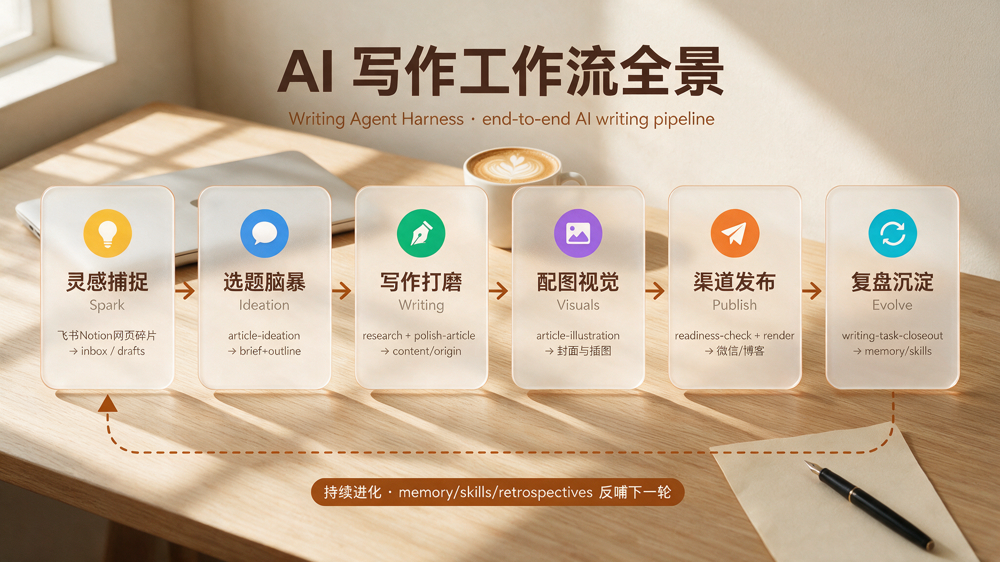
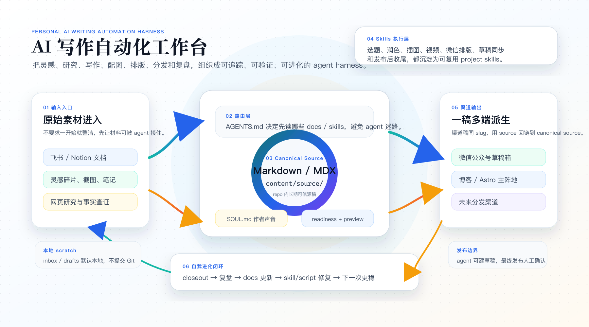

# writing-agent-harness

[](https://github.com/eriklee1895/writing-agent-harness)


`writing-agent-harness` 是 Erik 的个人 AI 自动化写作 harness。

它不是一个单一写作脚本，也不是 writer bot，而是一套面向写作活动的 agent harness：用项目级 skills、docs runbooks 和可追踪 source，把 Claude Code / Codex / Hermes / OpenClaw / Pi 等 agents 接入 Erik 的写作流程。

它也是一个会自我进化的 writing harness：通过 memory、retrospectives、local scratch、docs runbooks 和 project skills，把真实写作、发布、调试中的踩坑经验沉淀下来，持续修复 workflow、优化 skills，让系统越用越贴合 Erik 的写作方式。

## 🗺️ AI 写作 Harness 全景



`writing-agent-harness` 的核心不是一条固定流水线，而是一个可追踪、可扩展、会复盘进化的写作自动化系统：`AGENTS.md` 负责把 agent 路由到最小必要文档，`docs/` 保存 runbooks 和决策，`.agents/skills/` 执行具体能力，`content/origin/` 保存长期 canonical Markdown / MDX，再派生到微信公众号、博客和未来渠道。

详细 harness 架构（skills 分工、目录约定、渠道派生、memory 分层）见下图与 [docs/workflows/ai-writing-workflow.md](docs/workflows/ai-writing-workflow.md)：



## ⚡ Install Skills

把本 repo 的 project skills 安装到本机 agent 环境：

```bash
npx skills add eriklee1895/writing-agent-harness
```

只安装指定 skill：

```bash
npx skills add eriklee1895/writing-agent-harness --skill article-ideation
```

可用 skills 见 [🧩 Core Skills](#-core-skills)。新机器或新 agent 环境的本机依赖、可选 user-level skills 和账号态准备，见 [docs/project/prepare-environment.md](docs/project/prepare-environment.md)。

## 🌌 My Grand Design

我的目标是把 `writing-agent-harness` 做成 AI 写作领域的 Superpowers：不是单个 writer bot，而是一套面向写作 agents 的 skills methodology。

它受到 [obra/superpowers](https://github.com/obra/superpowers) 启发，但服务于写作、研究、配图、分发和复盘：让 agents 不只是“会写”，而是能稳定完成从选题到发布复盘的完整写作链路，并在每次真实任务后自我进化。

长期目标是形成一条可验证、可回滚、可扩展的写作分发链路：

```text
Feishu / Notion / notes / etc.
-> Markdown / MDX
-> Blog as primary home base
   Astro + Cloudflare Pages + GitHub Actions
-> downstream distribution
   WeChat Official Account / 掘金 / others
```

飞书文档和 Notion 可以继续作为原文写作、笔记和早期沉淀入口；进入 repo 后，再同步或转换为 Markdown / MDX，获得 diff、review、render、publish automation 和多渠道派生能力。

## ✍️ How to Start

### 我想用完整的 harness

克隆仓库，在 Codex 或 Claude Code 中作为项目打开：

```bash
git clone https://github.com/eriklee1895/writing-agent-harness.git
cd writing-agent-harness
# 在 Codex / Claude Code 中打开这个目录
```

所有 skills、docs runbooks、写作 memory 和风格指南会自动加载。告诉 agent 你想做什么即可。

> ⚠️ 建议 fork or clone repo 后将 [SOUL.md](SOUL.md) 替换为自己的写作风格（或直接删除），再按需调整`.env`账号配置。

### 我只想用单个 skill

```bash
npx skills add eriklee1895/writing-agent-harness --skill article-ideation
```

可用 skills 见 [🧩 Core Skills](#-core-skills)。

### 进来之后：万事起点 article-ideation

你有任何灵感、碎片、念头，直接告诉 agent，`article-ideation` 会帮你从模糊想法一步步打磨成可执行的 writing brief 和 outline。不需要先整理，不需要先想清楚——把原材料扔给 agent，它负责理清。

```text
👤  "我想写一篇关于《半生雪》的文章，给女儿找歌时偶然发现了学生版背后一个感人的故事..."

🤖  article-ideation（万事起点）
     → 复述确认你的想法
     → 校准：中心问题、读者、论题、切口、tone / register、anti-goals
     → 提供 2-4 个可选角度和取舍
     → 输出 writing brief + outline
     → 讨论、调整、确认
     ↓
✍️  手写初稿（或 agent 起笔）
     ↓
🎨  article-illustration: 文章插图（多种风格可选）
     ↓
🎞️  video-material-ingest → video-highlight-select → article-video-clip: 视频素材摄取、选片与文章视频片段（可选）
     ↓
📱  wechat-article-renderer: 排版 + 本地预览
     ↓
🚀  wechat-publish-workflow → CDP 草稿箱
     ↓
👤  人工 review → 群发
```

不用记命令——告诉 agent 你想做什么，skill 会自动衔接。命令参考：

```bash
# 生成插图
uv run .agents/skills/article-illustration/scripts/generate_article_illustration.py \
  --title "封面插画" --brief "水彩风格..." \
  --style-profile auto --size wechat-cover-hd

# 已知 URL 视频素材摄取
node .agents/skills/video-material-ingest/scripts/ingest-video-material.mjs \
  "https://example.com/video" \
  --target content/origin/YYYY-MM-DD-topic

# 人工辅助选择文章高光片段
node .agents/skills/video-highlight-select/scripts/select-video-highlights.mjs \
  --material content/origin/YYYY-MM-DD-topic/assets/media/source-slug \
  --intent "放在文章开头抓人"

# 从本地素材包生成文章视频片段
node .agents/skills/article-video-clip/scripts/create-article-video-clip.mjs \
  --material content/origin/YYYY-MM-DD-topic/assets/media/source-slug \
  --start 00:12 --end 00:38 \
  --preset wechat-landscape \
  --title "视频标题"

# 渲染微信公众号 HTML（四种风格可选）
node .agents/skills/wechat-article-renderer/scripts/render-wechat-article.mjs \
  content/origin/YYYY-MM-DD-topic/article.md --style literary-essay

# 本地预览
node .agents/skills/wechat-article-renderer/scripts/preview-server.mjs \
  content/origin/YYYY-MM-DD-topic/
# → http://localhost:49255/
```

详见 [docs/workflows/ai-writing-workflow.md](docs/workflows/ai-writing-workflow.md)。
## 📦 What This Repo Holds

- 项目 memory 和工作流规范。
- 项目级 AI writing / publishing skills。
- 文章源稿、渠道派生稿、视觉资产和发布流程文档。
- 对未来博客主阵地、微信公众号和其他分发渠道的自动化积累。
- 生成插图：支持多种风格 — `watercolor-illustration`（文学/散文默认）、`flat-tech-infographic`（agent 开发技术图）、`flat-illustration`、`sketchnote`、`soft-tech-diagram`、`repo-architecture-clean`。
- 视频素材：`video-material-ingest` 负责已知 URL 抓取和来源留痕，`video-highlight-select` 负责人工辅助选片，`article-video-clip` 负责文章内短视频片段轻包装。

## 🧭 Writing Modes

### usecase1. AI自主选题并完成写作

远期目标是让 agents 通过 cron / scheduled runs 定时触发：

```text
web search -> topic mining -> topic scoring -> outline -> research -> draft -> polish -> visuals -> blog preview -> publish
```

这个模式强调 agent autonomy：agent 不只是执行给定题目，而是主动发现值得写的主题。正式自动发布前，需要先沉淀选题质量评估、事实核查、预览验证和失败回滚机制。

### usecase2. 个人写作助手

Erik 提供主题、灵感、素材、判断和文章雏形；agent 负责：

- 深度收集相关信息。
- 汇总事实和观点。
- 建立文章结构。
- 撰写初稿。
- 用 `polish-article` 打磨逻辑、register、表达质感和专业深度。
- 根据渠道生成博客 / 微信公众号版本。

这个模式强调 human-in-the-loop：人的判断是核心，agent 做研究、组织和表达增强。

## 🚀 Distribution Targets

### Blog

未来计划：

```text
Astro + Cloudflare Pages + GitHub Actions
```

博客还没创建。当前原则是先保持 Markdown / MDX 和 assets 整理清楚，方便未来迁移到 Astro content collections。

### WeChat Official Account

微信公众号已经跑通过完整流程：

```text
article-ideation → draft → polish → article-illustration / video-highlight-select → article-video-clip → wechat-article-renderer → CDP 草稿箱 → human review → publish
```

Renderer 支持四种 style preset：`impact-rational`（技术评论/观点文，默认）、`literary-essay`（个人散文）、`cultural-essay`（文化现象/城市/音乐/文旅随笔）、`tech-blog`（通用技术博客）。发布使用 CDP browser 模式（不需要 API IP 白名单）。

详细流程见 [docs/workflows/ai-writing-workflow.md](docs/workflows/ai-writing-workflow.md) 和 [docs/workflows/wechat-writing-publishing.md](docs/workflows/wechat-writing-publishing.md)。

### Other Channels

掘金和其他平台暂时作为 downstream repackaging targets。先记录 format constraints、asset rules、publish boundary 和 rollback path，再决定是否自动化。

## 🧩 Core Skills

项目级 skills 放在 `.agents/skills/`。

| Skill | 用途 |
|-------|------|
| `article-ideation` | 灵感脑暴 → writing brief + outline |
| `polish-article` | 润色打磨，按题材强化逻辑、register、表达质感与作者气质 |
| `article-readiness-check` | 发布前 readiness 检查，确认正文、frontmatter、引用、图片/视频和渠道 handoff 是否可进入包装 |
| `article-illustration` | 通用文章生图：水彩插画、信息图、技术图表等多种风格，默认 `--style-profile auto`，Python `uv run` |
| `wechat-article-fetcher` | 用 Playwright + 本地持久化 Profile 提取微信公众号文章到结构化 Markdown + assets，支持图片落地和交互式登录引导 |
| `video-material-ingest` | 用 `yt-dlp` 摄取已知视频 URL，生成本地素材包、manifest 和 sources 留痕 |
| `video-highlight-select` | 人工辅助选择文章相关高光片段，生成 contact sheet、候选片段表和 `article-video-clip` handoff |
| `article-video-clip` | 从本地视频素材包裁切并轻包装文章视频片段，输出 `final.mp4`、预览帧和 clip manifest |
| `wechat-article-renderer` | Markdown → 微信公众号 HTML，支持 `impact-rational`/`literary-essay`/`cultural-essay`/`tech-blog` 四种风格 |
| `wechat-article-publisher` | Playwright 微信公众号发布器。输入 origin .md（`content/origin/&lt;slug&gt;/`，frontmatter 元数据权威源）+ renderer HTML preview，自动登录态复用、注入正文、上传正文图片到微信 CDN、写标题/作者/摘要、保存草稿并报告 appmsgid |
| `wechat-publish-workflow` | 编排微信公众号草稿箱同步、验证和发布交接 |
| `writing-task-closeout` | 发布或最终交付后的任务收尾：归档、复盘、memory/skill/docs 改进和 git/task handoff |

## 🧰 Companion Third-Party Skills

`writing-agent-harness` 的 project skills 负责写作、配图、排版、发布和收尾；项目自带的 skills 之外，还常借助以下 third-party / user-level skills 做计划澄清、提供方法论约束、复用外部发布能力。

这些不是本 repo 的 core project skills，但属于 Erik 本机 agent 环境里经常一起使用的 companion skills：

| Skill / Project | 高频用途 | 本 repo 中的角色 |
| --- | --- | --- |
| [`grill-me`](https://github.com/mattpocock/skills/tree/main/skills/productivity/grill-me) | 在设计、目录、workflow、自动化方案定型前，连续追问并压实决策树 | 用于 pre-request / planning grill，避免把模糊想法过早写进 docs 或 skills |
| [`obra/superpowers`](https://github.com/obra/superpowers) | skills methodology、progressive disclosure、specs / plans 工作流启发 | 项目愿景和 `docs/superpowers/` 约定的重要灵感来源 |
| [`JimLiu/baoyu-skills`](https://github.com/JimLiu/baoyu-skills) | 微信公众号 CDP 草稿箱、API 发布自动化 | 本项目微信公众号发布自动化的灵感与工程起点，促成后续 Playwright 自建 `wechat-article-publisher` |

With thanks to the authors and maintainers of these amazing skills and skill ecosystems.

边界：third-party skills 提供方法论、辅助能力或底层参考；本 repo 的目录约定、文章 readiness、渲染风格、发布编排和 closeout 规则仍以 `AGENTS.md`、`docs/` 和 `.agents/skills/` 为准。

## 🙏 Third-Party Acknowledgement

感谢 [JimLiu/baoyu-skills](https://github.com/JimLiu/baoyu-skills)，为本项目的微信公众号发布自动化提供了灵感和工程起点。

特别感谢宝玉 (Jim Liu) 和所有 `baoyu-skills` 的贡献者。

## 📚 Docs

流程和复盘放在 `docs/`，方便 agents 在执行前先读对应 runbook。

- [docs/README.md](docs/README.md): 文档索引。
- [docs/project/vision.md](docs/project/vision.md): 项目愿景、写作场景和分发目标。
- [docs/project/prepare-environment.md](docs/project/prepare-environment.md): 新机器 / 新 agent 环境的 runtime、外部 skills 和本机账号态准备。
- [docs/project/todolist.md](docs/project/todolist.md): 当前建设 todo。
- [docs/workflows/writing-overview.md](docs/workflows/writing-overview.md): 通用写作流程。
- [docs/workflows/wechat-writing-publishing.md](docs/workflows/wechat-writing-publishing.md): 微信公众号写作、排版、草稿箱同步与发布流程。
- [docs/reference/writing-agent-harness-profile.md](docs/reference/writing-agent-harness-profile.md): `writing-agent-harness` 的身份、职责、能力边界。
- [docs/skills/skills-list.md](docs/skills/skills-list.md): 项目 skills 边界。
- [docs/reference/visuals.md](docs/reference/visuals.md): 图片、视频素材和文章视频剪辑规则。

## 🗂️ Suggested Layout

项目还在演进中。当前不要为了整洁强行迁移历史内容；新内容建议逐步靠近这个 layout。

```text
writing-agent-harness/
├── .agents/skills/              # 项目级 writing/publishing skills
├── docs/                        # 工作流、规范、复盘
│   ├── project/                 # 愿景、目录结构、自动化路线图
│   ├── workflows/               # 可执行流程 runbooks
│   ├── reference/               # skills、visuals 等参考规则
│   ├── retrospectives/          # 真实任务复盘
│   └── superpowers/             # brainstorming specs / writing plans
├── .superpowers/                # generated scratch, preview server output, gitignored
├── content/
│   ├── inbox/                   # 本地原始输入 scratch，gitignored
│   ├── drafts/                  # 本地写作工作区，gitignored
│   ├── origin/                  # 可追踪 canonical Markdown / MDX
│   ├── blog/                    # 可追踪博客 Markdown / MDX，按一级主题目录归档
│   ├── wechat/                  # 微信公众号派生稿和 preview
│   └── assets/                  # 跨文章复用 prompts / metadata / manifests
```

写作初期可以使用自包含本地草稿目录：

```text
content/drafts/YYYY-MM-DD-topic/
├── article.md
├── article.mdx                  # optional, for blog
├── assets/
└── notes.md                     # optional research notes
```

进入可追踪状态后，canonical article 放在：

```text
content/origin/YYYY-MM-DD-topic/
├── article.md
├── article.mdx                  # optional, for blog
├── notes.md                     # optional research notes
└── assets/                      # article-local assets / prompts / metadata / manifests
```

渠道派生稿可以放在：

```text
content/wechat/YYYY-MM-DD-topic/
content/blog/<category>/YYYY-MM-DD-topic/
```

同一篇文章跨 `origin` / `wechat` / `blog` 使用同一个 folder slug；渠道稿 frontmatter 用 `source:` 指回 canonical article。当前 `content/drafts/` 按本地 scratch 处理，不会默认提交。新文章可以先在这里写作；进入可追踪状态时，再把 Markdown / MDX、notes 和 metadata promote 到 `content/origin/`。渠道版本再从 `content/origin/` 派生到 `content/wechat/` 和 `content/blog/`。文章目录里的 `assets/` 是 article-local assets；全局 `content/assets/` 只放跨文章复用素材。二进制素材默认留在 `.local-archive/` 或外部资产库，只提交可复现的 prompt、metadata、manifest 和 notes。

## 🧱 Principles

- `content/origin/` 中的 Markdown / MDX 是 repo 内长期 canonical source。
- 飞书文档、Notion 等可以作为上游写作入口，但进入 repo 后需要可追踪地同步到 Markdown / MDX。
- 先证明 small practical workflow，再扩大自动化范围。
- 不打印或提交 secrets、本地运行态、账号态数据和依赖目录。
- 不依赖 paid `md2wechat` API。
- 任何最终发布动作都需要 human final review，除非用户明确授权自动发布。
