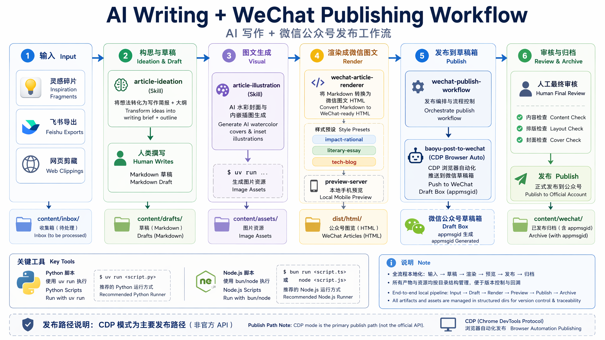
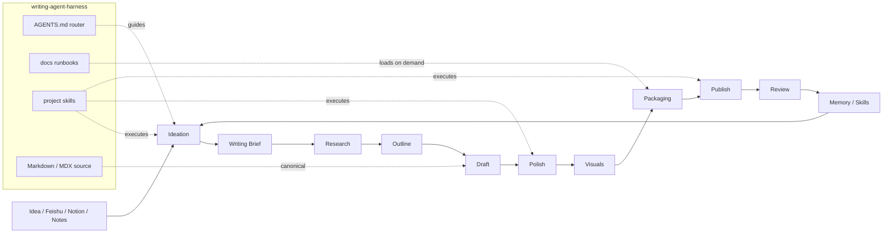

# writing-agent-harness

`writing-agent-harness` 是 Erik 的个人 AI 自动化写作 harness。

它不是一个单一写作脚本，也不是 writer bot，而是一套面向写作活动的 agent harness：用项目级 skills、docs runbooks 和可追踪 source，把 Claude Code / Codex / Hermes / OpenClaw / Pi 等 agents 接入 Erik 的写作流程。

## ⚡ Install Skills

把本 repo 的 project skills 安装到本机 agent 环境：

```bash
npx skills add eriklee1895/writing-agent-harness
```

只安装指定 skill：

```bash
npx skills add eriklee1895/writing-agent-harness --skill article-ideation
```

可用 skills 见 [🧩 Core Skills](#-core-skills)。新机器或新 agent 环境的本机依赖、Git LFS、可选 user-level skills 和账号态准备，见 [docs/project/prepare-environment.md](docs/project/prepare-environment.md)。

## 🌌 Grand Design

长期目标是形成一条可验证、可回滚、可扩展的写作分发链路：

```text
Feishu / Notion / notes / etc.
-> Markdown / MDX
-> Blog as primary home base
   Astro + Cloudflare Pages + GitHub Actions
-> downstream distribution
   WeChat Official Account / 掘金 / others
```

飞书文档和 Notion 可以继续作为原文写作、笔记和早期沉淀入口；进入 repo 后，再同步或转换为 Markdown / MDX，获得 diff、review、render、publish automation 和多渠道派生能力。

## 🗺️ AI 写作工作流全景



详细流程见 [docs/workflows/ai-writing-workflow.md](docs/workflows/ai-writing-workflow.md)。



## ✍️ How to Start

**万事起点：`article-ideation`。** 你有任何灵感、碎片、念头，直接告诉 agent，它会帮你从模糊想法一步步打磨成可执行的 writing brief 和 outline。不需要先整理，不需要先想清楚——把原材料扔给 agent，article-ideation 负责理清。

```text
👤  "我想写一篇关于《半生雪》的文章，给女儿找歌时偶然发现了学生版背后一个感人的故事..."

🤖  article-ideation（万事起点）
     → 复述确认你的想法
     → 校准：中心问题、读者、论题、切口、语气、不要什么
     → 提供 2-4 个可选角度和取舍
     → 输出 writing brief + outline
     → 讨论、调整、确认
     ↓
✍️  手写初稿（或 agent 起笔）
     ↓
🎨  article-illustration: 文章插图（多种风格可选）
     ↓
📱  wechat-article-renderer: 排版 + 本地预览
     ↓
🚀  wechat-publish-workflow → CDP 草稿箱
     ↓
👤  人工 review → 群发
```

不用记命令——告诉 agent 你想做什么，skill 会自动衔接。命令参考：

```bash
# 生成插图
uv run .agents/skills/article-illustration/scripts/generate_doc_illustration.py \
  --title "封面插画" --brief "水彩风格..." \
  --style-profile watercolor-illustration --size wechat-cover-hd

# 渲染微信公众号 HTML（三种风格可选）
node .agents/skills/wechat-article-renderer/scripts/render-wechat-article.mjs \
  content/drafts/YYYY-MM-DD-topic/article.md --style literary-essay

# 本地预览
node .agents/skills/wechat-article-renderer/scripts/preview-server.mjs \
  content/drafts/YYYY-MM-DD-topic/
# → http://localhost:49255/
```

详见 [docs/workflows/ai-writing-workflow.md](docs/workflows/ai-writing-workflow.md)。

### 已发布文章

| # | 标题 | 样式 | 日期 |
|---|------|------|------|
| 2 | [半生雪](content/wechat/2026-06-07-banshengxue/article.md) | `literary-essay` | 2026-06-07 |
| 1 | Cloudflare 收购 VoidZero | `impact-rational` | 2026-06-05 |

归档目录：`content/wechat/`。

## 📦 What This Repo Holds

- 项目 memory 和工作流规范。
- 项目级 AI writing / publishing skills。
- 文章源稿、渠道派生稿、视觉资产和发布流程文档。
- 对未来博客主阵地、微信公众号和其他分发渠道的自动化积累。
- 生成插图：支持多种风格 — `watercolor-illustration`（文学/散文默认）、`flat-tech-infographic`（agent 开发技术图）、`flat-illustration`、`sketchnote`、`soft-tech-diagram`、`repo-architecture-clean`。

## 🧭 Writing Modes

### usecase1. AI自主选题并完成写作

远期目标是让 agents 通过 cron / scheduled runs 定时触发：

```text
web search -> topic mining -> topic scoring -> outline -> research -> draft -> polish -> visuals -> blog preview -> publish
```

这个模式强调 agent autonomy：agent 不只是执行给定题目，而是主动发现值得写的主题。正式自动发布前，需要先沉淀选题质量评估、事实核查、预览验证和失败回滚机制。

### usecase2. 个人写作助手

Erik 提供主题、灵感、素材、判断和文章雏形；agent 负责：

- 深度收集相关信息。
- 汇总事实和观点。
- 建立文章结构。
- 撰写初稿。
- 用 `polish-article` 打磨逻辑、文风和专业深度。
- 根据渠道生成博客 / 微信公众号版本。

这个模式强调 human-in-the-loop：人的判断是核心，agent 做研究、组织和表达增强。

## 🚀 Distribution Targets

### Blog

未来计划：

```text
Astro + Cloudflare Pages + GitHub Actions
```

博客还没创建。当前原则是先保持 Markdown / MDX 和 assets 整理清楚，方便未来迁移到 Astro content collections。

### WeChat Official Account

微信公众号已经跑通过完整流程：

```text
article-ideation → draft → polish → article-illustration → wechat-article-renderer → CDP 草稿箱 → human review → publish
```

Renderer 支持三种 style preset：`impact-rational`（技术评论）、`literary-essay`（个人散文）、`tech-blog`（通用技术博客）。发布使用 CDP browser 模式（不需要 API IP 白名单）。

详细流程见 [docs/workflows/ai-writing-workflow.md](docs/workflows/ai-writing-workflow.md) 和 [docs/workflows/wechat-writing-publishing.md](docs/workflows/wechat-writing-publishing.md)。

### Other Channels

掘金和其他平台暂时作为 downstream repackaging targets。先记录 format constraints、asset rules、publish boundary 和 rollback path，再决定是否自动化。

## 🧩 Core Skills

项目级 skills 放在 `.agents/skills/`。

| Skill | 用途 |
|-------|------|
| `article-ideation` | 灵感脑暴 → writing brief + outline |
| `polish-article` | 润色打磨，按题材强化逻辑、文风与作者气质 |
| `article-illustration` | 通用文章生图：水彩插画、信息图、技术图表等多种风格，默认 `watercolor-illustration`，Python `uv run` |
| `wechat-article-renderer` | Markdown → 微信公众号 HTML，支持 `impact-rational`/`literary-essay`/`tech-blog` 三种风格 |
| `wechat-publish-workflow` | 编排微信公众号草稿箱同步、验证和发布交接 |
| `baoyu-post-to-wechat` | 底层 CDP 上传器参考实现 |

## 🙏 Third-Party Acknowledgement

本项目 vendored 了一份 `baoyu-post-to-wechat`，作为微信公众号草稿箱上传器和 Chrome CDP 发布流程的参考实现。

- Upstream: [JimLiu/baoyu-skills](https://github.com/JimLiu/baoyu-skills)
- Vendored path: `.agents/skills/baoyu-post-to-wechat/`
- Local role: uploader / API / browser automation reference only；项目排版风格和发布编排由 `wechat-article-renderer` 与 `wechat-publish-workflow` 负责。

## 📚 Docs

流程和复盘放在 `docs/`，方便 agents 在执行前先读对应 runbook。

- [docs/README.md](docs/README.md): 文档索引。
- [docs/project/vision.md](docs/project/vision.md): 项目愿景、写作场景和分发目标。
- [docs/project/prepare-environment.md](docs/project/prepare-environment.md): 新机器 / 新 agent 环境的 runtime、Git LFS、外部 skills 和本机账号态准备。
- [docs/project/todolist.md](docs/project/todolist.md): 当前建设 todo。
- [docs/workflows/writing-overview.md](docs/workflows/writing-overview.md): 通用写作流程。
- [docs/workflows/wechat-writing-publishing.md](docs/workflows/wechat-writing-publishing.md): 微信公众号写作、排版、草稿箱同步与发布流程。
- [docs/reference/writing-agent-harness-profile.md](docs/reference/writing-agent-harness-profile.md): `writing-agent-harness` 的身份、职责、能力边界。
- [docs/reference/skills.md](docs/reference/skills.md): 项目 skills 边界。

## 🗂️ Suggested Layout

项目还在演进中。当前不要为了整洁强行迁移历史内容；新内容建议逐步靠近这个 layout。

```text
writing-agent-harness/
├── .agents/skills/              # 项目级 writing/publishing skills
├── docs/                        # 工作流、规范、复盘
│   ├── project/                 # 愿景、目录结构、自动化路线图
│   ├── workflows/               # 可执行流程 runbooks
│   ├── reference/               # skills、visuals 等参考规则
│   ├── retrospectives/          # 真实任务复盘
│   └── superpowers/             # brainstorming specs / writing plans
├── .superpowers/                # generated scratch, preview server output, gitignored
├── content/
│   ├── inbox/                   # 从飞书 / Notion / 剪藏进入的原始内容
│   ├── drafts/                  # Markdown / MDX canonical drafts
│   ├── blog/                    # 未来 Astro / MDX 派生稿
│   ├── wechat/                  # 微信公众号派生稿和 preview
│   └── assets/                  # 可复用视觉资产
├── 微信公众号/                   # 当前历史微信公众号文章目录，后续可迁移到 content/wechat/
└── astro_blogs/                 # 未来博客实验区
```

每篇文章建议使用自包含目录：

```text
content/drafts/YYYY-MM-DD-topic/
├── article.md
├── article.mdx                  # optional, for blog
├── assets/
└── notes.md                     # optional research notes
```

渠道派生稿可以放在：

```text
content/wechat/YYYY-MM-DD-topic/
content/blog/YYYY-MM-DD-topic/
```

当前 `微信公众号/` 是已经跑通的历史文章目录；后续新文章优先进入 `content/drafts/`，再派生到 `content/wechat/` 和 `content/blog/`。

## 🧱 Principles

- Markdown / MDX 是 repo 内长期 canonical source。
- 飞书文档、Notion 等可以作为上游写作入口，但进入 repo 后需要可追踪地同步到 Markdown / MDX。
- 先证明 small practical workflow，再扩大自动化范围。
- 不打印或提交 secrets、本地运行态、账号态数据和依赖目录。
- 不依赖 paid `md2wechat` API。
- 任何最终发布动作都需要 human final review，除非用户明确授权自动发布。
