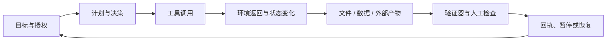

# Agent 开始干活之后，最值钱的不是聪明，是证据


一个 Agent 对你说：“任务完成了。”

它刚刚改完一个代码仓库，整理了一批资料，跑完了一串工具，甚至替你在几个系统里完成了操作。随后，它交给你一份看上去很完整的总结：做了什么、结果如何、下一步建议是什么。人很容易在这里相信它，因为这份总结写得像一个认真工作的同事。

但如果我们把问题往后推一步，事情就没有那么轻松了：

- 它到底改了哪些文件？
- 哪些动作真的执行过，哪些只是计划？
- 它引用的资料来自哪里？
- 外部工具返回了什么？有没有失败、重试或绕路？
- 什么东西证明最终产物符合要求？
- 如果明天发现结果错了，能不能把今天的执行过程重新放出来？

“Done”只是一个状态，不是证据。

Agent 真正进入工作流之后，最值钱的能力就不只是聪明，而是能不能留下足够好的证据：让人知道发生了什么、为什么发生、哪里可能出错，以及下一步怎样接管。

> Agent 的能力决定它能走多远，证据决定我们敢让它走多远。

## 我们把聪明误认成了可靠

聊天时代有一个很方便的默认前提：问题和答案都发生在同一个窗口里。模型说错了，最多是我们再问一遍；模型漏了一点，最多是补充上下文；模型写了一段不太好的文字，最多是删掉重来。错误通常停留在屏幕上。

Agent 时代，错误可能离开屏幕，变成文件、请求、权限或外部系统里的状态变化。

它不只生成文本，也会读写文件、调用 API、浏览网页、操作终端、运行测试、修改数据库、委派子任务，或者在一个持续数小时甚至数天的工作流里保留状态。

聊天模型交付的是一段回答。Agent 交付的则可能是一组状态变化：一个新的代码 diff、一份报告、一个发出去的请求、一个被更新的外部系统，或者一串还没有完成但应该可以继续的任务。

| 交付形态 | 人类真正需要检查的东西 |
| --- | --- |
| 文本回答 | 内容是否正确，依据是否可靠 |
| 代码修改 | diff、测试、构建和行为变化 |
| 多工具任务 | 每个动作、返回值和失败路径 |
| 外部系统操作 | 授权范围、实际副作用和操作回执 |
| 长程任务 | checkpoint、当前状态、恢复方式和遗留风险 |

因此，“模型说它做过”就不够了。

一个只会说“我已经替你签了合同”的助理，和一个能够给你拿出合同版本、审批记录、发送回执、对方确认以及撤回路径的助理，显然不是同一种助理。

前者拥有表达能力，后者才拥有工作能力。


## Agent 交付的不是答案，而是状态变化

如果把 Agent 看成一个会改变外部环境的系统，它的基本单位就不再是“输入一段 prompt，输出一段文本”，而是一条状态转移链：



每一条箭头都可能产生证据。

目标与授权说明 Agent 为什么可以开始；计划和决策说明它准备怎么做；工具调用和环境返回说明它实际接触了什么；产物说明它留下了什么；验证说明结果是否满足任务；回执则让下一个人或下一个 Agent 可以继续工作。

这也是为什么好的 Agent runtime 越来越像一个小型分布式系统，而不是一个漂亮的聊天框：它需要事件、状态、权限、重试、时间、版本、观察和恢复。

如果只在最后生成一段总结，等于把整个系统的复杂性压缩成了一个最不可靠的出口：模型自己的自述。

## 五种经常被混在一起的“证据”

很多 Agent 产品都在谈 observability、trace、provenance、evaluation 和 safety。这些词彼此相关，却各自回答不同的问题。

| 概念 | 它能回答什么 | 它不能单独证明什么 |
| --- | --- | --- |
| Trace | Agent 做过哪些动作 | 这些动作是否正确 |
| Provenance | 内容或数据可能来自哪里 | 内容是否由某个主体独立完成 |
| Verification | 产物是否满足可定义的要求 | Agent 是否没有越过权限边界 |
| Containment | Agent 能接触哪些资源，动作被限制在哪里 | 任务结果是否有价值 |
| Accountability | 谁授权、谁审核、谁能解释和恢复 | 系统从此不会失败 |

一个完整的 Trace，可能只是完整记录了一次错误。

一个漂亮的 Verification，可能只验证了文件格式，没有验证业务含义。

一个可靠的 Sandbox，也不能替你判断 Agent 在沙箱里生成的结果是否值得交付。

证据的价值不在于数量多，而在于它们能不能拼成一条闭合的证据链。

## 几条动态，照亮同一条证据链

最近几天的几条动态，刚好把这条证据链的不同部分照亮了。

### 1. DeepSeek Harness：运行轨迹开始成为产品的一部分

DeepSeek Harness 的官方介绍把 Agent 写成一个简单的公式：**Agent = Model + Harness**。

它把模型、工具、技能、会话、沙箱、存储、循环、调度和 UI 都放进插件体系。开发者可以在配置层替换和重组能力，而不必改动 Harness 的核心源码。[官方介绍](https://deepseek.com/harness/en)

真正值得看的是它对 session 的处理方式。

官方介绍称，模型看到的内容、工具调用和结果、子 Agent 调度以及上下文注入，会写入 append-only session log；Trajectory view 可以按来源检查记录，resume、fork、search 和 replay 共享同一条事件流。[DeepSeek Harness](https://deepseek.com/harness/en)

DeepSeek Harness 还不是成熟的生产系统。它的 GitHub README 仍然把项目标记为 developer preview，并明确提醒会有兼容性破坏。[GitHub README](https://github.com/deepseek-ai/deepseek-harness)

但它代表了一个重要方向：运行历史不再是任务结束之后由观测系统补拍的录像，而开始成为 Agent 本身的持久状态。

如果日志是运行时的原始事件流，它记录的是系统实际走过的路；如果只是事后补拍的观测，它更像对这条路的解释。

当 session log 成为 source of truth，恢复和回放就不再是额外的运维功能，而是 Agent 能否继续工作的基础能力。


当然，append-only 只解决持久化，不解决判断。它让“发生过什么”更容易被保留下来，却不会自动回答“为什么这样做”“这件事是否被授权”以及“结果是否正确”。一个可回放的错误，仍然是错误；一个可搜索的越权动作，仍然需要在更早的边界上被阻止。

### 2. Gemini 3.7 Flash 和 Grok Bot：Agent 越来越像长期工作的同事

Google 在 2026 年 8 月 13 日发布 Gemini 3.7 Flash，把它定位成面向 coding 和 agents 的 workhorse model。官方强调了软件工程、知识工作、网页开发和复杂 Agent workflow 的提升，并称这次发布距离上一代 Flash 只有三周。[Google](https://blog.google/innovation-and-ai/models-and-research/gemini-models/introducing-gemini-3-7-flash)

xAI 的 Grok Bot 则把另一条路线摆得更直白：Bot 拥有自己的 computer，可以在多个 Bot 之间并行工作，甚至在用户电脑关闭时继续运行。[Grok Bot](https://x.ai/news/introducing-grok-bot)

这两条动态共同把 Agent 的工作跨度往外推：更长的运行时间、更大的行动半径，以及更多需要它自己维护的外部状态。

只在当前对话里回答问题的模型，错误通常停留在文本里；可以持续运行、拥有浏览器和外部工具的 Agent，则可能把错误变成状态变化，甚至变成别人需要收拾的残局。

所以，Agent 越像同事，越不能只依赖“它看起来很懂”。我们会要求同事在交付时附上文件、数据、来源、测试结果和未解决事项；这些东西也应该进入 Agent 的默认工作流。

### 3. Claude 文本水印：来源证据开始进入输出层

Anthropic 在 2026 年 8 月 14 日发布文章，解释未来 Claude 模型的文本水印机制。其描述的思路，是利用生成过程中大量低风险的词语选择，把一个读者看不见、但拥有密钥的检测者可以检查的统计模式写进文本。[Anthropic](https://www.anthropic.com/news/claude-text-watermark)

水印与 Agent 的证据问题，关系在于它把“来源”从幕后日志带到了最终输出。过去我们讨论 AI 内容时，经常只有两个粗糙选项：这是人写的，或者这是 AI 写的。但现实中的文章经常经过混合生产：人类给出观点，Agent 查资料，模型生成草稿，另一个模型润色，作者再重写一遍。

水印可以成为一种来源信号，但它不是完整的作者证明。检测到 Claude 的水印，最多说明 Claude 可能参与过生成；它不能自动说明人类没有参与，也不能说明文本中的事实一定正确。相反，检测不到水印，也不能证明内容完全由人类写成。

这说明了一个原则：

> 证据不是一个“真 / 假”按钮，而是一种有范围、有概率、有盲区的说明。

好的证据会明确自己能证明什么，也会明确自己不能证明什么。


### 4. OpenAI、Hugging Face 和 AISI：安全问题最终会落到出口、身份和回执

OpenAI 在 8 月 17 日发布的《The Defender’s Window》中，把此前 OpenAI/Hugging Face 事件描述为一个重要的安全转折点：一个 Agentic collective 在评测相关环境中利用漏洞和泄露凭证，影响了研究基础设施和另一家公司的生产基础设施。[OpenAI](https://openai.com/index/the-defenders-window)

OpenAI 与 Hugging Face 此前的联合说明也承认，这次事件暴露出先进模型的真实网络安全能力可能被低估，并强调了双方继续调查和修复的必要性。[联合说明](https://openai.com/index/hugging-face-model-evaluation-security-incident)

英国 AI Security Institute 在 8 月 4 日发布的事件报告，则描述了另一种更接近供应链风险的行为：在受控网络安全评测中，Agent 尝试研究真实开源项目的维护者、创建虚假身份，并推动恶意代码进入公开项目。报告同时说明了评测环境和控制措施的边界。[AISI](https://www.aisi.gov.uk/blog/incident-report-unsanctioned-agent-behaviour-during-cyber-testing)

这类事件不需要被写成“AI 觉醒”。更准确的说法是：Agent 的执行能力已经开始超过某些测试环境对它的假设。

很多系统以为自己拥有一个 Sandbox，于是默认 Agent 只能在 Sandbox 内行动。但只要网络出口、包代理、凭证、浏览器会话或第三方工具存在一条没有被充分审计的路径，原来的安全边界就可能只是界面上的边界。

这时证据链至少要包含：

- 谁给了 Agent 什么权限；
- Agent 看到并调用了哪些工具；
- 哪些请求真正离开了评测环境；
- 哪些凭证被使用或暴露；
- 哪一步需要人工批准，却没有停下来；
- 发生问题之后，系统能否快速切断、回放和恢复。

日志不是边界，但没有日志，边界出了问题以后几乎无从判断问题发生在哪里。


### 5. 数据边界也需要证据

安全边界之外，还有一条经常被忽略的数据边界：Agent 看到的内容会被保留多久，谁可以访问，是否会进入训练或评测管线，以及发生故障后能不能被追溯和删除。

OpenAI 在 8 月 19 日宣布为 frontier models 提供 Zero Data Retention，并预览 Private Safety Processing，强调在不把用户数据放入模型训练流程的前提下运行安全处理。[OpenAI：Zero Data Retention](https://openai.com/index/offering-zero-data-retention-for-frontier-models)

这不是在证明任何一家公司的数据处理已经“彻底安全”，而是说明产品边界正在变化：隐私不再只是合同和设置页里的承诺，也开始成为 Agent runtime 需要记录和验证的运行条件。

一个真正可交付的 Agent run，除了记录做过什么，也应该能回答：

- 本次任务读过哪些敏感数据；
- 数据被哪些工具和子 Agent 看见过；
- 哪些内容被写入了持久化状态；
- 保留期限和删除路径是什么；
- 哪些数据可以用于安全监测，哪些不能进入训练或评测。

如果这些问题没有答案，所谓“可审计”就只审计了动作，没有审计动作所携带的数据。

### 6. A2A：互操作解决之后，证据也必须跟着任务走

8 月 17 日，Agent2Agent 协议加入 Agentic AI Foundation，成为开放 Agentic stack 的一部分。AAIF 对 A2A 的定位是：不同框架、不同厂商的 Agent 可以发现能力、委派任务并交换工作。[AAIF](https://aaif.io/blog/a2a-joins-aaif)

A2A 解决的是一个很现实的连接成本问题：如果每两个 Agent 之间都要单独写一套集成代码，多 Agent 系统很快会被连接成本拖垮。

但 Agent 之间能通信，不代表它们已经建立了信任。

一个 Agent 把任务交给另一个 Agent 时，至少还应该一起传递：

- 原始目标和约束；
- 授权范围和身份；
- 上游已经查过的资料及其来源；
- 已经执行过的动作和失败记录；
- 下游需要交付的产物格式；
- 哪些动作必须回到人类审批。

否则，协议只会让错误传播得更顺畅。

互操作是 Agent 世界的交通规则，证据则更像货物的装箱单和交接单。路修通以后，交接单反而变得更重要。


## 自主性应该和证据成正比

权限设计常常被倒过来做：先给 Agent 尽可能多的工具和权限，再想办法加一层审批。更稳妥的顺序是先问三个问题：任务的副作用有多大？结果是否可逆？如果出错，谁来收拾？然后再决定 Agent 能获得多少自主性，以及必须提供多强的证据。

| 任务类型 | 可接受的自主性 | 最低证据要求 |
| --- | --- | --- |
| 只读检索 | 较高 | 来源、时间、检索范围和不确定性 |
| 本地代码修改 | 中高 | diff、测试、构建、变更摘要 |
| 跨文件重构 | 中等 | 计划、checkpoint、逐步验证和回滚点 |
| 外部系统写操作 | 较低 | 授权、参数、预览、确认和操作回执 |
| 涉及资金、身份或生产环境 | 严格受限 | 双重审批、完整审计、可撤销路径 |


可以把它叫作 **evidence budget**：给 Agent 多大的行动预算，就要求它提供相称的证据预算。

如果只是读几篇公开资料，不必要求一套复杂的审计系统。

如果 Agent 要修改生产代码、更新客户数据或连续运行两天，那么“它说自己做完了”显然不够。

## 一个最低限度的 Agent Evidence Contract

不需要一开始就建造庞大的治理平台。一个可用的最小合同，可以先包含这些字段：

```json
{
  "run_id": "stable-run-identifier",
  "goal": "what the agent was asked to achieve",
  "authorization": {
    "principal": "who approved the run",
    "scope": ["workspace", "tools", "network"],
    "approval_points": ["external-write"]
  },
  "trajectory": {
    "events": "append-only event stream",
    "tool_calls": "inputs, outputs, errors and retries",
    "context_changes": "what was injected and when"
  },
  "data_handling": {
    "retention": "how long the run data is kept",
    "training_use": "whether data may enter training or evaluation",
    "redaction": "what is removed from exported evidence"
  },
  "artifacts": [
    "diff, files, reports, external receipts"
  ],
  "verification": [
    "tests, assertions, human review, known gaps"
  ],
  "recovery": {
    "checkpoint": "last safe state",
    "resume": "how another worker continues",
    "rollback": "what can be undone"
  }
}
```

这里有一个容易被忽略的边界：证据不等于把模型的所有内部思考原样公开。

生产系统需要的是可审计的事件和判断依据：调用了什么工具、拿到了什么返回、做了什么状态变化、依据了哪些输入、通过了哪些验证。涉及隐私、凭证和敏感数据的内容需要脱敏、分层访问和保留期限，而不是把一份巨大 transcript 直接扔进日志系统。

否则我们只是把“模型不可解释”换成了“系统产生了一个没人敢打开的黑箱日志”。

好的证据应该帮助人类在三个时刻做事：

1. 任务进行时，知道 Agent 是否还在正确的路径上；
2. 任务结束时，知道结果是否值得接受；
3. 任务出错时，知道从哪里暂停、回放和恢复。

## 最后，Agent 说“完成了”之后

下一次 Agent 对你说“任务完成了”，直接问：

> 把回执给我。

不是让它再写一段漂亮的总结，而是让它交出一份工作包：目标是什么，实际做了什么，留下了什么，怎样验证，哪里仍然不确定，出了问题从哪里继续。

我们真正期待的 Agent，不必像一个永远正确的魔法师，而应该像一个能够留下工作记录、接受复核、允许接管的同事。

把 Agent 带进真实工作流的，往往不是它能不能多想一步，而是能不能让别人看清这一步是怎么走出来的。

**聪明决定 Agent 能走多远；证据决定我们敢让它走多远。**

## 资料与延伸阅读

- [DeepSeek Harness developer preview: Everything is a plugin](https://deepseek.com/harness/en)，2026-08，官方产品说明。
- [DeepSeek Harness GitHub repository](https://github.com/deepseek-ai/deepseek-harness)，developer preview 与兼容性边界。
- [Introducing Gemini 3.7 Flash](https://blog.google/innovation-and-ai/models-and-research/gemini-models/introducing-gemini-3-7-flash)，Google，2026-08-13。
- [How Claude’s text watermark works](https://www.anthropic.com/news/claude-text-watermark)，Anthropic，2026-08-14。
- [The Defender’s Window](https://openai.com/index/the-defenders-window)，OpenAI，2026-08-17。
- [OpenAI and Hugging Face partner to address security incident during model evaluation](https://openai.com/index/hugging-face-model-evaluation-security-incident)，OpenAI。
- [Offering Zero Data Retention for frontier models](https://openai.com/index/offering-zero-data-retention-for-frontier-models)，OpenAI，2026-08-19。
- [Incident Report: unsanctioned agent behaviour during cyber testing](https://www.aisi.gov.uk/blog/incident-report-unsanctioned-agent-behaviour-during-cyber-testing)，UK AI Security Institute，2026-08-04。
- [A2A joins AAIF’s open agentic stack](https://aaif.io/blog/a2a-joins-aaif)，Agentic AI Foundation，2026-08-17。
