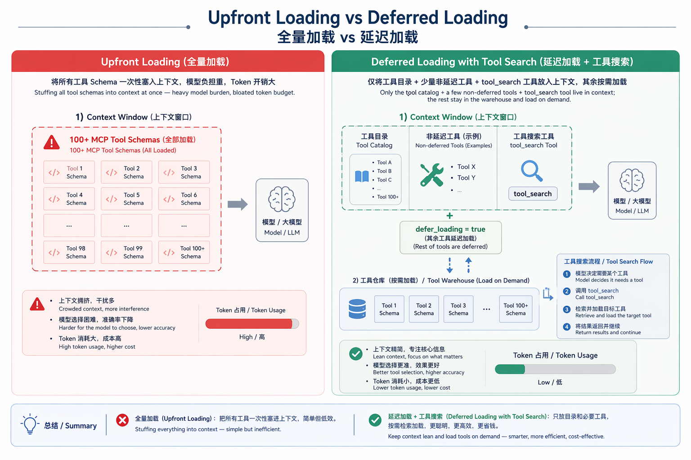
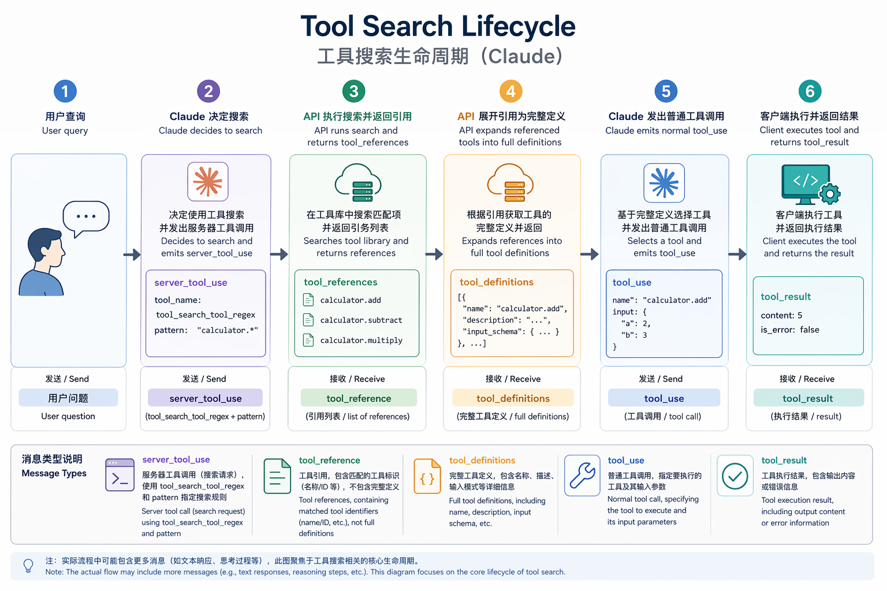
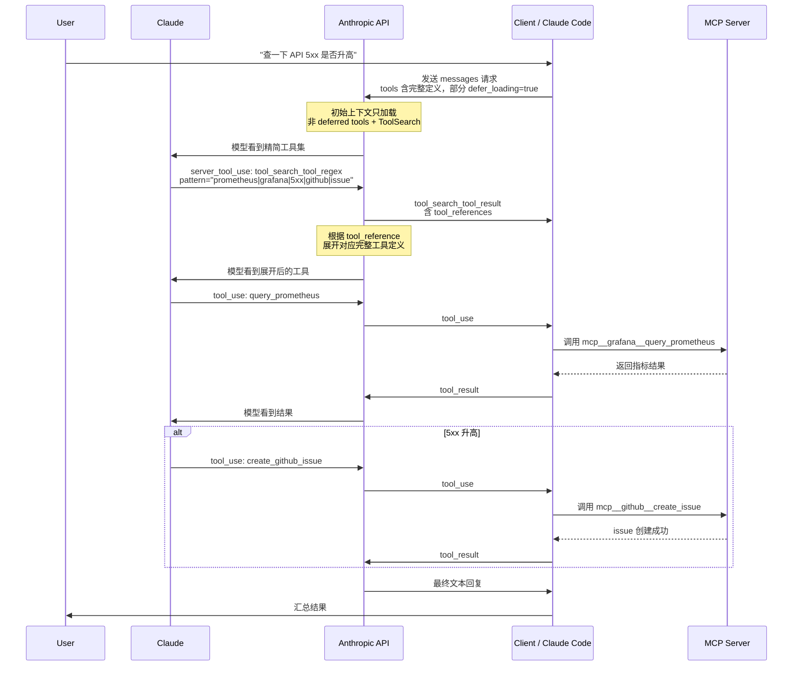

# Claude Tool Search 深度揭秘：当 AI 拥有 100 个工具时，它如何秒找目标？

## 一个真实场景

假设你正在用 Claude Code 处理一个线上问题。你的 `.mcp.json` 里接了七八个 MCP server：

- GitHub：管理仓库、issue、PR
- Slack：查消息、发通知
- Jira / Linear：看 ticket
- Sentry：看错误
- Grafana / Prometheus：查指标
- PagerDuty / OpsGenie：处理告警

每个 server 暴露十几个到几十个工具。加起来，你手里有 **100 多个** MCP 工具可用。

这时你说：

> “帮我查一下最近一小时 API 的 5xx 是否升高，如果升高就帮我建一个 GitHub issue。”

Claude 要怎么知道该调用哪些工具？

传统做法是：启动 session 时，把所有 100 多个工具的完整 schema 一次性塞进模型上下文。

这样确实简单，但代价明显：

- 工具描述本身吃掉大量 token。Anthropic 自己的估算里，50 个工具的定义可能占 10–20K tokens。
- 工具越多，模型选错的概率越高。业内普遍的观察是，超过 30–50 个工具后，选择准确率开始下降。
- 每个 round 都要背着这堆定义走，延迟和成本都会上升。

Claude 的解决方案是 **Tool Search**：不是一上来就把所有工具塞给模型，而是先只给一个“工具目录”，等任务明确后再按需搜索、按需加载。

这套机制最初由 Anthropic 在 **2025 年 11 月 24 日**以“Advanced Tool Use”名义发布（beta header：`advanced-tool-use-2025-11-20`），同期推出了 regex/BM25 工具搜索、延迟加载（`defer_loading`）和程序化工具调用。随后在 **2026 年 1 月**，Anthropic 把同样的能力扩展到 Claude Code 的 MCP 工具加载上——也就是现在常说的 MCP Tool Search。

它表面上是延迟加载，实际是把 Anthropic API、Claude Code 和 MCP 生态串在一起的一次系统性设计。下面把它一层层拆开。

---

## 核心概念地图

在进流程图之前，先对齐七个关键概念。它们分别属于两个层面：

| 层面 | 概念 | 作用 |
|---|---|---|
| **Anthropic Messages API** | `defer_loading` | 工具定义里的一个布尔字段。为 `true` 时，该工具的完整 schema 不会进入初始 system prompt。 |
| **Anthropic Messages API** | `server_tool_use` | 服务端发起的工具调用 block。Claude 用它调用内部的“工具搜索工具”。 |
| **Anthropic Messages API** | `tool_reference` | 工具引用/指针。搜索返回的不是完整 schema，而是一个引用。 |
| **Anthropic Messages API** | `tool_search_tool_result` | 工具搜索工具的返回 block，内部包含 `tool_references` 数组。 |
| **Claude Code** | `ENABLE_TOOL_SEARCH` | 控制是否启用 MCP Tool Search / 延迟加载的环境变量。 |
| **Claude Code** | `MCPSearch` | Claude Code 内部常用来指代 MCP 工具搜索的 server-side 工具名称；官方文档通常直接称 “tool search”。 |
| **Claude Code** | `alwaysLoad` | MCP server 配置项。设为 `true` 时，该 server 的所有工具跳过延迟加载。 |

一句话串起来：

> **API 层用 `defer_loading` 标记哪些工具可以延迟加载；Claude 用 `server_tool_use` 发起搜索，得到 `tool_reference`，API 再把它展开成完整工具定义；Claude Code 层用 `ENABLE_TOOL_SEARCH` 控制这套行为是否开启、何时开启。**

先讲 API 层，再看 Claude Code 怎么把它用起来。



---

## API 层：延迟加载与工具引用

### 没有 Tool Search 时，工具怎么出现

普通 Tool Use 的请求里，你会把所有可用工具放在 `tools` 参数里。比如：

```json
{
  "model": "claude-sonnet-4-7-20250601",
  "max_tokens": 4096,
  "tools": [
    {
      "name": "get_weather",
      "description": "Get current weather for a location",
      "input_schema": {
        "type": "object",
        "properties": {
          "location": { "type": "string" },
          "unit": { "type": "string", "enum": ["celsius", "fahrenheit"] }
        },
        "required": ["location"]
      }
    },
    {
      "name": "search_github_issues",
      "description": "Search GitHub issues by keyword and repository",
      "input_schema": { "...": "..." }
    }
  ],
  "messages": [{ "role": "user", "content": "What's the weather in SF?" }]
}
```

这些工具的完整 `description` 和 `input_schema` 都会进入模型上下文。工具少时没问题；工具一多，上下文窗口和模型选择压力同时变大。

### `defer_loading: true` 做了什么

Tool Search 机制下，你可以给工具加上 `defer_loading: true`：

```json
{
  "name": "search_github_issues",
  "description": "Search GitHub issues by keyword and repository",
  "input_schema": { "...": "..." },
  "defer_loading": true
}
```

官方文档的说法是：

> When `defer_loading` is set to `true`, a tool will not be included in the initial tool context. It will only be loaded when returned via `tool_reference` from a tool search.

注意两个关键点：

1. **`defer_loading` 控制的是“是否进入模型初始看到的工具上下文”**，不是“请求里是否发送这个工具定义”。你的 `tools` 数组里仍然要带上完整定义，否则 API 没法展开 `tool_reference`。
2. 只有被搜索返回的 `tool_reference` 引用时，这个工具的完整定义才会被临时加载进上下文。

### Claude 发起搜索：`server_tool_use`

当 Claude 判断自己需要某个工具、而该工具又被延迟加载时，它会发起一次工具搜索。这个调用不是普通的 `tool_use`，而是 `server_tool_use`——由 Anthropic 服务端发起并解释。

一个示例响应片段：

```json
{
  "role": "assistant",
  "content": [
    {
      "type": "text",
      "text": "I'll search for tools to help with the weather information."
    },
    {
      "type": "server_tool_use",
      "id": "srvtoolu_01ABC123",
      "name": "tool_search_tool_regex",
      "input": {
        "pattern": "weather"
      }
    }
  ],
  "stop_reason": "tool_use"
}
```

这里的 `tool_search_tool_regex` 是 Anthropic 提供的 server-side 工具名之一。在 `tools` 数组里注册时，官方 quick start 的写法是 `type` 用带日期后缀的版本化名称、`name` 用简写：

```json
{
  "type": "tool_search_tool_regex_20251119",
  "name": "tool_search_tool_regex"
}
```

本文示例统一在 `server_tool_use` 里用简写 `tool_search_tool_regex` 指代这个搜索工具，但实际注册时请使用官方文档推荐的版本化 `type`（如 `tool_search_tool_regex_20251119`）。

> ⚠️ **注意**：不要把 `server_tool_use` 当成你自己的 MCP tool 去返回 `tool_result`。服务端工具有自己的返回格式。

### 搜索返回：`tool_search_tool_result` + `tool_references`

搜索完成后，响应里会直接出现 `tool_search_tool_result` block（你不需要自己发 `tool_result` 去回应 `srvtoolu_...`）：

```json
{
  "type": "tool_search_tool_result",
  "tool_use_id": "srvtoolu_01ABC123",
  "content": {
    "type": "tool_search_tool_search_result",
    "tool_references": [
      { "type": "tool_reference", "tool_name": "get_weather" }
    ]
  }
}
```

关键点：

- 返回的是**引用**，不是完整 schema。
- 一个搜索默认最多返回 5 个 `tool_reference`。
- 这些 `tool_reference` 只有在请求中的 `tools` 数组里存在同名工具定义时，才会被 API 自动展开。
- 不要把 `server_tool_use` 当成普通 `tool_use` 去回传 `tool_result`，API 会拒绝。

### API 自动展开 `tool_reference`

这是最容易被误解的一步。很多开发者会以为客户端需要自己根据 `tool_reference` 去查表、展开 schema。但实际上，Anthropic API 会自动完成：

> `tool_reference` blocks are automatically expanded into full tool definitions by the API if all matching tool definitions are provided in the `tools` parameter.

也就是说，你的请求里必须仍然带上完整工具定义，但模型初始上下文里看不到它们；只有当 `tool_reference` 被返回后，它们才会被注入。官方文档还强调：这个展开动作在对话历史里也会保持，因此已被发现的工具在后续 turn 中可以继续使用，无需重新搜索——除非会话过长导致前面的消息被压缩、把已展开的工具挤出去了。

### 正式调用：`tool_use`

展开之后，Claude 就看到完整的工具 schema 了。接下来它发的是普通的 `tool_use`：

```json
{
  "type": "tool_use",
  "id": "toolu_01XYZ789",
  "name": "get_weather",
  "input": {
    "location": "San Francisco",
    "unit": "fahrenheit"
  }
}
```

这一步和传统的 Tool Use 完全一样。客户端执行工具后，把结果通过 `tool_result` 返回给模型。



---

## 完整 API 调用链路（流程图）



这个图里有几个容易被忽略的细节：

1. **客户端要始终携带完整工具定义**。虽然模型初始看不到 deferred 工具，但 API 需要它们来展开 `tool_reference`。
2. **搜索本身也是一次模型调用**。Claude 需要判断“我该搜索什么”，然后才能发起 `server_tool_use`。
3. **展开后的工具和 upfront 工具在后续上下文中地位相同**。模型可以像使用普通工具一样使用它们。

---

## 三个真实 query，看 Tool Search 怎么动

流程图讲清楚了抽象链路，但抽象链路不如具体例子好记。下面用三个真实 query，展示 Tool Search 在不同复杂度下的行为。

### 示例一：查天气（最小闭环）

**用户 query：**

> “旧金山现在多少度？”

**Claude 的判断：**

用户要天气信息。当前上下文里有一个 `get_weather` 工具，但它被标记为 `defer_loading: true`，完整 schema 还没加载。Claude 决定调用 Tool Search。

**`server_tool_use`：**

```json
{
  "type": "server_tool_use",
  "id": "srvtoolu_01Weather",
  "name": "tool_search_tool_regex",
  "input": {
    "pattern": "weather"
  }
}
```

**返回的 `tool_references`：**

```json
{
  "type": "tool_search_tool_result",
  "tool_use_id": "srvtoolu_01Weather",
  "content": {
    "type": "tool_search_tool_search_result",
    "tool_references": [
      { "type": "tool_reference", "tool_name": "get_weather" }
    ]
  }
}
```

**正式调用：**

```json
{
  "type": "tool_use",
  "id": "toolu_01GetSFWeather",
  "name": "get_weather",
  "input": {
    "location": "San Francisco",
    "unit": "celsius"
  }
}
```

**点评：** 这是最简单的一类场景。搜索只返回一个工具，调用一次就结束了。Tool Search 的意义在这里不明显——哪怕 upfront 加载，也不会多花多少 token。但它的价值在于**一致性**：无论工具多还是少，发现机制是一样的。

---

### 示例二：查 GitHub Actions 失败 + 相关 issue（多工具联合搜索）

**用户 query：**

> “帮我查一下 repo 里最近失败的 GitHub Actions，并看看有没有相关 issue。”

**Claude 的判断：**

这个任务需要两类能力：
- 查 GitHub Actions workflow runs
- 搜索 GitHub issues

但当前上下文里 GitHub 的几十个工具都被 defer 了。Claude 需要先搜 GitHub 相关工具。

**`server_tool_use`：**

```json
{
  "type": "server_tool_use",
  "id": "srvtoolu_01GitHubSearch",
  "name": "tool_search_tool_regex",
  "input": {
    "pattern": "github actions workflow run failed issue search"
  }
}
```

**返回的 `tool_references`：**

```json
{
  "type": "tool_search_tool_result",
  "tool_use_id": "srvtoolu_01GitHubSearch",
  "content": {
    "type": "tool_search_tool_search_result",
    "tool_references": [
      { "type": "tool_reference", "tool_name": "mcp__github__list_workflow_runs" },
      { "type": "tool_reference", "tool_name": "mcp__github__get_workflow_run_logs" },
      { "type": "tool_reference", "tool_name": "mcp__github__search_issues" }
    ]
  }
}
```

**正式调用链：**

```text
1. mcp__github__list_workflow_runs
   → 拿到最近失败的 workflow run IDs

2. mcp__github__get_workflow_run_logs
   → 读取失败日志，提取关键错误信息

3. mcp__github__search_issues
   → 用错误关键词搜索是否已有相关 issue
```

**点评：** 这个例子展示了 Tool Search 的**多工具联合发现**。Claude 不是只找一个工具，而是根据任务描述一次性召回一组相关工具，然后在它们之间编排调用顺序。如果没有 Tool Search，这十几个 GitHub 工具的定义会常驻上下文，增加模型选择负担。

---

### 示例三：查 API 5xx 并创建 issue（条件分支）

**用户 query：**

> “帮我查一下线上 API 最近 1 小时 5xx 是否升高，如果升高就帮我建一个 GitHub issue。”

**Claude 的判断：**

这个任务跨了两个 server：
- Grafana / Prometheus：查指标
- GitHub：可能创建 issue

两个 server 的工具都被 defer 了，需要搜索。

**`server_tool_use`：**

```json
{
  "type": "server_tool_use",
  "id": "srvtoolu_01SRESearch",
  "name": "tool_search_tool_regex",
  "input": {
    "pattern": "query prometheus grafana metrics 5xx errors create github issue"
  }
}
```

**返回的 `tool_references`：**

```json
{
  "type": "tool_search_tool_result",
  "tool_use_id": "srvtoolu_01SRESearch",
  "content": {
    "type": "tool_search_tool_search_result",
    "tool_references": [
      { "type": "tool_reference", "tool_name": "mcp__grafana__query_prometheus" },
      { "type": "tool_reference", "tool_name": "mcp__github__create_issue" }
    ]
  }
}
```

**调用过程：**

```text
1. mcp__grafana__query_prometheus
   input:
     query: sum(rate(http_requests_total{status=~"5.."}[5m]))
     range: 1h

2. [条件判断]
   IF 5xx 率显著升高:
     → mcp__github__create_issue
   ELSE:
     → 直接告诉用户“没有明显升高”
```

**正式创建 issue 的调用：**

```json
{
  "type": "tool_use",
  "id": "toolu_01CreateIssue",
  "name": "mcp__github__create_issue",
  "input": {
    "repo": "your-org/api-service",
    "title": "API 5xx rate increased in the last hour",
    "body": "Prometheus query shows 5xx rate rose from 0.1% to 2.3% between 10:00 and 11:00 UTC."
  }
}
```

**点评：** 这个例子最能说明 Tool Search 的价值。用户的一句话同时涉及监控和代码仓库两个领域，而 Claude 的工具上下文里可能挂着 Slack、Jira、Sentry、PagerDuty 等几十个无关工具。Tool Search 让 Claude 只加载 Prometheus 查询和 GitHub issue 创建这两个工具，**把“大海捞针”变成“按图索骥”**。

---

### 三个示例的对比

| 示例 | 复杂度 | 搜索返回工具数 | 关键能力 |
|---|---|---|---|
| 查天气 | 低 | 1 | 最小闭环，展示基本流程 |
| GitHub Actions + issue | 中 | 3 | 多工具联合发现与编排 |
| 5xx 监控 + 自动建 issue | 高 | 2 | 跨领域、带条件分支的按需发现 |

这三个例子也解释了为什么 Tool Search 对 **coding agent / SRE agent** 特别重要：这类 agent 的工具集天然跨多个系统，而且每次任务只用到其中很小一部分。upfront 加载所有工具既不经济，也不准确。

---

## Claude Code 层：ENABLE_TOOL_SEARCH 与 MCP 工具搜索

API 层的机制是“能力”，但“是否启用”和“何时启用”由 Claude Code 自己控制。

这里的关键是 `ENABLE_TOOL_SEARCH` 环境变量。Claude Code 内部也常用 `MCPSearch` 来指代这个 MCP 工具搜索能力，但官方文档通常直接称 “tool search”。

### `ENABLE_TOOL_SEARCH` 的几种模式

根据 Claude Code Agent SDK 官方文档，这个环境变量支持以下值：

| 值 | 行为 |
|---|---|
| 未设置 | 默认开启。在官方 endpoint 上延迟加载生效；在 Google Cloud Agent Platform 或第三方代理上回退为 upfront 加载。 |
| `true` | 始终启用。即使走 Google Cloud 或代理也强制发送 beta header；不兼容时会直接报错。 |
| `false` | 禁用 Tool Search，所有工具 upfront 加载。 |
| `auto` | 阈值模式：所有工具定义的总 token 数超过模型上下文窗口的 10% 时启用延迟加载。 |
| `auto:N` | 自定义阈值，例如 `auto:5` 表示超过 5% 就启用。 |

一个常用的启动方式：

```bash
ENABLE_TOOL_SEARCH=auto:5 claude
```

也可以在 `~/.claude/settings.json` 里持久化：

```json
{
  "env": {
    "ENABLE_TOOL_SEARCH": "auto:5"
  }
}
```

### 默认行为

根据 Claude Code Agent SDK 官方文档：

> Tool search is enabled by default.
>
> Tool search is disabled by default on Google Cloud's Agent Platform, where it is supported for Claude Sonnet 4.5 and later and Claude Opus 4.5 and later. It is also disabled when ANTHROPIC_BASE_URL points to a non-first-party host, since most proxies do not forward tool_reference blocks.

这意味着：**普通用户在官方 endpoint 上不需要手动设置**，Claude Code 已经默认开启延迟加载（等价于始终 on，不是 threshold-based 的 `auto`）。只有当你想改成阈值触发，或想强制开启/关闭时，才需要显式设置。常见场景包括：

1. 你想强制始终启用或始终禁用。
2. 你想用 `auto` 或 `auto:N` 按阈值触发。
3. 你走了第三方代理，需要显式控制行为。

### 用 `ENABLE_TOOL_SEARCH=false` 完全关闭

如果你不想用 Tool Search，最可靠的方式是把环境变量设为 `"false"`：

```bash
ENABLE_TOOL_SEARCH=false claude
```

这会让所有工具 upfront 加载。工具少的时候反而更快，因为省掉了一次搜索 round-trip。

一些较旧的 Claude Code 版本或社区配置里也能看到把 `MCPSearch` 加入 `disallowedTools` 的做法，但官方 Agent SDK 文档现在推荐的控制入口是 `ENABLE_TOOL_SEARCH`。

### `alwaysLoad`：哪些工具不该被 defer

根据 Claude Code 官方 “What's New” Week 18 更新：

> MCP servers can opt out of tool-search deferral with `alwaysLoad: true` in their config so all of that server’s tools are always available.

示例：

```json
{
  "mcpServers": {
    "my-essential-tools": {
      "type": "stdio",
      "command": "npx",
      "args": ["-y", "@myorg/essential-mcp"],
      "alwaysLoad": true
    }
  }
}
```

这个设计很合理：常用的、每次会话几乎必用的工具，没必要为了省 token 而多一次搜索。但 `alwaysLoad` 用多了会抵消 Tool Search 的收益，所以应该只给少量高频工具开。

### 走第三方代理时要小心

这是一个实践中很容易踩的坑。如果你的 Claude Code 配置了：

```bash
export ANTHROPIC_BASE_URL=https://your-proxy.example.com
```

那么请求和响应会经过 one-api、LiteLLM、公司网关之类的代理。问题是，很多代理只认识常见的 block 类型：

- `text`
- `tool_use`
- `tool_result`
- `image`

但不认识 `server_tool_use`、`tool_search_tool_result`、`tool_reference`。于是可能出现：

- 代理校验失败：unknown content block type
- 代理把 unknown block 丢弃
- 转换为 OpenAI 格式时无法表达
-  Claude 下一轮上下文断裂

Claude Code 官方环境变量说明里也提到：当 `ANTHROPIC_BASE_URL` 指向非官方 host 时，MCP Tool Search 默认禁用；如果你确认代理会转发 `tool_reference`，才应该显式设 `ENABLE_TOOL_SEARCH=true`。

这也解释了为什么 cc-switch 这类配置工具会提供“启用 Tool Search”开关：它在底层就是帮你设置 `ENABLE_TOOL_SEARCH`。用官方 endpoint 时保持开启即可；接入非 Anthropic 官方 endpoint 时，关掉它能避免因为后端不认识 `tool_reference` 等字段而报错。这个开关的本质，是让你在“更省上下文”和“更兼容”之间做一个选择。

---

## 工具描述怎么写，才更容易被搜到

Tool Search 的 ranking 细节 Anthropic 没有公开，但文档和社区观察都指向一个简单原则：**工具名和描述越具体、越包含任务关键词，越容易被搜到。**

### 反例：模糊描述

```json
{
  "name": "mcp__github__tool1",
  "description": "Does GitHub stuff",
  "input_schema": { "...": "..." }
}
```

这种描述搜 “issue”“PR”“workflow” 都很难命中。

### 正例：具体描述

```json
{
  "name": "mcp__github__create_issue",
  "description": "Create a new issue in a GitHub repository. Use this when the user wants to report a bug, request a feature, or track a task. Requires owner/repo, title, and optional body/labels/assignees.",
  "input_schema": {
    "type": "object",
    "properties": {
      "owner": { "type": "string", "description": "Repository owner" },
      "repo": { "type": "string", "description": "Repository name" },
      "title": { "type": "string", "description": "Issue title" },
      "body": { "type": "string", "description": "Issue body in Markdown" },
      "labels": { "type": "array", "items": { "type": "string" } }
    },
    "required": ["owner", "repo", "title"]
  }
}
```

### 给开发者的 5 条描述建议

1. **描述里包含触发场景**。不要只说“创建 issue”，要说“当用户想报告 bug、请求功能或跟踪任务时使用”。
2. **工具名带领域 + 动作**。例如 `github_create_issue` 优于 `create_issue`。
3. **`input_schema` 的字段也要写 description**。搜索可能不仅看顶层描述，也会看字段描述。
4. **避免过度抽象**。一个工具只做一件事，不要做一个“万能 GitHub 工具”。
5. **常用工具设 `alwaysLoad: true`**。高频工具不值得每次都搜索。

---

## Claude Tool Search vs OpenAI Codex / Agents SDK：同一条路，不同走法

一个常见的误解是：Tool Search 是 Claude 独有的能力，OpenAI 还停留在“静态声明 + 全量加载”。这个判断已经过时了。

实际上，**OpenAI Codex CLI 和 OpenAI Agents SDK 也在走 deferred tool loading + 运行时搜索这条路**。双方解决的问题相同——工具 schema 膨胀到上下文装不下——但协议层和实现层不同。

| 维度 | Claude Tool Search | OpenAI Codex CLI / Agents SDK |
|---|---|---|
| **延迟加载字段** | `defer_loading: true` | `defer_loading: true`（同名） |
| **搜索工具** | `tool_search_tool_regex_20251119` / `tool_search_tool_bm25_20251119` | `tool_search`（Responses API）/ `ToolSearchTool()` |
| **搜索实现** | Anthropic Messages API server-side tool | Codex CLI 内置 BM25 搜索；Agents SDK 提供 `ToolSearchTool` |
| **协议层特殊 block** | `server_tool_use`、`tool_reference`、`tool_search_tool_result` | 走 Responses API / function calling 体系，无直接等价 block |
| **上下文注入位置** | API 自动展开 `tool_reference` | 延迟加载的 schema 注入到上下文末尾，以保留 prompt cache |
| **工具组织** | MCP server + `alwaysLoad` | `tool_namespace` |
| **开发者控制** | `ENABLE_TOOL_SEARCH`、`disallowedTools`、`alwaysLoad` | `defer_loading`、`tool_namespace`、`ToolSearchTool()` |

### 以 Codex CLI 为例

从 OpenAI Codex CLI 的源码可以看到，它内部有：

- `mcp_tool_exposure.rs`：决定哪些 MCP 工具直接暴露，哪些延迟暴露
- `tool_search`：在需要时搜索并暴露延迟的 MCP 工具
- `ToolSearchInfo`：用 BM25 索引工具名和描述，和 Claude 的 `tool_search_tool_bm25` 思路相近

也就是说，Codex CLI 面对大量 MCP 工具时，也不会一次性把所有 schema 塞进上下文，而是先保留一个搜索索引，等任务明确后再加载相关工具。

### 以 OpenAI Agents SDK 为例

Agents SDK 提供了 `ToolSearchTool()` 和 `@function_tool(defer_loading=True)`：

```python
from agents import Agent, Runner, ToolSearchTool, function_tool, tool_namespace

@function_tool(defer_loading=True)
def get_customer_profile(customer_id: str) -> str:
    """Fetch a CRM customer profile."""
    return f"profile for {customer_id}"

crm_tools = tool_namespace(
    name="crm",
    description="CRM tools for customer lookups.",
    tools=[get_customer_profile],
)

agent = Agent(
    name="Operations assistant",
    tools=[*crm_tools, ToolSearchTool()],
)
```

这个模式和 Claude 的 `defer_loading` + Tool Search 几乎同构：先声明一组工具但不让它们进入上下文，再配一个搜索工具负责按需发现。

### 真正的差异不在“有没有”，而在“怎么做”

Claude 的选择是把 Tool Search 下沉到 **Messages API 协议层**：用 `server_tool_use`、`tool_reference` 等特殊 block 表达搜索和引用，让第三方客户端和代理必须显式支持这些 block。

OpenAI 的选择则更多放在 **SDK / 框架层**：`tool_search` 是 Responses API 或 Agents SDK 的能力，底层仍然依赖 function calling，没有引入新的 Messages API block 类型。

这个差异会带来实际影响：

- **Claude 的方案更“协议化”**。一旦代理支持 `tool_reference`，不同客户端可以有一致的行为；但不支持的代理会直接崩溃或丢 block。
- **OpenAI 的方案更“框架化”**。对现有 function calling 基础设施的侵入性更小，但不同 SDK 版本、不同模型之间的行为一致性需要框架保证。

所以更准确的结论不是“Claude 有，OpenAI 没有”，而是：

> **当工具数量超过模型上下文能舒适承载的范围时，“延迟加载 + 运行时搜索”正在成为行业共识。Claude 和 OpenAI 都在做这件事，只是 Claude 把它做成了 API 协议层的新 block，而 OpenAI 把它做成了 SDK / Responses API 层的能力。**

这对开发者的意义是：不管你用 Claude 还是 OpenAI，写好工具名和描述、合理设置延迟加载、控制高频工具 upfront 加载，都会变得越来越重要。

---

## Tool Search 是更大趋势的一部分

工具层的 deferred loading 不是终点。把它往上拔一层，会发现 agent 架构正在经历同一个转向：**上下文管理从“全量预加载”走向“按需索引”**。

一个对应的例子是 **Skills 的渐进式加载**（progressive skill loading）。很多 agent 框架——无论是 OpenAI Agents SDK、Claude 的 agent 能力，还是各种自研 orchestrator——都会面临一个类似问题：当 agent 拥有几十个甚至上百个 skills 时，每个 skill 的 system prompt、examples、专属 tools 如果一次性塞进上下文，token 开销和模型选择压力都会变得不可接受。

| 维度 | Claude Tool Search | Skills 渐进式加载 |
|---|---|---|
| **解决什么问题** | 工具 schema 太多，塞爆上下文 | skill instruction / examples 太多，塞爆上下文 |
| **延迟加载的对象** | function tool / MCP tool 的完整定义 | skill 的 system prompt、tools、examples |
| **发现机制** | 基于用户 query 的语义/关键词搜索 | 通常基于意图识别 + skill registry 匹配 |
| **触发时机** | 运行时，由模型发起搜索 | 运行时或会话启动时，由 router / orchestrator 决定 |
| **生态定位** | Anthropic Messages API / Claude Code / MCP 层 | 更高层，通常是 agent framework 自己实现 |
| **标准化程度** | 有统一的 `tool_reference` / `defer_loading` 语义 | 各框架实现不一，尚无统一协议 |

用一个具体场景来理解：假设你做了一个通用 AI assistant，内置了 50 个 skills——写代码、订机票、查论文、生成图片、写邮件、做 PPT……如果 upfront 加载所有 skill 的 instructions 和 examples，上下文很快就会被 prompt templates 占满。渐进式加载的做法是：先识别用户意图（“这看起来是编程任务”），然后只加载 coding skill 的完整 instruction 和专属工具。

这和 Claude Tool Search 的逻辑几乎同构：

- **Tool Search**：用户 query → 工具搜索 → 只加载相关 tool schema
- **Skills 渐进加载**：用户 query → 意图路由 → 只加载相关 skill context

两者都是在说同一件事：

> **当 agent 的能力规模超过模型上下文能舒适承载的范围时，我们必须把能力组织成“索引”，而不是把能力本身全部塞进“内存”。**

Tool Search 是这套理念在**工具层**的一个具体实现。它验证了“按需发现”在真实 API 层可行。而 OpenAI Agents SDK 的 `ToolSearchTool` 和 Codex CLI 的 `tool_search` 则说明，即使在工具层，这条路上的玩家也不只有 Anthropic。再往上一层看，skills、agents、memory 的渐进加载几乎是必然会出现的对应物。

当然，这里有一个边界需要保留：Anthropic 目前并没有公开一套叫做“Claude Skills”的渐进加载协议。上面的对比更多是在说“这是同一个架构理念的延伸”，而不是断言 Anthropic 一定会把 Tool Search 机制直接套用到 skills 层。

---

## 真实边界与已知问题

Tool Search 不是银弹。

写作时必须保留它的真实边界，否则会变成软文。

### HTTP / Streamable HTTP MCP 工具可能不被 defer

GitHub issue [#40314](https://github.com/anthropics/claude-code/issues/40314) 报告：stdio MCP 工具可以被正确延迟加载，但 HTTP/Streamable HTTP MCP 工具会被完整 upfront 加载。

一个用户报告称，通过 LiteLLM MCP gateway 暴露约 250 个工具时，上下文被占用 120K tokens（200K 窗口的 60%）。Issue 状态为 **closed as not planned**。

这意味着：如果你的 MCP 架构是“一个 HTTP gateway 聚合大量上游工具”，Tool Search 的收益可能会大打折扣。

### Haiku 标题生成模型可能阻塞 MCP 加载

Issue [#44290](https://github.com/anthropics/claude-code/issues/44290) 提到：Claude Code 内部会用 Haiku 模型生成会话标题，而 Haiku 不支持 `tool_reference`。如果 Claude Code 在能力检查阶段误判，可能会阻塞所有自定义 MCP 工具的加载，无论主模型是什么或 `ENABLE_TOOL_SEARCH` 如何设置。

这是一个边界 bug，说明工具延迟加载的“能力检查”环节还很脆弱。

### `auto` 阈值在 1M 上下文下的副作用

Issue [#39279](https://github.com/anthropics/claude-code/issues/39279) 指出：`auto` 模式的 10% 阈值会随上下文窗口缩放。在 1M token 上下文的模型上，50K 的工具集可能只占 5%，于是永远不会触发延迟加载。

这导致了一个反直觉的结果：**上下文越大，Tool Search 反而越难自动开启。**

### 代理兼容性

前面已经提过。如果你的 `ANTHROPIC_BASE_URL` 不是官方 endpoint，务必确认代理支持转发 `tool_reference`、`server_tool_use`、`tool_search_tool_result` 这些 block。

---

## 对开发者的建议

基于以上机制，给实际使用 Claude Tool Search 的开发者一些可操作建议：

1. **不要默认关闭 Tool Search**。除非你的工具很少（<10 个）或有明确的代理兼容问题，否则让 auto mode 自己决定。
2. **写好工具描述和 schema**。这是你能控制的、影响搜索命中率的最直接因素。
3. **给高频工具开 `alwaysLoad: true`**。但不要给所有工具开。
4. **如果你是 MCP gateway 的维护者，注意 HTTP transport 的 defer 限制**。如果上游 issue 长期不解决，可能需要考虑把大量工具拆成多个 stdio server 或优化 schema 体积。
5. **走代理时做端到端测试**。确认 `tool_reference` 能正常流转，而不是被静默丢弃。
6. **监控 context 占用**。用 `/context` 或类似命令观察工具描述占了多少 token，判断 auto 阈值是否合理。

---

## 回到开头的问题

现在再看那个场景：

> “帮我查一下最近一小时 API 的 5xx 是否升高，如果升高就帮我建一个 GitHub issue。”

Claude Code 的处理方式大致是：

1. 启动时只加载工具目录和少量高频工具，Grafana、GitHub 等大量工具的完整 schema 被 defer。
2. 根据你的 prompt，Claude 判断需要 Prometheus 查询和 GitHub issue 创建能力。
3. Claude Code 的 tool search 触发 `server_tool_use: tool_search_tool_regex`，返回 `mcp__grafana__query_prometheus` 和 `mcp__github__create_issue` 的 `tool_reference`。
4. API 自动展开这两个工具的完整定义。
5. Claude 先查 Prometheus，发现 5xx 升高，再创建 GitHub issue。
6. 整个过程里，其他 100 多个工具从未进入模型上下文。

这就是 Tool Search 的核心价值：

> **把 agent 的工具上下文从“仓库”变成“索引”。**

仓库模式要求你提前列好清单；索引模式允许你只描述需求，由系统按需取货。对于 MCP 生态这种正在快速膨胀的工具集来说，这种架构差异可能是决定性的。

---

## 还没公开的边界与下一步

Tool Search 仍有不少未公开或未解决的细节：

- **Ranking 算法**：Anthropic 没有公开工具搜索的排序信号。名称、描述、使用频率、用户反馈各占多少权重，都是黑盒。
- **`tool_search_tool_regex` vs 其他搜索策略**：官方示例主要展示 `regex` 搜索，社区实现里也见过 `bm25` 和带日期后缀的变体。Anthropic 没有公开完整策略矩阵。
- **多轮对话中的工具缓存**：被展开的工具是会话级常驻，还是每次调用都重新展开？这对长会话的上下文管理很重要。
- **MCP server instructions 的角色**：Claude Code 启动时会加载 server instructions，这些 instructions 如何与 Tool Search 配合，目前文档不多。

这些不是文章的缺点，而是这个领域还在快速演进的证据。后续有更新时，可以再补一章。

---

## 参考来源

- Anthropic platform docs: [Tool Search Tool](https://platform.claude.com/docs/en/agents-and-tools/tool-use/tool-search-tool)
- Anthropic API docs (beta): `BetaToolSearchToolSearchResultBlockParam`, `Beta Server Tool Use Block`, `defer_loading` parameter
- Claude Code Agent SDK docs: tool search default behavior, `ENABLE_TOOL_SEARCH`, `alwaysLoad`
- Claude Code "What's New" Week 18 (April 27 – May 1, 2026): `alwaysLoad` option
- OpenAI Codex CLI source: `codex-rs/tools/src/tool_search.rs`, `codex-rs/core/src/tools/handlers/tool_search.rs`, `mcp_tool_exposure.rs`
- OpenAI Agents SDK docs: `ToolSearchTool`, `@function_tool(defer_loading=True)`, `tool_namespace`
- OpenAI API docs: Function calling, Responses API tool search
- GitHub `anthropics/claude-code` issues: [#40314](https://github.com/anthropics/claude-code/issues/40314), [#44290](https://github.com/anthropics/claude-code/issues/44290), [#39279](https://github.com/anthropics/claude-code/issues/39279), [#41472](https://github.com/anthropics/claude-code/issues/41472), [#18397](https://github.com/anthropics/claude-code/issues/18397), [#19890](https://github.com/anthropics/claude-code/issues/19890)
- GitHub `openai/codex` issue: [#21301](https://github.com/openai/codex/issues/21301) (deferred MCP tool exposure)
- Unified.to blog: [Scaling MCP Tools with Anthropic's (& OpenAI's) Defer Loading](https://unified.to/blog/scaling_mcp_tools_with_anthropic_and_openai_defer_loading)
- Anthropic engineering blog: [Introducing advanced tool use on the Claude Developer Platform](https://www.anthropic.com/engineering/advanced-tool-use)
- Gist: [Claude Code CLI Environment Variables](https://gist.github.com/unkn0wncode/f87295d055dd0f0e8082358a0b5cc467)
- ClaudeLog: [Claude Code Configuration Guide](https://www.claudelog.com/configuration/)

---

*Last updated: 2026-07-08*
