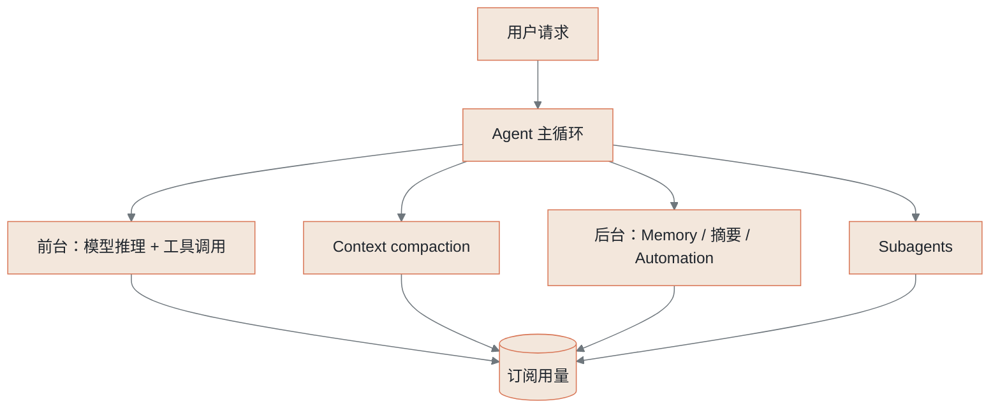
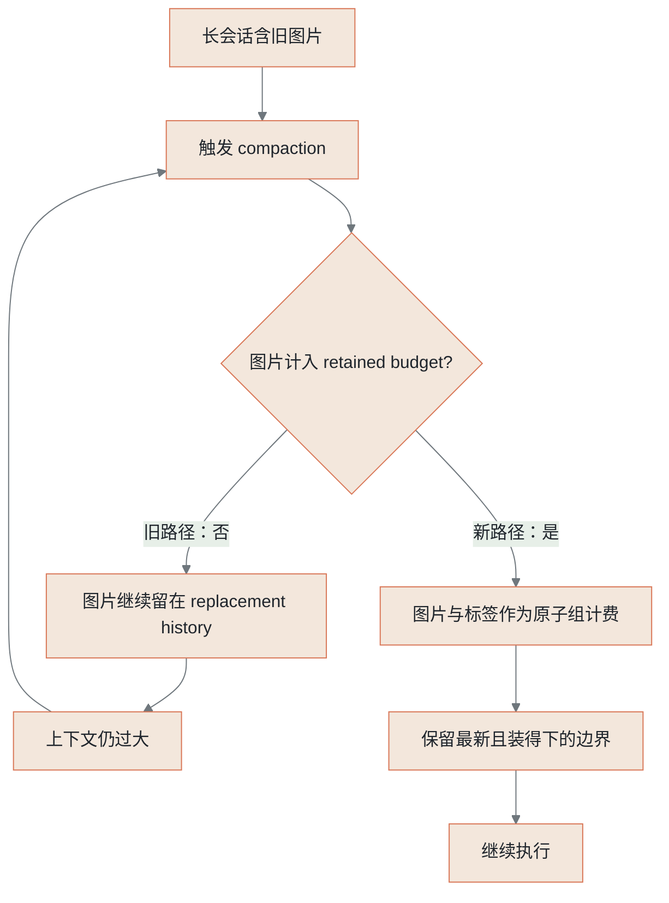
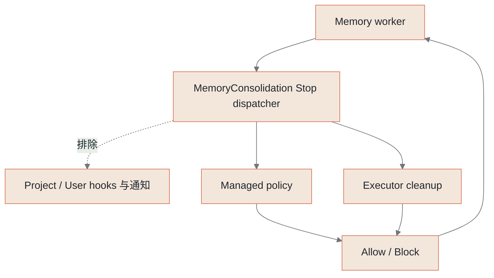
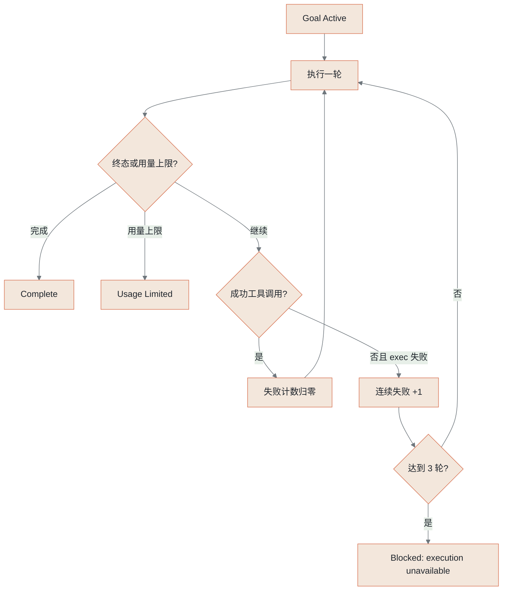
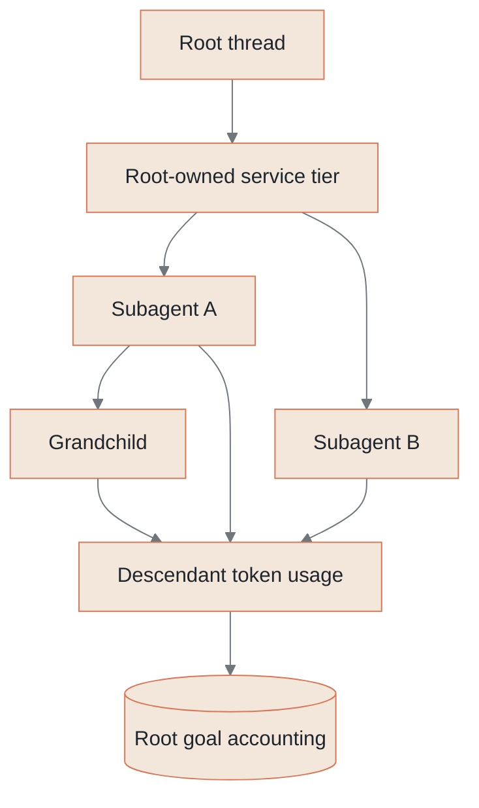
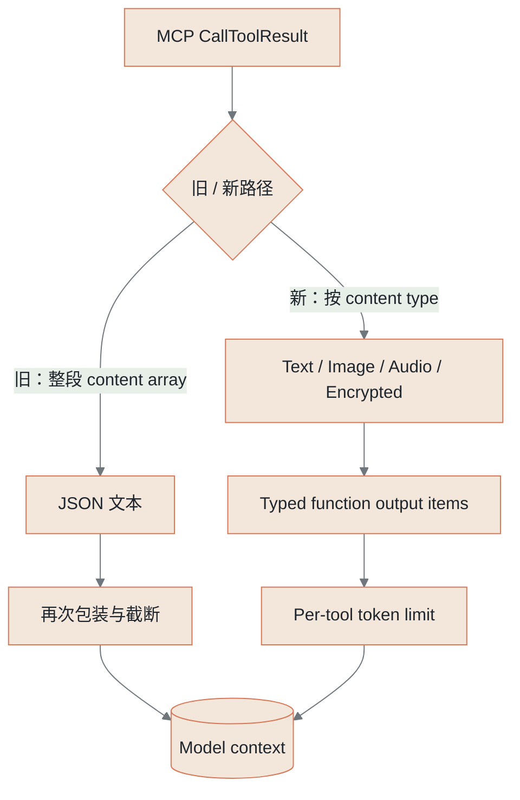

# Tibo 再次“赛博回血”：这次 Reset 不是庆祝，而是 Codex Harness 大修后的回执

2026 年 8 月 30 日，Tibo 又一次给 Codex 用户“赛博回血”。

https://x.com/thsottiaux/status/2093801758665715784


Codex 刚刚迎来用户数创新高。看到 Tibo 再次宣布全量 Reset，很多人的第一反应自然是：这又是一轮庆祝里程碑的用户福利。

但 Tibo 对这次 Reset 给出的解释，并不是庆祝。

他说，Codex 工程团队连续处理了数千份报告，找出并修复了一批长期存在的异常消耗。根据使用方式不同，同一份 Codex 用量现在预计可以多支撑 **10%～50%**。在公布修复的同时，OpenAI 为所有 Codex 和 ChatGPT Work 付费用户重置了用量。

因此，这次“赛博回血”更像一张工程回执：前台是订阅用量重新回满，后台则是 Codex Harness 经历了一轮涉及上下文、Memory、长程任务、多 Agent 与工具协议的系统性大修。

这也让本次 Reset 同时拥有两层意义：对订阅用户，它是修复异常消耗后的用量回馈；对 Agent 开发者，它公开了一组真实生产系统里的 failure modes。

> 为了让 Codex 额度更耐用，OpenAI 到底优化了哪些 Agent 工程环节？这些修复，对我们设计自己的 Agent 应用有什么可以直接借鉴的意义？

Tibo 列出的八个问题——Compaction、Memory、Goals、Automations、Subagents、Computer History、Rolling Summaries 和 MCP——恰好覆盖了 Agent 开发最常见、也最难做稳的基础设施：context engineering、长期记忆、后台 worker、任务状态机、多 Agent 编排、增量摘要和工具协议。

Codex 修的并不是几项无关紧要的产品边角，而是一套 Agent runtime 如何管理上下文、生命周期、成本归属和后台工作的系统工程。


这篇文章会以 Tibo 的解释为线索，结合 OpenAI 官方文档、Codex 当前开源源码、相关提交和回归测试，拆解这次 Reset 背后的工程优化。重点不是计算 OpenAI “送了多少”，而是把 Codex 的经验翻译成我们可以复用的 Agent 设计原则。

## 一、这次“赛博回血”，为什么不是普通庆祝

过去讨论 Coding Agent 的额度，容易落入两个简单答案：要么是模型太贵，要么是平台给得太少。这次修复揭开了第三层原因——Agent runtime 自己也会浪费用量。

前台模型没有变，用户任务也没有变，但只要后台多做了几轮无效工作，同一份订阅就会明显变得“不耐用”。反过来，堵住这些泄漏，即使名义额度没有增加，用户实际能完成的工作也会增长。

更关键的是，这八项修复几乎可以直接映射到我们自己的 Agent 技术栈：

| Codex 修复项 | Agent 应用里的通用技术问题 |
| --- | --- |
| Compaction | Context engineering、多模态预算与压缩边界 |
| Memory | 后台 worker、hook scope 与生命周期隔离 |
| Goals | 长程任务状态机、终止条件与 bounded retry |
| Automations | Scheduler、幂等、去重与恢复 |
| Subagents | 多 Agent 路由、层级策略与成本归集 |
| Computer History | 增量处理、滑动窗口与 processed frontier |
| Rolling summaries | 后台摘要的触发、debounce 与 stale-result rejection |
| MCP | Tool result 的 typed representation 与输出预算 |

从这个角度看，这次 Reset 更像一份难得的 Agent 工程事故复盘：OpenAI 把生产环境中最容易藏住成本的几个角落，一次性摊在了桌面上。

### 一次用户请求背后，其实是一张 cost graph

聊天产品留下了一个很顽固的错觉：一条用户消息大致对应一次模型回答，因此“用量”似乎只取决于输入长度、输出长度和模型大小。

Agent 改变了这个对应关系。

用户只说了一句“帮我修复这个 Bug”，runtime 可能先读取项目指令，检索 memory，调用模型制定计划，执行命令，收集工具结果，再让模型判断下一步。上下文变长后，它会触发 compaction；任务复杂时，它会 spawn 子 Agent；会话离开前台后，产品可能生成标题、摘要或历史笔记；Goal 模式还可能在当前 turn 结束后主动续跑。



这张图里，真正受用户直接控制的通常只有最左边。剩下的分支由 harness、runtime、产品功能和模型共同决定。

这也是为什么 Agent 用量治理比 API token 计费更难。API 调用至少有明确的 caller、request ID 和 usage 字段；一个成熟 Agent 产品还要回答下面这些问题：

- 这次后台请求是谁触发的，服务哪个用户动作？
- 它应该计入当前 turn、整个 Goal，还是产品自身的维护成本？
- 父任务选择了普通模式，子 Agent 能不能自己切到 Fast？
- 工具结果进入日志、UI、Code Mode 和下一轮模型上下文时，分别需要多大的表示？
- 后台 worker 被 Stop hook 拒绝时，是应该继续、重试、报错，还是静默退出？
- 任务已经达成目标后，谁负责让 continuation 真正停止？

只要其中一个答案模糊，系统就会出现“技术上每一次调用都合法，但整体上没有人想要这些调用”的状态。

如果把一次任务的总成本写成一个粗略公式，它更接近：

```text
Task Cost
= foreground turns
+ tool-result replay
+ compaction
+ memory / title / recap
+ automation runs
+ descendant agents
+ retries and recovery
```

这个公式没有假装不同模型、缓存和 service tier 可以直接相加。它想说明的是另一件事：订阅产品的计量单位虽然对用户表现为一个百分比，runtime 内部却必须保留多维 attribution。否则，foreground turn 的优化会掩盖 background fan-out 的增长；模型单次调用便宜了，任务总成本仍可能上升。

还要看到 Agent 成本的乘法效应。假设一个普通 turn 后面多出一次只占主请求 1% 的摘要调用，单次看几乎可以忽略；如果它发生在所有普通 turns、所有活跃用户上，就是稳定的系统税。相反，一个只影响不到 1% 用户的 memory 无限循环，平均值可能不显眼，却能在长尾里烧掉整周额度。因此，平均 token/turn 远远不够，必须同时看 feature fan-out 和用户分位数。


## 二、本次 Codex 到底优化了什么：八项 Agent 工程修复

Tibo 的清单并不是八个孤立的小 Bug。它从模型上下文一路延伸到 memory worker、长程 Goal、自动化调度、子 Agent、计算机历史、后台摘要和 MCP，几乎横跨了一套 Agent runtime 的完整执行链。

下面把八项优化集中放在一个章节里。每一项都回答三个问题：旧路径为什么浪费用量，Codex 公开源码能验证到哪一步，以及这个修复解决了什么 Agent 工程边界。

按 Tibo 在 X 上的说明，本次排查最终收敛为八项优化：

| 优化项 | 发现的问题 | Tibo 披露的影响 | 处理结果 |
| --- | --- | --- | --- |
| Compaction | 压缩后仍保留旧图片，导致上下文再次变大并重复触发 compaction | 重度图片用户修复后用量约下降 10% | 已修复 |
| Memory | 后台 memory worker 继承 Stop hooks，被阻止结束后继续运行 | 影响少于 1% 用户；极端 thread 检查能否停止 15000 次 | 已修复 |
| Goals | Goal 已完成仍继续，或反复重试损坏的工具 | 个别案例消耗每周额度的 15%～70% | 已修复 |
| Automations | 某些自定义 schedule 实际运行频率高于配置 | 未披露统一比例 | 已修复 |
| Subagents | 小模型未经要求选择更强 helper；普通模式的 root 请求 Fast 子 Agent | 未披露统一比例 | 已修复 |
| Computer History | 重复总结相互重叠的 activity | 个别案例约消耗每周额度的五分之一 | 已修复 |
| Rolling Summaries | 普通 turn 也触发额外后台摘要请求 | 累计约增加 1% token 用量 | 已禁用旧路径 |
| MCP | Tool result 被编码两次；工具说明截断后再次获取 | 未披露统一比例 | 已修复 |

Tibo 还提到，团队补充了防回归架构和告警，并在开发应用内的用量归因，让用户能够直接看到额度花在了哪里。

这张表只整理 Tibo 的公开说明。后面的八个小节会继续区分：哪些修复能在当前 Codex 开源源码中直接验证，哪些只能看到相邻机制，哪些仍属于未开源的产品或服务端边界。

### 阅读说明：先把证据边界画清楚

这次事件有四类证据，不能混为一谈。

第一类是 [Tibo 的原帖](https://x.com/thsottiaux/status/2093801758665715784)。八类问题、10%～50% 的整体改善、图片重度用户约 10%、Goal 个案消耗 15%～70%、Computer History 个案约占一周用量五分之一、memory worker 检查 15000 次，都来自这条帖子。它是 OpenAI 产品负责人的直接披露，但没有公开生产 trace 和统计口径。

第二类是 [OpenAI 官方 compaction 文档](https://developers.openai.com/api/docs/guides/latest-model?model=gpt-5.2)。官方把 compaction 描述为针对长会话的 loss-aware compression，返回可供后续请求继续使用的 opaque items；API 返回里还包含 compaction 自身的 token usage。官方建议在工具密集阶段的里程碑进行压缩，而不是每个 turn 都压一次。这个原则正好说明：compaction 本身也不是免费的。

第三类是开源源码。本文固定分析 `/Users/eriklee/code/coding-agent/codex` 的 `main@88f776588f5e73467e7659c268f8358a9a2378b6`。在 Tibo 发帖前后，仓库出现了 retained-image budgeting、memory Stop hook 隔离、Goal execution failure 熔断、root service tier 传播、MCP typed content 等提交。它们能证明客户端 runtime 如何处理这些边界，但不能证明同一套代码已经部署到全部 ChatGPT Work 和 Codex 产品表面。

第四类是社区报告。例如 [#24388](https://github.com/openai/codex/issues/24388) 记录了历史图片进入 compacted replacement history 后，下一次 compaction 自己先超出 context window 的循环；[#34095](https://github.com/openai/codex/issues/34095) 则记录了一次长任务经历 24 次 compaction 后，仍不断回到相似的“最后步骤”。这些报告很具体，能帮助理解 failure mode，但它们仍是个案，不是生产总体数据。

因此，后文统一使用四个标签：

| 标签 | 含义 |
| --- | --- |
| 源码确认 | 公告描述、当前代码、提交说明与测试可以直接对齐 |
| 相邻实现 | 代码能证明一个相关机制，但不能证明它就是生产事故的完整修复 |
| 未开源边界 | 只能确认产品现象或协议边界，当前仓库没有实际实现 |
| 工程推断 | 从已确认事实中提炼的通用设计原则，不冒充 OpenAI 官方结论 |

### 1. Compaction：压缩完，怎么又要压一次

> **证据等级：源码确认。** 对应 [#40280](https://github.com/openai/codex/pull/40280)、[#40994](https://github.com/openai/codex/pull/40994) 和 backport [#41003](https://github.com/openai/codex/pull/41003)。生产环境约 10% 的改善数字只来自 Tibo。

长任务迟早会碰到 context window。最直觉的解决方案是把早期历史压成摘要，再保留最近几轮原始内容：前者保住长期语义，后者保住当前操作边界。

问题出在“最近几轮原始内容”不一定只有文字。

一张截图通常以图片 URL、data URL 或 provider content item 的形式进入历史。旧实现如果只给文字计费，却原样保留图片，就会得到一份账面上很小、实际上仍然很重的 replacement history。下一轮请求发现上下文依旧接近上限，于是再次触发 compaction。压缩器像一个搬家的人，每次都认真把旧报纸扔掉，却把最占地方的几只大衣柜原样搬进新房。

当前源码在 [`compact_remote_v2_images.rs`](https://github.com/openai/codex/blob/88f776588f5e73467e7659c268f8358a9a2378b6/codex-rs/core/src/compact_remote_v2_images.rs) 里明确给不同 content item 计费。下面保留核心 `match` 分支，省略错误转换的外围代码：

```rust
match item {
    ContentItem::InputText { text } | ContentItem::OutputText { text } =>
        approx_token_count(text),
    ContentItem::InputImage { image_url, detail } =>
        approx_tokens_from_byte_count_i64(
            estimate_image_bytes(image_url, *detail)
        ),
    ContentItem::InputAudio { .. } => 0,
}
```

这里并不是精确计算图片会消耗多少模型 token，而是给 retained history 一个足够保守、可比较的预算单位。更关键的逻辑在后面：图片与它前后的 harness 标签被视为一个原子组。

如果历史里是：

```text
<local_image path="screenshot.png">
[InputImage]
</image>
```

runtime 不会只保留图片、丢掉路径标签，也不会留下标签却丢掉图片。整个组要么装得进剩余预算，要么一起被舍弃。文字仍然可以在边界处截断，图片不能被切成半张。

外层的 [`truncate_retained_messages`](https://github.com/openai/codex/blob/88f776588f5e73467e7659c268f8358a9a2378b6/codex-rs/core/src/compact_remote_v2.rs#L589) 从最新 history group 向旧 group 迭代。这里有个看似保守的决定：如果当前边界含图片，却连这个图片组都装不下，代码把剩余预算直接归零，不再用更旧、更便宜的纯文本回填。

为什么不把空位利用起来？

因为 compaction 不是普通的信息检索。它需要保存一个连续的执行前沿。丢掉最新边界里的重内容，却捡回更早的零散文本，可能让模型得到一个 token 数量合格、时间顺序却失真的上下文。预算利用率高了，任务连续性反而更差。

对应回归测试把这个边界写得很具体。`image_only_boundary_is_atomic_and_does_not_backfill_older_messages` 构造了“旧文本—图片—最新文本”三组历史：预算够时保留图片和最新文本；只够最新边界时丢掉图片；图片放不下时绝不把旧文本捡回来。另一个测试验证图片开标签、图片、闭标签、后续文本、音频和 metadata annotation 在截断后仍然对齐。

这些测试很像 context engineering 里容易缺失的一类 property：大家常测“压缩后 token 变少了”，却不测“语义边界是否仍然原子”“被丢弃的重内容会不会让更旧内容倒灌”“metadata 是否仍与 content item 一一对应”。压缩算法如果只优化长度，不验证时间边界和关联关系，就会把 context window 变成一个语义上损坏的数据结构。



这项修复带来的工程启示，不是简单的“压缩时记得删图片”。

真正的原则是：**任何能进入模型上下文的 modality，都必须进入同一份 context budget。** 如果 text、image、audio、tool output 分别由不同模块估算，又有某类内容在压缩边界上被当作免费，就迟早会产生预算套利。

### 2. Memory：后台 worker 为什么一直问“我能下班了吗”

> **证据等级：源码确认。** 对应 [#40587](https://github.com/openai/codex/pull/40587)。15000 次检查是 Tibo 披露的极端样本，不是代码中的固定循环次数。

Codex 的 memory 不是在用户每次发消息时，简单把全文追加到一个文件里。当前仓库的 memory pipeline 分成独立阶段：先从 rollout 提取候选记忆，再由后台 consolidation agent 整理为长期可用的 memory artifacts。

这意味着 memory consolidation 是一个内部任务。它有自己的输入、工作目录、权限和终止条件。问题是，内部任务仍然跑在通用 Agent runtime 上，很容易“继承太多”。

Stop hook 的原始语义通常是：模型说自己做完了以后，先问一组外部检查器能不能停。项目可以要求测试必须通过，用户可以要求某个文件必须存在，插件也可以在停止前做清理。如果检查器返回“不能停”，Agent 会继续一轮，修复问题后再问。

这套机制用在前台任务上很有价值。memory worker 如果把项目级 Stop hook 也继承进来，问题就来了。

一个负责整理历史记忆的后台 agent，可能被要求证明当前代码仓库的产品任务已经完成；它没有这个上下文，也未必有相应工具，于是不断尝试结束，又不断被拒绝。单次后台请求很小，循环足够久以后就成了用量黑洞。

修复没有粗暴关闭所有 hook，而是新增了一个明确的生命周期类型：

```rust
pub enum StopHookTarget {
    Stop,
    /// Internal memory work runs policy and executor hooks,
    /// not project completion checks.
    MemoryConsolidation,
    SubagentStop { /* ... */ },
}
```

在 [`StopHookTarget::select_handlers`](https://github.com/openai/codex/blob/88f776588f5e73467e7659c268f8358a9a2378b6/codex-rs/hooks/src/events/stop.rs#L68) 中，MemoryConsolidation 会排除来自 `User`、`Project`、`SessionFlags` 和 `Plugin` 的 handlers；来自 System、MDM、CloudRequirements 等 managed source 的策略仍然保留，executor-scoped cleanup 也会执行。



这个取舍很漂亮。它没有把“内部任务”误解为“不受治理的任务”，而是把治理拆成三层：

- **安全与组织策略**仍然有效；
- **executor cleanup** 仍然必须执行；
- **用户任务的完成检查与通知**不属于 memory worker。

PR 的测试还覆盖了一个容易漏掉的失败路径：managed hook 如果拒绝 memory consolidation，后台 agent 不能把拒绝当作普通 continuation 一直跑下去，而要以错误结束；与此同时 executor cleanup 仍要执行。也就是说，`block` 对前台任务和内部 worker 的语义不同。前台任务被 block 后可以把原因交给模型继续处理，后台 maintenance job 被组织策略 block 后更安全的选择是停止、记录失败、交给调度层按 backoff 决定何时再试。

通知同样需要隔离。memory consolidation 如果沿用普通 completion notification，用户会收到一个自己从未发起的“任务完成”提示；更糟糕的是，通知插件本身还可能触发外部调用。修复显式关闭 legacy completion notification，说明 background work 的副作用不仅是 token，还包括所有挂在生命周期事件上的 downstream effects。

Agent 工程里常见的错误，是让后台任务直接复制前台 session 的全部环境。短期看省了配置，长期看等于把身份、权限、hook、通知和终止条件绑成一个不可分割的包。一个健康的 runtime 应该继承 policy，而不是继承所有 lifecycle behavior。

### 3. Goals：自主执行不能靠模型“自己觉得差不多了”

> **证据等级：源码确认。** 对应 [#41454](https://github.com/openai/codex/pull/41454)、[#40628](https://github.com/openai/codex/pull/40628)、[#41562](https://github.com/openai/codex/pull/41562) 和 [#41183](https://github.com/openai/codex/pull/41183)。15%～70% 的个案用量来自 Tibo。

普通聊天 turn 有天然终点：模型输出 final，runtime 就停下来等用户。Goal 改变了这个节奏。一个持久目标在当前 turn 结束后仍然可以触发 continuation，让 Agent 继续推进，直到完成、被阻塞、达到用量限制或用户停止。

这时，“模型说完成了”和“runtime 进入 terminal state”必须是两件不同的事。

如果目标已经完成，状态却仍是 Active，continuation 会再发一轮。如果执行宿主坏了，模型不断重试同一个工具，却没有 circuit breaker，用量会沿着一条没有进展的路径持续累积。更麻烦的是，单轮看来每一次重试都可能合理：也许只是临时错误，再试一次就好。系统性问题只有在跨 turn 观察时才出现。

当前 `GoalAccountingState` 同时跟踪成功工具、失败执行和连续失败 turn。下面是收紧变量名后的语义摘录，完整错误分支以源码为准：

```rust
match outcome {
    ToolCallOutcome::Completed { success: true } => {
        turn.successful_tool = true;
        consecutive_execution_failure_turns = 0;
    }
    ToolCallOutcome::Failed { handler_executed: true }
        if tool_name.name == "exec" => {
            turn.failed_execution = true;
        }
    _ => {}
}
```

turn 结束时，只有满足下面三个条件才会增加失败计数：

1. 当前 turn 属于一个 active goal；
2. 没有任何成功工具调用；
3. 默认 namespace 的 `exec` 确实进入 handler 后失败。

相同 goal 连续三轮命中后，`execution_failure_goal` 返回 goal ID，runtime 以 `ExecutionUnavailable` 把它置为 `Blocked`。换了新 goal，计数不会继承；任意成功工具调用也会清零。



为什么是三轮，不是一次？代码没有宣称这是普适最优值，但它体现了 bounded retry 的基本方法：允许短暂故障恢复，同时把“继续相信下一次会成功”的次数变成 runtime 可执行的政策，而不是模型的临场乐观。

另一项容易被忽略的改动，是 [#41183](https://github.com/openai/codex/pull/41183) 把 descendant token usage 计入 root goal。没有这条规则时，根线程可以看起来预算健康，同时把真正昂贵的工作委派给子 Agent。预算只约束父进程，不约束进程树，和容器只统计 init process 的资源而忽略所有 child process 一样，数字很漂亮，机器还是会被吃满。

Goal 的工程本质不是“让模型更自主”，而是给自主执行增加一个 durable control plane：目标、状态、预算、终止条件、阻塞原因和 continuation 都必须由 runtime 持有。

这个 control plane 还有两处细节值得展开。

第一，progress accounting 使用 per-thread semaphore，把“读取 token/time delta—写入持久状态—标记已记账”串行化。没有这个临界区，两个并发 tool-completion hook 可能同时读取同一份未结算 delta，然后各自写一次，造成双重计费；也可能一方先更新 baseline，另一方把一段 usage 永久漏掉。用量治理并不是等模型返回一个 `usage` 字段就结束，它和金融账本一样需要原子结算边界。

第二，停止 active goal 时会同时校验 expected goal ID。用户可能在最后一个失败 turn 与 stop hook 之间替换目标；如果 runtime 只看“当前有个 goal”，旧 turn 的 failure 就会把新目标误置为 Blocked。`ExecutionUnavailable { expected_goal_id }` 把失败归因绑定到原目标，避免异步结束事件污染后来状态。Goal lineage 的意义就在这里：continuation、usage 与 terminal event 都必须知道自己属于哪一代目标。

### 4. Automations：能看到 schedule，看不到 scheduler

> **证据等级：未开源边界。** Tibo 说某些 custom schedules 实际执行得比配置更频繁；当前仓库没有足够代码解释根因。

Codex 开源仓库公开了 scheduled task 的协议形状：Hourly、Daily、Weekdays 和 Weekly，也公开了 `InAppLocalAutomation` feature gate、automation thread source 与注入模型上下文的 automation info。

这些代码证明客户端和 app-server 能描述、识别和承载 automation，却没有展示真正负责“下一次什么时候触发”的产品 scheduler。我们看不到它怎样解析自定义 recurrence、怎样处理时区、错过的运行、重启恢复或重复投递，也就不能从开源代码推断这次“运行过频”究竟是 RRULE 展开、timer 恢复还是幂等性出了问题。

能确定的工程原则只有一条：**计划任务的正确性不能靠 prompt 保证。** 触发时间、dedup key、last-fired watermark、租约和幂等性必须是 scheduler 的持久状态。否则，一个“每天一次”的自然语言意图，很容易在设备重启、网络恢复或多实例并发时变成多次。

### 5. Subagents：子任务可以选能力，不能私自改用户的成本档位

> **证据等级：部分源码确认。** root service tier 的传播可以直接验证；小模型选择更强 helper 的完整策略没有在同一个公开提交里出现。

Tibo 披露了两个相近问题：Luna 等较小模型有时会在用户没有明确要求时选择更强的 helper；根模型没有运行在 `/fast`，却可能要求子 Agent 使用 `/fast`。

当前 [#41308](https://github.com/openai/codex/pull/41308) 对第二个问题给出了非常清晰的所有权规则：service tier 由 root thread 持有，并共享给整棵 Agent tree。

```rust
pub(crate) fn root_service_tier(&self) -> Option<String> {
    self.root_service_tier.load_full().map(|tier| (*tier).clone())
}

pub(crate) fn set_root_service_tier(&self, tier: Option<String>) {
    self.root_service_tier.store(tier.map(Arc::new));
}
```

V2 的 spawn 参数不再暴露 per-spawn `service_tier`，role config 里的 tier override 也被移除。root 在运行中切换 tier 后，已经存在的子 Agent、未来 spawn 的子 Agent以及它们发起的 remote compaction 都使用新的 root tier，同时不去重写 child-owned settings snapshot。

“不重写 child-owned snapshot”并不是多余的洁癖。子 Agent 可能有自己的 model、reasoning、cwd、权限与 role 配置；把根策略同步实现成整份 config 覆盖，可能顺手破坏这些合法差异。当前实现把 root service tier 放在共享的 control state 中，请求发出前再解析有效值。这样既能让在线更新立即生效，又不必修改每个 child 的持久配置。

回归测试覆盖了 active child、idle child、未来 child、被 evict 后重新加载的 child 和 remote compaction。这个测试面说明 service tier 被视为 request routing policy，而不是 spawn-time decoration：只在创建子 Agent 时复制一次还不够，任何后续模型请求都必须重新服从根策略。



这里需要区分两个维度：

- 子任务需要什么 **model / reasoning effort**，属于能力匹配；
- 请求走 default 还是 Fast/Priority **service tier**，属于用户选择的成本与延迟政策。

前者可以委派，后者应该继承。让子 Agent 自己升级 service tier，等于允许库函数在调用者不知情的情况下改用昂贵基础设施。

### 6. Computer History：重叠历史被反复总结

> **证据等级：未开源边界。** Computer History 的生产实现不在当前仓库，不能从开源代码推断最终去重算法。

Computer History 很容易被低估，因为它并不发生在用户正在盯着 Agent 干活的时候。

Computer History 的价值在于把用户在应用、网页或电脑上的近期活动带入任务上下文。问题是“历史”天然存在重叠：10:00～10:10 的窗口和 10:05～10:15 的窗口共享一半内容。如果系统每次都把窗口当作全新材料总结，同一段活动会在采集、摘要、再摘要中被重复处理。

Tibo 说旧实现会反复总结重叠 activity，某些个案一周消耗接近总用量的五分之一。当前开源仓库没有 Computer History 的采集 cursor、窗口去重或摘要代码，因此我们不能声称 OpenAI 最终采用了 event ID、时间水位线还是内容 hash。能确认的 failure mode 是：**增量系统如果没有稳定的 processed frontier，就会把滑动窗口误当作新数据。**

### 7. Rolling summaries：普通 turn 后面多跑了一次模型

> **证据等级：未开源边界 + 相邻实现。** 旧 rolling task summaries 的生产实现不在当前仓库；TUI recap 是相邻机制，不能直接画等号。

rolling task summaries 则是另一种“善意的后台工作”。给任务生成短摘要，可以让用户在侧边栏快速知道发生了什么，也能帮助重新进入长任务。Tibo 说普通 turns 错误触发了额外后台请求，累计约增加 1% token，用量虽小却普遍；旧功能已经被禁用。

当前源码恰好存在一个独立的 TUI recap pipeline。不能证明它就是被禁用功能的替代品，但它展示了避免“每轮都总结”的几个控制点：

- 至少有 3 个 completed turns；
- 距离上次 recap 至少新增 2 个 turns；
- 线程失焦且最后一轮完成后等待 3 分钟；
- 最多读取最近 8 个 user turns；
- 用 `turn_revision` 丢弃过期请求；
- 同时只允许一个 in-flight recap；回到前台会取消自动请求。

它还把 recap 放进 temporary structured thread，而不是污染原任务 history；输出用 schema 限制为最多 320 个字符，prompt 只取约 900 bytes 的近期对话。请求开始与返回时都会核对 `completed_turn_count` 和 `turn_revision`：在 recap 生成期间如果用户又完成了一轮，旧结果不会被当成最新摘要写回。

这是一种典型的 optimistic background job：允许在不锁住主线程的情况下工作，但提交结果前验证读到的版本仍然有效。缺少最后这一步，后台摘要不仅浪费 token，还可能把过时状态展示给用户，促使下一次任务从错误的“当前进度”继续。

这里的关键不是 3、2、3 分钟这些具体数字，而是 recap 有了自己的触发状态机。它不再是“某个普通 turn 顺手再发一次模型请求”，而是一个具备 eligibility、debounce、single-flight 和 stale-result rejection 的后台工作单元。

这类功能的成本应该由产品显式选择：要么作为系统体验成本由平台承担，要么在用量面板中单独展示。最糟糕的状态，是它既不在用户的任务计划里，也不在用户可见的用量归因里。

### 8. MCP：同一份工具结果为什么会变胖两次

> **证据等级：部分源码确认。** typed content 与 per-tool output limit 可以直接验证；“工具说明被截断后重新获取”的完整生产路径没有在同一组提交中公开。

MCP `CallToolResult` 不是一段普通字符串。它可以同时包含 text、image、audio、resource link、embedded resource、structured content 和 metadata。

最简单的实现方式，是把 `content` 整个 JSON array 序列化成字符串，塞进 function-call output。这个做法看似通用，却会制造两类浪费：

1. text 本来已经是 text，又被包进 JSON 字符串；引号、反斜杠和字段名都会占上下文；
2. image/audio 等有原生 content item 的数据失去类型，后续还要重新识别或再次包装。

[#40737](https://github.com/openai/codex/pull/40737) 把这条路径改成 typed conversion。当前 `CallToolResult::as_function_call_output_payload` 先把每个 MCP content 转成 `FunctionCallOutputContentItem`：普通文本变成 `InputText`，图片变成带 detail 的 `InputImage`，音频变成 `InputAudio`，加密内容保留专用类型。只有 `structured_content` 确实存在且非 null 时，才把那个结构化对象序列化为文本。下面的代码删去了实际实现中的错误返回分支，只展示表示选择：

```rust
let content_items = convert_mcp_content_to_items(&self.content);

if let Some(structured) = &self.structured_content
    && !structured.is_null()
{
    return FunctionCallOutputBody::Text(
        serde_json::to_string(structured)?
    );
}

FunctionCallOutputBody::ContentItems(content_items)
```

[#41421](https://github.com/openai/codex/pull/41421) 又增加了 per-tool output token limit。MCP 原始结果仍可供 Code Mode 和扩展处理；进入下一轮模型 history 的表示则应用独立预算，并保留约 20% 的 serialization allowance。

为什么需要额外的 serialization allowance？因为工具输出在内存中的文字长度，与它进入 Responses payload 后的长度并不相同。引号、转义字符、content item wrapper 和字段名都会增加传输体积。如果先把纯文本精确截到模型预算上限，再包成 JSON，请求仍可能超预算。当前路径把 allowance 放在上下文投影层，而不是提前破坏 raw result，保持了“完整事实”和“模型可见表示”的边界。

per-tool limit 也比一个全局 truncation policy 更合理。`git diff`、测试日志、数据库查询和图片分析工具的有效输出结构不同：有的需要保留头尾，有的需要完整 JSON，有的返回少量文字和一张大图。统一上限会让轻量工具浪费预算、重型工具又不够用；工具级设置允许 runtime 根据 contract 限制最坏情况。



这个改动对应一个非常实用的 Agent 设计原则：**日志表示、程序表示和模型上下文表示不是同一个东西。**

日志需要可审计，Code Mode 需要完整结构，UI 需要可展示，下一轮模型只需要在 token budget 内保留决策相关内容。为了省事把同一份大字符串广播给所有消费者，最终不会真的省事，只会把成本推迟到更难观察的地方。

## 三、Codex 的优化方法，对我们设计 Agent 有什么启发

逐项修 Bug 只能解决眼前事故。真正可以复用的，是 Codex 在这些修复里体现出来的方法：先把八个表象归纳为稳定的 runtime failure，再用 ownership、lifecycle、budget、typed representation 和 observability 去建立边界。

### 方法一：把八个 Bug 归纳为四类 runtime failure

#### 1. 上下文膨胀

- Compaction 没有正确给旧图片计费；
- Computer History 反复处理重叠活动；
- rolling summaries 给普通 turns 增加额外请求。

共同特征是：系统不断把已经处理过或用户没有再次请求的信息送回模型。

#### 2. 生命周期失控

- Memory worker 继承了不属于自己的 Stop hooks；
- Goal 完成后继续，或在执行宿主失败时不断重试。

共同特征是：一个工作单元已经没有合理进展路径，却没有进入 terminal state。

#### 3. 编排与路由失配

- Automations 的实际触发频率高于配置；
- Subagent 越过根任务选择更贵模型或 service tier。

共同特征是：用户在根任务上表达的时间与成本意图，没有被整棵执行树忠实继承。

#### 4. 表示重复

- MCP result 被重复编码；
- 工具说明截断后又重新获取。

共同特征是：同一份信息在不同边界被反复序列化、裁剪和恢复。

这四类 failure 在任何 Agent 产品里都可能出现。它们不依赖 Codex，也不依赖某个模型。模型越能长时间自主工作，问题反而越明显：一次小泄漏乘以几百个 turns、几十个后台任务和一棵子 Agent 树，就会变成产品级成本事故。

### 方法二：把修复沉淀为六条 Agent 工程原则


#### 原则一：每一枚 token 都要有 owner

不要只记录 provider 返回的总 usage。至少要能回答它属于哪个 user action、turn、goal、background feature 和 agent lineage。

如果一个 token 只能归因到“这个 thread”，定位异常时仍然太粗。Goal descendant accounting 就是在把子进程的成本重新归到根目标。

#### 原则二：每一个后台 worker 都要有独立 lifecycle

后台任务可以复用 Agent loop，但不能复制前台 session 的全部行为。它需要独立的权限、hook scope、通知策略、retry budget、lease 和 terminal state。

MemoryConsolidation 的价值，不只是一条 if 分支，而是 runtime 终于承认“内部维护任务”和“用户任务”不是同一种 session。

#### 原则三：所有 retry 都必须有预算和进展判定

最大重试次数只是最初级的保护。更好的 circuit breaker 还要观察：是否出现过成功工具、错误是否属于同一 execution host、目标是否已经变化、外部状态是否可能恢复。

连续三轮 execution failure 的规则比“任何失败都停”更稳，也比“让模型自己判断还要不要试”更可控。

#### 原则四：层级系统的成本政策由根节点拥有

子 Agent 可以根据任务选择能力，却不能自行升级用户的成本档位。模型、reasoning、service tier、并发数和 token budget 要分别定义继承规则。

最危险的配置不是“没有默认值”，而是父子层都能写同一个值，优先级又不清楚。

#### 原则五：一种事实只保留一个 canonical representation

MCP content 应先有 typed representation，再按消费者投影为日志、UI、Code Mode 或模型上下文。不要先把所有东西变成字符串，再在下游重新猜类型。

同样的原则也适用于 Computer History：原始事件、处理水位线、摘要和展示文本应该是不同层，不要拿摘要反复生成摘要。

#### 原则六：后台成本必须进入可观测性与回归报警

只看用户主动请求的 p50 延迟，几乎发现不了这类问题。需要观察：

- 每个 feature 的 background request count；
- 每个 user action 的 fan-out ratio；
- 每次 compaction 前后的 context reduction；
- 每个 goal 的 continuation count 与 no-progress turns；
- root/descendant usage 比例；
- 工具结果进入模型前后的字节数与 token 数；
- 自动摘要、标题和 memory 的用户分位数，尤其是 p95/p99 长尾。

Tibo 说 OpenAI 已经做了架构调整，并会在这些问题再次发生时触发 paging。对 Agent 系统来说，这比“修了几个 Bug”更重要：成本异常终于被当作 runtime correctness，而不只是财务报表上的波动。

### 把方法落成一份 Agent runtime cost checklist

如果你正在搭建自己的 Agent 系统，可以用下面这份清单做一次审计。

#### Context

- text、image、audio、tool output 是否进入统一预算？
- compaction 是否记录输入、输出、压缩比和再次触发间隔？
- retained tail 是否以完整 tool-call/result group 或消息边界为单位？
- 压缩失败时是否保留原历史，而不是进入半成功状态？

#### Background jobs

- 每类 worker 是否有独立 session source 与 lifecycle？
- 是否只继承必要 policy，而不是复制所有用户/项目 hooks？
- 是否有 lease、heartbeat、retry backoff、single-flight 和 stale-result rejection？
- 通知和用量是否能归因到具体 feature？

#### Goals and loops

- “模型说完成”与“runtime terminal state”是否分离？
- 是否有 no-progress 检测、retry budget 和 execution circuit breaker？
- continuation 是否携带稳定的 goal ID、turn lineage 和预算？
- 子 Agent 的时间与 token 是否进入根目标？

#### Delegation and routing

- model、reasoning effort、service tier、并发和预算分别由谁拥有？
- 子 Agent 是否能越过 root policy？
- root policy 在线更新后，存量 child、未来 child 和 compaction 是否一致？

#### Tools and representations

- 工具结果是否有 typed canonical form？
- 日志、UI、Code Mode、model context 是否分别投影？
- 每个工具是否能设置独立输出预算？
- 截断是否发生一次，并保留错误尾部、结构化字段与媒体类型？

#### Observability

- 能否按 feature、turn、goal 和 agent lineage 查询 usage？
- 是否监控后台请求的 p95/p99，而不只看平均值？
- 是否对重复 compaction、重复 summary、连续失败 continuation 和 tier drift 报警？

## 四、为什么这些修复等于让订阅额度大幅“增容”

所谓“额度耐用度”，不是账户页面上那个名义数字，而是同一份额度最终能换来多少有效工程进展。

可以把它理解成一个很朴素的关系：

```text
有效工作量 = 名义额度 - 无效后台消耗 - 重复上下文 - 失控重试
```

OpenAI 这次没有简单把名义额度统一提高 10%～50%。它减少的是公式右边那些本不该发生的消耗。浪费越多的使用模式，修复后释放出的有效工作量越大；原本就很少触发这些路径的用户，变化自然更接近区间低端。

举一个纯粹用于说明机制的例子：一份名义额度是 100 的订阅，如果过去有 20 被重复 compaction、后台摘要和失控重试消耗，真正推进任务的只有 80；修复后无效消耗降到 5，有效工作量就从 80 变成 95。额度数字没变，可交付工作量却增加了 18.75%。

Goal 无限 continuation、Computer History 重复摘要这类长尾问题，命中时的浪费远高于日常 1% 的后台请求；图片较少、任务较短的用户又几乎不会命中。因此，Tibo 给出的是 10%～50% 的区间，而不是统一提额比例。这个区间反映的正是不同 Agent workflow 对这些基础设施的依赖程度。

### 10%～50% 对不同用户意味着什么

10%～50% 不是统一扩容，也不是每个账户都获得同样比例的额度。

从 Tibo 披露的影响面看，可以做出有限但有用的判断：

- 主要进行短文本任务、很少使用图片、Goal、Automation、Computer History 和多 Agent 的用户，改善可能更接近区间低端；
- 经常贴截图、做 UI/Computer Use、让任务经历多次 compaction 的用户，更可能感受到 retained-image 修复；
- 重度使用 Goal、长期自主运行或遇到 execution host 故障的用户，避免一次失控循环就可能省下远高于日常优化的用量；
- 经常 spawn 子 Agent 或使用 Fast/Priority 的用户，会受益于更一致的 tier 继承与用量归集；
- MCP 工具多、返回内容复杂或输出很大的工作流，会从 typed content 和 per-tool budget 中获得更稳定的上下文。

这些是基于机制的场景判断，不是用户级效果承诺。真正的提升仍然取决于模型、任务长度、工具调用、缓存命中、产品表面与部署进度。

更值得期待的是 Tibo 提到的另一个方向：直接在应用里展示用量去了哪里。Agent 产品如果只能告诉用户“本周还剩 37%”，却不能说明有多少来自前台任务、compaction、子 Agent、memory 和 automation，用户就只能靠体感猜测系统是否偷偷变贵。

透明的 attribution 不只是客服功能。它会迫使 runtime 为每一类后台工作建立 owner，也会让产品团队更早发现“一项没人主动请求的小功能，正在所有普通 turns 后面多跑一次模型”。

## 结语：这次 Reset，是一份 Agent 工程优化回执


这次 Codex 更新有一个很好的反直觉之处：产品没有改变用户看到的任务，也没有要求模型突然变得更聪明，却可能让同一份订阅多完成 10%～50% 的工作。

省下来的并不是某个神奇压缩算法凭空创造的算力，而是原本不该发生的调用：不该留下的旧图片、不该继承的 Stop hook、不该继续的 Goal、不该升级的子 Agent、不该重复的摘要和编码。

在传统后端系统里，我们很早就接受了一个事实：线程泄漏、重试风暴、重复投递和资源记账错误都属于 correctness bug。Agent runtime 只是把同一类问题换成了 context、tool call、background model request 和 token budget。

模型能力决定 Agent 能走多远；runtime 的边界决定它会不会在路上把油漏光。

---

## 参考资料

- Tibo Sottiaux：[Codex usage limits update，2026-08-29](https://x.com/thsottiaux/status/2093801758665715784)
- OpenAI Docs：[GPT-5.2 compaction guidance](https://developers.openai.com/api/docs/guides/latest-model?model=gpt-5.2)
- OpenAI API Reference：[Compact a response](https://developers.openai.com/api/reference/java/resources/responses/methods/compact)
- OpenAI Codex PRs：[#40280](https://github.com/openai/codex/pull/40280)、[#40587](https://github.com/openai/codex/pull/40587)、[#41454](https://github.com/openai/codex/pull/41454)、[#41183](https://github.com/openai/codex/pull/41183)、[#41308](https://github.com/openai/codex/pull/41308)、[#40705](https://github.com/openai/codex/pull/40705)、[#40737](https://github.com/openai/codex/pull/40737)、[#41421](https://github.com/openai/codex/pull/41421)
- Community reports：[#24388](https://github.com/openai/codex/issues/24388)、[#34095](https://github.com/openai/codex/issues/34095)、[#41220](https://github.com/openai/codex/issues/41220)
