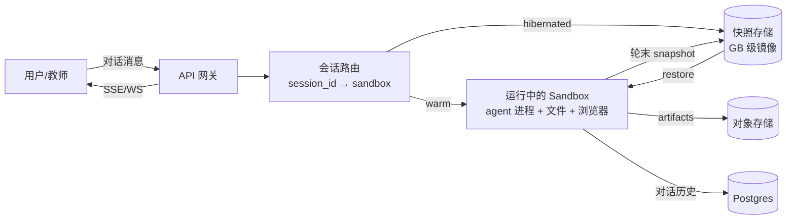
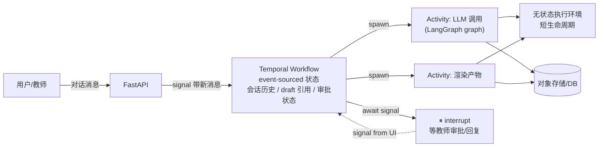
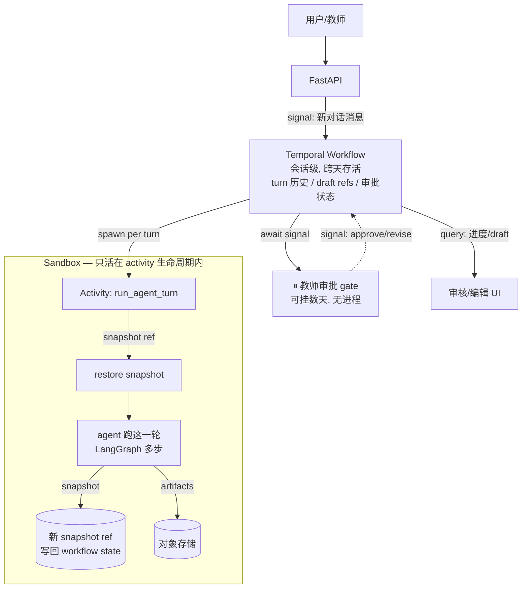
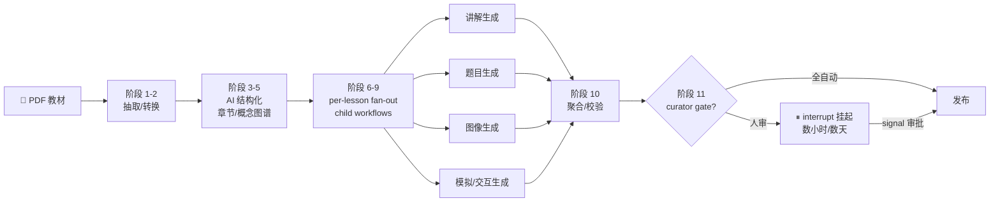
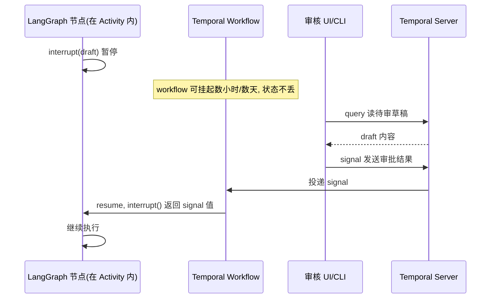
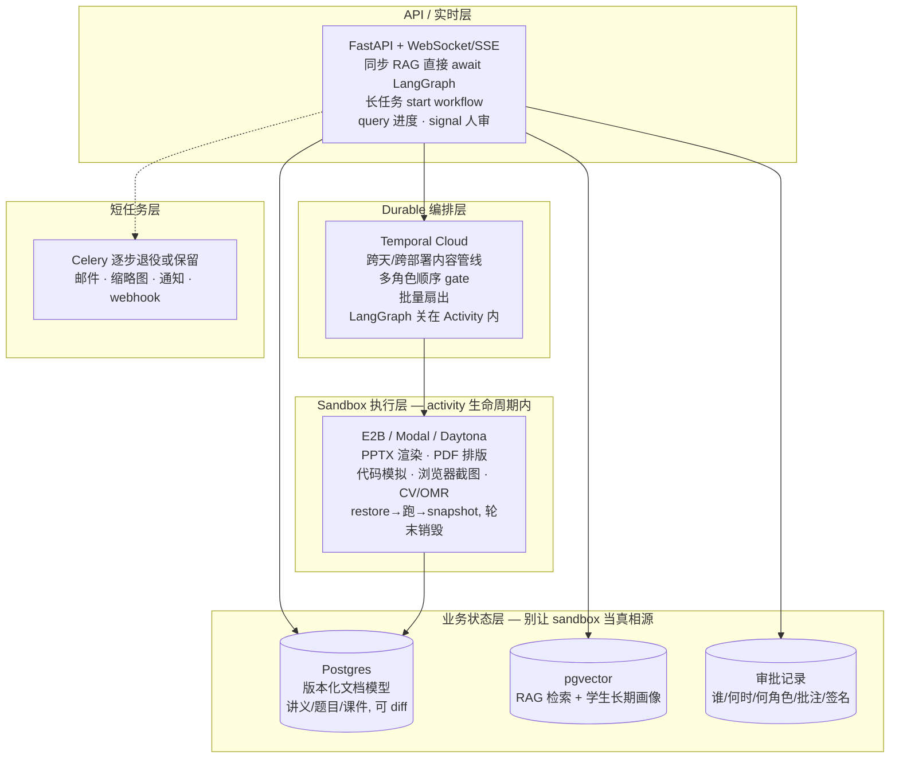

## 一、一个巴西教育公司，和一条我正站在中间的迁移路径

Maria Educação 是巴西的 B2G/B2B 教育科技公司。它不把自己叫出版商，也不叫 LMS，官方定位是「A infraestrutura de IA que transforma materiais didáticos em experiências personalizadas」——把教材转化为个性化学习体验的 AI 基础设施。

产品理念那行 tagline 更值得琢磨：**「IA com propósito. Professores no controle. Alunos no centro.」**（有目的的 AI、教师在掌控中、学生在中心）。这句话把买卖关系说清楚了：客户是市政府、学校、出版社，他们采购的前提是「教师在掌控中」，不是「AI 替代老师」。

规模（官方口径，2026-08-12 案例页 + 公司官网两处交叉一致）：

| 指标 | 数值 |
|---|---|
| 覆盖城市 | 80+ 个 municípios |
| 学生 | 10M+ |
| 教材产出 | 1M+ 页 |
| 测评处理 | 1M+ 次 |
| 题目索引 | 3M+ 道 |
| 教育数据点 | 3B+ |
| AI token 消耗 | 10B+（未标注是累计还是月度） |
| 工程团队 | ~38 人 |

真正让我坐直的是它的技术栈和迁移路径：

> **Backend: Python (Django)** · **Temporal Python SDK: temporalio** · **Workers: Google Kubernetes Engine (GKE)** · **Agent/LLM logic: LangGraph/LangChain inside activities (keeps the Workflow code deterministic)** · **两个 Temporal Cloud 集群，全 mTLS**

而它的演进路径是：

```
裸 Python 线程  ──►  Celery + Redis  ──►  Temporal Cloud
```

官方案例里对前两代的判词很直白：

- 线程：「Original approach: raw Python threads — lost state on every deploy」
- Celery：「handled task execution but no durable, resumable, observable multi-step workflows」

我现在做教育 RAG Agent 的栈是 **FastAPI + LangGraph + Celery**。跟 Maria 迁到 Temporal 之前那一代，基本是同一个东西。

所以这篇不是转述一个客户故事，而是回答我自己的问题：**我该不该迁，迁什么，以及 2026 年主流云端 agent 产品是不是也在做同样的事。**

先剧透第二个问题的答案，因为它最反直觉：**不是。主流云端 agent 产品几乎清一色是纯 sandbox + snapshot，没有一家公开使用 durable workflow 层。**

---

## 二、主流云端 Agent 到底怎么跑的

环境这一层我另写过一篇：[《从 Muse 到 Manus，为什么 Agent 开始需要一台自己的电脑？》](/posts/2026-09-29-cloud-agent-runtime/)，讲的是 agent 为什么需要持久环境、容器/VM/microVM 的隔离机制怎么选。那篇结尾停在一句判断上：**「能恢复一台电脑，不等于能正确恢复一项委托」**——快照回滚不了已经发出去的邮件，所以平台还需要动作记录、外部系统核对和幂等设计。

这篇接着往下问：那些「动作记录和规则」，在生产里长什么样、由谁提供、教育场景是不是非有不可。

我跑了一轮针对性调研，目标产品包括 OpenAI/ChatGPT 系、Anthropic/Claude 系、Devin、Manus、Cursor、Replit、Lovable/Bolt/v0、Gamma、Notion AI 等，以及底层 sandbox（E2B、Daytona、Modal、Cloudflare Sandboxes、Firecracker）。

**先说调研的方法论缺陷，因为后面所有结论都受它约束：** 能通过对抗式验证活下来的，集中在**编码 / headless research agent** 这个角落——Devin、Cursor Cloud Agents、Manus，加上 E2B 这个底层原语。你点名的第一方产品（ChatGPT Tasks/Operator/Codex cloud、Claude Code background agents、Computer Use）和 canvas/PPT 类产品（Gamma、v0、Notion AI）**公开工程材料非常稀缺**，抓到了页面但没能验证出具体架构 claim。

所以下面描述的是**编码 agent 的架构**，不是整个云端 agent 市场。这个边界很重要，我会在第六节说它为什么恰恰是理解教育场景差异的钥匙。

### 2.1 Devin（Cognition）：最重的 sandbox 路线

| 维度 | 做法 |
|---|---|
| 隔离 | **专用 microVM**，独立内核/存储/网络/计算；明确拒绝容器隔离——理由是共享内核下一个被攻破的会话可以触及别的会话的文件系统、凭据、网络，且开发环境常需 Docker-in-Docker（容器内嵌套容器存储放大 17 倍、慢 6 倍）。microVM 实现自称花了「一年多 hypervisor 工程」 |
| 持久化 | **hypervisor 级整机 snapshot**：内存 + 进程树 + 文件系统。自研开源 **blockdiff** 增量格式，基于宿主机 XFS reflink，只存差异块——50MB 会话快照 vs 多 GB 全镜像；20GB 快照约 200ms（裸拷贝 6.5s），恢复后用 xxhsum 校验与原盘逐位一致 |
| 长时等待 | 空闲时关机不烧 compute；CI 结果或 review 评论到达时原地 resume，「从离开的地方继续」 |
| 编排层 | **自建**。原文：「Our solution for the orchestration layer took over three quarters of dedicated engineering to build」，管数千并发 VM（provisioning、需求预测预热 warm pool、崩溃恢复、teardown、按工程师权限定制环境）。**全文未提 Temporal/Cadence/状态机**——这里的 orchestration 只指 VM 资源生命周期 |
| HITL | 框架为「agents execute and humans direct, review, and decide」。开 PR → 等 CI → 回应 review → 重跑测试 → follow-up commit，官方描述这个 gap 是「minutes, hours, sometimes days」，解决方案就是整机 snapshot。**没有** durable 审批 gate，没有 turn-by-turn 批准 |
| 多 agent | manager/child 层级 + 内部 MCP 协调。coder 与独立 verifier（Devin Review）**故意不共享上下文**，reviewer 仅凭 diff 反推，为的是规避 Context Rot；跨 agent 状态共享被官方列为开放失败模式 |

### 2.2 Cursor Cloud Agents（原 Background Agents）：活 VM 协作 + git 交接

| 维度 | 做法 |
|---|---|
| 运行时 | 隔离云 VM 跑完整开发环境；Cursor 自管 provisioning / 隔离 / snapshot / 启动 / 容量 |
| Snapshot | 单元叫 **Build**，是「bootable snapshot」，但**只保存磁盘状态**——「Running processes, shell exports, and in-memory caches stop when Cursor snapshots the machine」。预热活跃 Build 副本，把 clone + 依赖安装移出启动路径 |
| 持久交接 | 靠 **git**：独立分支 clone，push 回用户 repo；多 repo 时开协调 PR。**VM 本身是短暂的** |
| 并行/长时 | 「as many agents as you want in parallel」，不依赖本地机器联网；入口 Web/Desktop/iOS、Slack、GitHub/Bitbucket PR 评论、Linear、API |
| HITL | **不是 durable 挂起式审批**，而是对活 VM 的实时协作：默认只读观看（每个观看者重新校验 repo 权限，「Team membership alone doesn't grant access」）、一键 Take control 接管远程桌面亲自测、Release control 交回。PR Routing & Approval 是完成后的 merge 门，不是工作流内挂起 |

### 2.3 Manus：把文件系统当「终极上下文」

| 维度 | 做法 |
|---|---|
| 运行时 | 每 task 一个完全隔离的云 VM（第三方报道指底层 E2B/Daytona + Firecracker，非 Manus 官方确认），per-task 而非 per-turn，可并行 |
| 生命周期 | Create → Sleep/Awake → Recycle。不活动自动睡眠，需要时唤醒，睡眠期间文件不变；连续睡眠超 Free 7 天 / Pro 21 天被回收 |
| 状态哲学 | 「we treat the file system as the ultimate context in Manus: unlimited in size, persistent by nature, and directly operable by the agent itself」。`todo.md` 当逐步 scratchpad，文件路径跨步骤保留以便引用 |
| 跨 recycle | **不是**全盘 snapshot/restore，是选择性文件迁移：用户上传、Manus 产物、Slides/WebDev 等重要输出自动恢复；「intermediate code and temporary files created during execution will not be restored」 |

### 2.4 E2B（底层原语）：刻意只做四态状态机

| 维度 | 做法 |
|---|---|
| 状态机 | 只有 **Running / Paused / Snapshotting / Killed** 四态，**刻意不内置** workflow / step retry / event sourcing / HITL 等待原语 |
| Pause | 默认同时捕获**文件系统 + 内存**（所有运行进程、加载变量、数据），恢复约 1 秒；pause 约 4 秒/GiB RAM。另有 `keepMemory=false` 的轻量冷启动模式 |
| Snapshot | point-in-time 捕获 FS+内存，支持**一对多 fork**——从同一 snapshot 并行 spawn 多个 sandbox 探索不同方案 |
| 保留 | paused sandbox **无限期保留、无 TTL**，只能显式 `kill()` 删除；sandbox ID 需外部（你的数据库）持久化 |
| 等人 | 只能靠**把整个 VM pause**；没有 signal / 等待原语。`connect()` 只延长生命周期，不重置 timeout |

### 2.5 归纳：一个 archetype

四家（三家产品 + 一个原语）收敛到同一个模式：

> **per-session / per-task 隔离 microVM + hypervisor/磁盘级 snapshot 休眠 + 自建编排层（只管 VM 生命周期）+ git/文件产物交接。**

长时空闲通过**整机 snapshot 后关机**桥接，不是通过 workflow engine 挂起步骤。HITL 普遍建模为**对活 VM 的实时观察/接管**或**事后 PR 审批**，而不是可挂起数周的 durable gate。

**为什么主流都不上 Temporal？** 这不是技术落后，是场景特征让纯 sandbox 成为理性选择：

1. **工作区天然可丢弃**：git 就是状态真相源，VM 随便扔，`git reset` 可逆
2. **单一 owner + 事后 merge**：一个 Devin 服务一个工程师，审批是 PR merge 这一个二元动作，不需要多角色顺序 gate
3. **等待靠外部事件驱动**：CI 完成、review 评论到达——事件来了 resume 整个 VM，比在 workflow 里建模「等哪些信号」简单
4. **agent 状态极其丰富但不可序列化**：开着的浏览器、登录 session、shell 变量、LSP 内存、node_modules——这些塞进 workflow state 是不可能的，整机 snapshot 反而最省事
5. **没有跨学期/合规留存要求**：snapshot 可以无 TTL（E2B）或 7/21 天回收（Manus），没人要求「这条审批记录按政策存 7 年且可审计重放」
6. **自建编排层只管 VM 不管业务**：Cognition 四分之三工程投入的是 VM fleet 编排，不是业务状态机——因为业务状态（代码）已经在 git 里了

**关键的方法论警告**：「没有一家使用 Temporal」是**缺席论证**。厂商不公开完整后端栈，Cognition 的编排引擎本身就未具名，Devin/Manus 内部可能用了 Temporal 类系统而没写进博客。这个结论应读作「公开工程叙事里 durable workflow 引擎不是卖点、不是被讨论对象」，而不是「经逆向确认无人使用」。

---

## 三、Sandbox 和 Durable Workflow 不是竞品，是两层

这是整篇最想讲清楚的一件事。很多人把它们当竞品，是因为都在说「多轮 + 持久化 + 人审」，但它们回答的是**不同层的问题**：

- **Sandbox + snapshot 解决的是**：agent 的运行时（文件系统、进程、浏览器、shell 内存状态）在两轮之间**住在哪**
- **Durable workflow 解决的是**：跨轮次、跨步骤、跨小时/天的**业务流程**怎么 durably 编排、重试、等人、扇出

### 3.1 模式 A：Sandbox + Snapshot/Restore



**机制**：每轮对话唤醒一个有完整运行时状态的 sandbox，agent 接着上次状态继续改；轮末 snapshot 后休眠。会话历史和 artifacts 单独存。

**典型**：E2B / Daytona / Modal / Cloudflare Sandboxes / 自建 Firecracker microVM——Devin、Manus、大量 PPT 生成与 deep research agent 都是这套。

### 3.2 模式 B：Temporal Durable Workflow + Signals



**机制**：没有长寿命进程。workflow 状态 = event history（KB～MB 级可序列化事件）；每轮对话 = 给 workflow 发一个 signal；workflow 调度 short-lived activities 做实际工作，activity 失败可单独重试；等人就是 await 一个 signal，期间**没有进程在跑**，可以等几周。

### 3.3 模式 C：Temporal 编排 + Sandbox 执行（生产推荐）



**关键**：sandbox 只活在**一个 activity 内**（一轮 agent 工作的时长），轮末 snapshot 后销毁；snapshot 引用存在 workflow state 里；跨天的人审等待由 Temporal 扛，**不占用任何 sandbox**。

### 3.4 逐维度对比

| 维度 | A: Sandbox + Snapshot | B: Temporal | C: 组合 |
|---|---|---|---|
| **持久化的是什么** | 整个 VM/容器的 opaque 镜像（FS + 进程内存），GB 级 | 显式 event history + 可序列化 state，KB～MB 级 | 历史在 Temporal；运行时状态在 snapshot，引用在 Temporal |
| **状态可观测/可查询** | 差。要「看状态」必须 restore 再 inspect；无法 SQL 查「哪些会话卡在第 3 步」 | 强。query 随时读 workflow state；UI 里看每个 event | 强（继承 Temporal） |
| **失败重试粒度** | 整轮。中途崩了这一轮重来（除非频繁 snapshot，贵） | **单个 step/activity** | 单个 activity；sandbox 崩了重试整轮 agent 工作 |
| **人审挂起几天的成本** | snapshot 占 GB 存储；restore 有依赖漂移/token 过期风险 | 几乎为零（无进程，history 很小） | 几乎为零 |
| **代码版本演进** | 痛苦。3 天前的 snapshot 里是旧代码/旧依赖 | Temporal versioning API 处理新旧 workflow；activities 总跑当前代码 | Temporal 扛版本；sandbox 镜像按版本 tag |
| **凭证/token 过期** | snapshot 里冻结着过期 token | activity 每次跑拿新鲜凭证 | 同 Temporal |
| **扇出/并行** | 弱。一个 session 一个 sandbox；要并行得自己协调 | **原生强**。child workflow / `asyncio.gather` / 独立 task queue | 继承 Temporal |
| **多人协作/多审核者** | 难。一个活跃 sandbox，多编辑要自己加同步层 | 自然。多 signal 来源、多 query viewer | 自然 |
| **审计/合规** | 弱。opaque 历史，教育/政府场景难过审 | 强。每 step/event 可审计、可 replay | 强（对 B2G 是决定性的） |
| **富运行时（浏览器/Shell/代码执行）** | **极强**。运行中进程、登录态 browser、shell 变量全保留 | 没有「活进程」概念，browser/shell 每次 activity 重开 | 强（sandbox 提供） |
| **冷启动延迟** | restore 秒级，warm 时毫秒级 | 每个 activity 可能新开 sandbox，冷启动累加 | sandbox 池化可缓解 |
| **规模/成本** | 10000 个 hibernated session = 10000 × GB 存储 | 10000 个 idle workflow = 极小存储 + 无计算 | 存储是 snapshot 大小（不可避免），计算只在活动时 |
| **心智/运维成本** | 低（「就是一台长寿命机器」），但 debug snapshot 很难 | 高（determinism 约束、replay 心智） | 高，但两个组件都成熟 |
| **vendor 锁定** | 重（snapshot 格式私有） | 低（开源、可自托管、多语言） | 中 |
| **本地复现 bug** | 难（要拉 snapshot） | 强（download event history 本地 replay） | 中 |

### 3.5 两种模式各自的真实失败模式

**Sandbox-only 会怎么坑你：**

1. **snapshot 版本漂移**：3 天前的 sandbox 里跑着旧版 agent 代码、旧版 Chrome、旧依赖。restore 后要么行为不一致，要么每轮启动跑迁移——迁移逻辑本身就是你的「工作流引擎」，你在重新发明 Temporal
2. **中途崩溃丢一整轮**：agent 正在改 PPT，第 5 次 LLM 调用超时，整轮 3 分钟工作白费（除非每步 snapshot，那等于自己写 activity 边界 + checkpoint）
3. **「跑到哪了」不可观测**：老师问「我那 50 份报告生成到哪了」，你得逐个 restore sandbox 才知道——状态是 opaque 的
4. **扇出要自己造**：并行生成 20 页 PPT、5 个候选方案对比，要在 sandbox 里手搓进程池/子 sandbox + 协调 + 失败处理
5. **snapshot 格式/厂商绑定**：换 sandbox 厂商或自建时，历史 session 迁移困难
6. **存储成本随会话数线性涨**：每个 session 一个 GB 级镜像，即使它只是「等老师审核」

**Temporal-only 会怎么坑你：**

1. **determinism 税**：workflow 代码里不能用随机数、不能直接读时钟、不能直接发 HTTP——所有非确定操作必须进 activity。刚上手会反复踩 replay 报错
2. **抓不住活进程**：无法持久化一个开着的浏览器、有状态的 shell、登录 session。对 computer-use / 浏览器自动化 agent，每个 activity 都得重新拉起浏览器 + 恢复登录态。**这正是 sandbox snapshot 擅长的**
3. **activity 冷启动**：每个 LLM 步骤都开新 sandbox 会很难看——需要池化或一个 activity 内跑多个 LangGraph 节点
4. **event history 不是无限记忆**：长会话会撞 history 大小上限，必须 `continue-as-new`，大状态外置到 DB/对象存储
5. **学习曲线和运维**：即使 Temporal Cloud，团队也要理解 workflow/activity/worker/task queue/signal/query/session 一整套概念

---

## 四、Maria Educação 的答案：两层怎么拼

回到那个 38 人的巴西团队。他们的生产规模：

> **约 100 个 Workflow、240+ 个 Activity、16 个 Task Queue、13 个 Scheduled Routine**，跑在 **2 个 Temporal Cloud 集群**上。

架构原则：

- **每个业务管线 = 一个 Workflow**
- **每个原子单元（一次 LLM 调用、一次 DB 写入、一次外部 API、一次文件处理）= 一个 Activity，带自己的 timeout 和 retry policy**
- **大任务通过 child workflow 扇出**（每个文档窗口/分块一个子工作流）
- **LLM/agent 逻辑用 LangGraph/LangChain 写在 Activity 内部**，以保持 Workflow 代码确定性

### 4.1 旗舰工作流：LISA 内容摄入（11 阶段）

原始 PDF → 完整互动课程（章节、课程、概念、题目、图像、模拟）。



要点：

- **每个 LLM 调用是独立 Activity**，为了「independent retries and observability」
- 两种运行模式：**全自动长跑**（「one long workflow that resumes from wherever it stopped」）或 **curator 每步 gate**（「where a curator reviews before each step advances」）
- per-lesson fan-out 用 **child workflow + concurrency caps**（尊重 LLM rate limit）

**诚实标注**：11 个阶段的**精确顺序和名称官方没有公开**。调研中有一条声称「五阶段 pipeline」的 claim 在对抗验证里以 1-2 被驳回，因为它编造了阶段顺序。已知的只有阶段数（11）和阶段类别（document extraction、conversion、AI structuring、resource generation fan-out、可选 curator gate）。

### 4.2 三条测评工作流：三种典型 Activity 形态

| 测评流 | 技术特征 | Temporal 模式 |
|---|---|---|
| **OMR 答题卡批改** | 计算机视觉识别填涂 | CPU/GPU 密集 → 隔离 task queue + 隔离 GKE node pool |
| **开放题/作文批改** | LLM 按 rubric 评分 | 细粒度 Activity + retry-until-valid 校验循环 |
| **IRT/TRI 心理测量评分** | Item Response Theory 统计建模 | **长时任务（heartbeat 轮询可达 1 小时）** |

第三条最值得注意：**Temporal 原生 heartbeat 让「worker 活着但还在算」与「worker 挂了需要重试」可区分**。Celery 这类队列要用外部状态机/lease 才能勉强模拟。

这也说明教育场景不全是 LLM 调用——**把传统心理测量学管线与 LLM 管线编排在同一个 durable workflow 里，才是真实生产形态。**

### 4.3 共享媒体工厂

案例里还有一个子系统：多模型**并行生成 + AI judge 评选 + 技术图代码自生成**。典型的「扇出 N 个候选 → 评判 → 选最优」，每个候选一个 Activity，judge 也是 Activity。

### 4.4 记忆架构（这部分最可直接抄）

| 记忆类型 | 存哪 | 坑 |
|---|---|---|
| **per-run 状态**（单次辅导/生成） | Temporal Workflow state | — |
| **跨 run 长期记忆**（学生画像、向量检索） | 外部 PostgreSQL/pgvector，每 worker 配连接 | LangGraph 的 `Store` **不能在 Activity 节点内用**（Store 持活状态，跨 Activity 边界丢失） |
| **agent checkpoint** | **`InMemorySaver`** 即可 | 不要再自搭 Postgres/Redis checkpointer——Temporal event history 已持久化 |
| **大 payload**（PDF、图片、长上下文） | GCS 对象存储，history 里只留引用 | 长 graph 会撞 **Temporal event history 大小上限**，必须 `continue-as-new` + `cache()` |
| **streaming chunk** | 订阅端必须幂等 | streaming Activity 是 at-least-once per attempt，已 publish 的 chunk 不回滚 |

### 4.5 Human-in-the-loop：interrupt + query + signal

官方 Temporal × LangGraph 集成（`temporalio[langgraph]` 1.27.0+，标注 Public Preview）把这个模式产品化了：



集成的硬约束（不声明就直接报错，无默认值）：

- 网络调用、LLM、随机数、时钟、文件 IO、`interrupt()` → **必须** `metadata={'execute_in': 'activity'}`
- 纯状态变换、路由、subgraph dispatch → 可 `'workflow'`

**关键优势**：workflow 挂起期间 worker 可以下线、可以重新部署，Temporal 不在线也会持久化 signal——这是自建审批表 + 轮询做不到的。审核 gate 可以加在**每个阶段前**，不只是最终末尾。

### 4.6 Temporal 用法清单

| Temporal 能力 | Maria 怎么用的 | 为什么对教育 Agent 重要 |
|---|---|---|
| **Durable execution** | 几乎所有长时/AI 管线 | 跨部署不丢状态；3 小时的题库生成中途 deploy 也能 resume |
| **per-Activity retry** | 每个原子单元独立 retry policy | LLM 抖动只重试该步而非整条管线 |
| **timeout + heartbeat** | 慢 LLM 调用、IRT 1 小时统计任务 | 区分「还在算」和「挂了」 |
| **Child workflow fan-out** | 每个文档窗口/分块/lesson 一个 | 大批量题库/课件并行生成 |
| **Concurrency cap** | child workflow + 并发上限 | 尊重 LLM rate limit |
| **16 个 Task Queue** | 按负载画像隔离（LLM/CV/统计/IO） | 资源物理隔离 |
| **13 个 Schedule** | 定时例行任务（具体内容未公开） | 周期性批处理 |
| **Signal / Query** | 教师审批投递 / 暴露待审草稿 | 人审零轮询 |
| **`interrupt()`** | Activity 内 LangGraph 节点暂停等人审 | per-stage gate |
| **continue-as-new + cache()** | 长 graph 避免 event history 超限 | 长会话/长跑 pipeline |
| **mTLS** | 两个 Cloud 集群全客户端证书认证 | B2G/学校安全合规 |

### 4.7 跨案例佐证：HeyGen 的对照

Temporal 博客上另一家 AI 客户 HeyGen（2026-08-14）踩了几乎一样的坑——旧栈是「MySQL 任务表 + 轮询 scheduler + RabbitMQ + Celery workers + 独立 job-tracking 服务」，失败模式包括「worker 完成了 job 但回调投递失败」「tracker 重启丢请求」，以及**一次托管 RabbitMQ 升级导致全站停滞、需要手动修复受影响 job**。

但它的扇出策略和 Maria 形成有价值的对照：

| | Maria Educação | HeyGen |
|---|---|---|
| 扇出粒度 | **每个文档窗口/lesson 一个 child workflow** | scene 管线用**同一 workflow 内并发协程**（`asyncio.gather` + per-stage semaphore） |
| child workflow 判据 | 分块独立处理 | 仅在需要独立 timeout/retry/失败域边界时才用 |

**判断标准**：独立失败域/重试/超时边界 → child workflow；同一失败域内可并行、共享信号量、不需要独立生命周期 → 协程。不要把每个并行单元都开成 child workflow（会爆），也不要把跨小时、需要独立 retry 的大单元塞成协程（失去隔离）。

---

## 五、教育场景的结构性错配

现在把两条线接起来。主流云端 agent 的架构是为「**可丢弃 workspace + 单一 owner 事后 merge**」优化的。教育/出版场景不是。

| 维度 | 编码 agent（主流） | 教育/出版 agent |
|---|---|---|
| **Owner 模型** | 单工程师，二元 merge | **多角色顺序审批**：教师 → 编辑 → 合规 → 管理员 |
| **可逆性** | git revert 极廉价 | 发布给学生后不可逆，版本/审批链要留痕 |
| **状态真相源** | git（天然可审计、可 diff、可签名） | **文档/题目/课件 + 审批决策**——snapshot 里的机器状态不是业务台账 |
| **等待周期** | 分钟～天，事件驱动 resume | 跨学期、按月计，可能远超任何 sandbox TTL |
| **留存政策** | 无强约束 | B2G/学校采购常要求 **tamper-evident** 的步骤级历史、谁何时批准了什么、可重放审计 |
| **HITL 形态** | 实时看 VM / 接管 / 事后 PR 审批 | **异步、多角色、可能挂几周**，审批意见本身是业务记录 |
| **扇出** | 一个 task 一个 agent，或多 agent 探索 | **批量**：30 个学生各一份定制讲义、5000 道题、每章独立人审 |
| **retry 语义** | 整轮重来可接受（代码可重生成） | LLM 某步失败应**只重试该步**，别让教师已审过的章节重跑 |
| **跨部署** | agent 任务短，deploy 窗口可等 | 内容管线可能跑几小时，跨 deploy 不能丢 |

**纯 sandbox 在教育场景会遇到的具体问题：**

- **审批台账在 snapshot 里是 opaque 的**。snapshot 存的是内存/磁盘/进程，不是「张老师 2026-09-01 14:32 批准了第 3 章并附了批注」这种可查询、可签名、符合留存策略的事件。合规审计时你没法回答「过去一年有多少 AI 生成内容未经教师审批就发布」——除非你在 sandbox 之外另建审批表，那时你已经在手写半个 workflow engine 了
- **TTL 与政策留存冲突**。E2B paused 无 TTL（成本线性涨），Manus 式 7/21 天回收（跨学期任务直接炸）。恢复 3 个月前的 snapshot 还会撞代码版本漂移、过期 token、旧依赖
- **多角色顺序审批没有原生表达**。活 VM 上「看屏幕 + 接管」适合单 owner 实时协作，不适合「教师批准后流转给编辑、编辑驳回回退给 AI、AI 改完再流转」这种多天、多角色、可回退的状态机
- **扇出 + 人审组合爆炸**。50 份讲义每份要各自的教师审批，每份审批可挂几天——用 50 个 hibernated VM 扛等待，既贵又不可观测；用 durable workflow 就是 50 个轻量 workflow state + signal
- **retry 粒度粗**。sandbox 崩溃整轮重跑，可能丢掉教师这一轮里已经给过的修改指令

---

## 六、但也别矫枉过正：什么时候不需要 Temporal

诚实地划线。

**数据库一个状态字段 + sandbox pause/resume 就够：**

- 单一教师 gate（不是多角色顺序流）
- 等待在 sandbox TTL 内（小时～几天，不是跨学期）
- 没有批量扇出
- 没有强合规审计要求（私立校、课后辅导、C 端工具）
- 团队小，产品在 PMF 之前

**Temporal / durable 层才值得引入**（多条同时出现）：

- 等待可能超过 snapshot 留存窗口，或要跨基础设施迁移存活
- **多个不同 human role 顺序批准**，决策须独立于 agent 记忆记录
- 监管要求 **tamper-evident** 的步骤级历史、幂等重试与补偿
- 对大量 artifact（多学生文档、多章节、多题）做确定性扇出/扇入
- 工作流跨小时 + 跨部署不能丢状态
- 你已经开始在 Celery/DB 上自建「任务状态表 + 轮询 + 审批流」，且它在变复杂

**迁移时机的硬判据**——出现以下**任意两条**再启动：

- [ ] 有工作流跑超过 5 分钟，期间任何 deploy/restart 会让它状态错乱或重跑
- [ ] 你在 Celery 之外建了「任务状态表 + 轮询」来追踪多步进度
- [ ] LLM 调用失败时，你想只重试那一步而不是整条任务，发现做不到或很丑
- [ ] 有人审/审批环节，任务需要挂起几小时等人工输入
- [ ] 有大批量 fan-out（几百到几千个子任务），需要控制并发和 rate limit
- [ ] 出问题时你无法回答「这个任务现在跑到哪一步、每步发生了什么」
- [ ] 你混用了 Celery + 自建状态机 + 定时任务 + webhook 回调，状态在多处同步，开始出现「worker 完成了但回调丢了」类故障

一条都没中 → 别动。中 1 条 → 做个 spike 验证。中 2 条以上 → 认真迁。

**还有一个容易被忽略的形态差异。** 编码 agent 的真相源是**文件系统 + git**，sandbox 天然合适。而 canvas 类产品（Artifacts、Gamma、v0、Notion AI、文档式编辑器）的真相源更可能是**版本化文档模型存数据库**（OT/CRDT + 文档数据库），而不是 workspace 文件 + VM snapshot。agent 修改的是结构化文档，多轮编辑 = 对文档的增量 patch + 对话历史；持久化是文档数据库的事，sandbox 只在需要执行代码/渲染时短暂存在。

教育场景很可能**两边都有**：文档结构化内容（讲义文本、题目、教学步骤）应该是数据库里的版本化文档模型；富产物（PPTX 渲染、代码模拟、浏览器截图、PDF 排版）需要 sandbox 执行；多轮对话 + 多角色审批 + 批量需要 durable workflow 编排。**Devin 只有第二层 + git 当第一层，所以它不需要第三层；教育场景三层都需要。** 这是两者最大的架构差异。

---

## 七、目标架构

综合两轮调研，针对 FastAPI + LangGraph + Celery 现状 + 多轮编辑 + 教师 gate 的场景：



**迁移节奏：**

1. **现在就能做**：把文档/题目/审批状态从「sandbox 里的文件」提升到 Postgres 版本化模型。这是无论上不上 Temporal 都该做的一步，也是从纯 sandbox 架构演进时最贵的一件事——早做早省钱
2. **观察 Celery 痛点**：当开始在 Celery 之外建「任务状态表 + 轮询」、或有任务跨 deploy 丢失、或人审要挂几小时——就是引入 durable 层的信号
3. **引入时从一个工作流开始**：选一个非关键的长时管线（批量题目生成或文档摄入），Temporal Cloud 跑通，再扩。别 big bang
4. **Sandbox 留着，但缩小它的职责**：从「长寿命会话容器」收缩为「activity 内的短寿命执行单元」。富产物渲染在 sandbox 里，业务状态和审批在外面

**选型语境**（2026-09）：

| 选项 | 适合谁 | 取舍 |
|---|---|---|
| **Temporal** | 长时（小时+）、多语言、要 depth、要自建/多云 | 最成熟、最深；心智和运维（或 Cloud 账单）最重。Maria 用的就是它 |
| **Restate** | 想要 durable execution 但嫌 Temporal 重 | 更现代的 Durable Promise 抽象；生态/案例少很多 |
| **Inngest / Trigger.dev** | 团队小、serverless、TS 友好、工作流分钟级 | DX 好上手快；超长 workflow / 自托管 / 多语言 depth 不及 Temporal |
| **DBOS** | 想把 durable execution 直接建在 Postgres 上 | 极轻量；成熟度和多语言 depth 不及 |
| **LangGraph Platform** | 已深押 LangChain 生态、不跨语言 | 集成最顺；锁定生态，durable depth 不及 Temporal |
| **Celery + 自建状态机** | 工作流都是分钟内、少人审 | 零新依赖；但在重复造 Temporal 已经造好的轮子 |

Maria 的选择也值得注意：**Temporal Cloud 而不是自建**，理由是「a fully-managed service (no cluster for us to run)」。38 人团队不运维 K8s 上的 Temporal。

---

## 八、开放问题与信息缺口

这些是我没能查到的，也是判断时需要保持不确定的地方：

1. **LISA 11 阶段的精确顺序与名称、每阶段用的哪些 LLM 模型、prompt 结构、rubric 设计与质量指标**——官方没公开，也没找到 Maria 工程博客、Rubens Aguiar 的技术演讲、GitHub 仓库、StackShare 或葡萄牙语深度采访。**所有 Temporal 用法细节都只能回溯到那一篇官方案例**
2. **Lisa AI 家教的实时辅导会话怎么建模**——每学生会话一个 workflow？还是只把离线内容/题目生成放 Temporal、实时对话走另一条栈？多轮记忆、工具调用、自适应选题与 workflow 生命周期的映射完全没展开
3. **生产硬指标缺失**：峰值并发 workflow 数、P50/P95 延迟、token 月烧（10B+ 是累计还是月度？）、Temporal Cloud 成本、retry 率、event history 平均大小、worker 规格
4. **Maria 是否用了官方 `temporalio[langgraph]` plugin**，还是自研 wrapper。案例只说「LangGraph/LangChain inside activities」
5. **到底有没有主流 agent 产品在生产中用 Temporal/Restate 类 durable 层**——公开材料里 Devin/Cursor/Manus 一家都没提，但这是缺席论证。可能的真相是：durable workflow 在 agent 领域目前主要被**非编码类、强合规/长流程场景**（教育出版、医疗、金融、客服后台、媒体生产——Maria 和 HeyGen 都属此类）采用，而编码 agent 因为有 git 这个天然状态真相源而不需要它

**来源质量的总警告**：Maria 的技术事实几乎全部来自 Temporal 官方 2026-08-12 发布的联合客户案例，属于厂商联合营销性一手材料。架构自陈事实（代码库规模、组件选型、迁移路径）是合适的权威来源，但「Temporal 优于 Celery」「99.9999% uptime」这类属于厂商或客户立场陈述，不是独立第三方 benchmark。**不要把 16 队列划分、child workflow 粒度这些具体选择当教条。**

---

## 九、来源

**Maria Educação 一手来源：**
- [Temporal 官方案例：Maria Educação](https://temporal.io/resources/case-studies/maria-educacao)（2026-08-12，架构/规模/迁移路径主源）
- [mariaeducacao.com](https://mariaeducacao.com)（业务规模/产品线交叉验证）
- [Maria Educação LinkedIn](https://www.linkedin.com/company/maria-educa%C3%A7%C3%A3o)（定位 tagline）

**Temporal 技术文档：**
- [Temporal × LangGraph 官方集成](https://docs.temporal.io/develop/python/integrations/langgraph)（execute_in / InMemorySaver / interrupt+query+signal / Store 限制 / continue-as-new）
- [Temporal AI 定位页](https://temporal.io/ai)
- [HITL 官方样例代码](https://github.com/temporalio/samples-python/tree/main/langgraph_plugin/graph_api/human_in_the_loop)
- [LangGraph GitHub](https://github.com/langchain-ai/langgraph)

**主流 agent 产品架构来源：**
- [Cognition: What we learned building cloud agents](https://cognition.com/blog/what-we-learned-building-cloud-agents)（microVM 隔离、整机 snapshot、自建编排层、HITL 框架）
- [Cognition: blockdiff](https://cognition.com/blog/blockdiff)（增量 snapshot 格式）
- [Cognition: multi-agents working](https://cognition.com/blog/multi-agents-working)（manager/child + 内部 MCP）
- [Manus Sandbox](https://manus.im/blog/manus-sandbox)（per-task VM、Sleep/Awake/Recycle）
- [Manus: Context Engineering for AI Agents](https://manus.im/blog/Context-Engineering-for-AI-Agents-Lessons-from-Building-Manus)（file system as ultimate context）
- [Cursor Cloud Agents 文档](https://cursor.com/docs/cloud-agent) · [Builds](https://cursor.com/docs/cloud-agent/builds)（Build 只存磁盘、活 VM 协作、git 交接）
- [E2B persistence](https://docs.e2b.dev/sandbox/persistence) · [snapshots](https://docs.e2b.dev/sandbox/snapshots)（四态状态机、FS+内存 pause、one-to-many fork）

**跨案例参考：**
- [HeyGen: How Temporal Powers Workflows](https://temporal.io/blog/how-temporal-powers-workflows-at-heygen)（child workflow vs 协程对照、Celery/RabbitMQ 失败模式）
- [Temporal 客户案例索引](https://temporal.io/resources/case-studies)（Maria 是目前唯一教育主题案例）

原始调研产物（含 67 + 115 条 claim 的提取与对抗验证记录）见 [notes.md](notes.md)。
