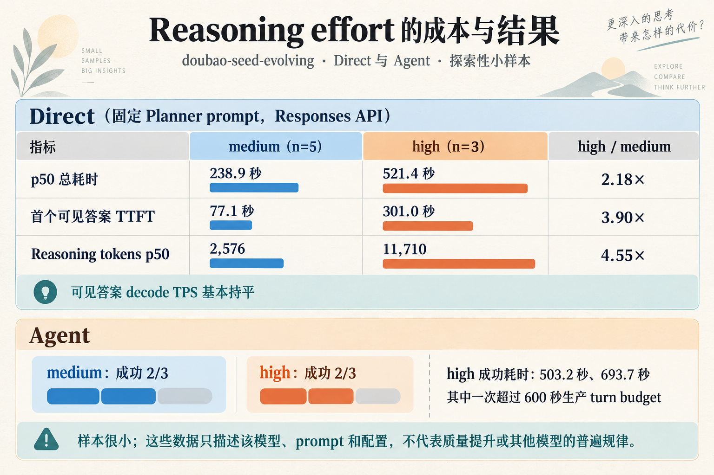
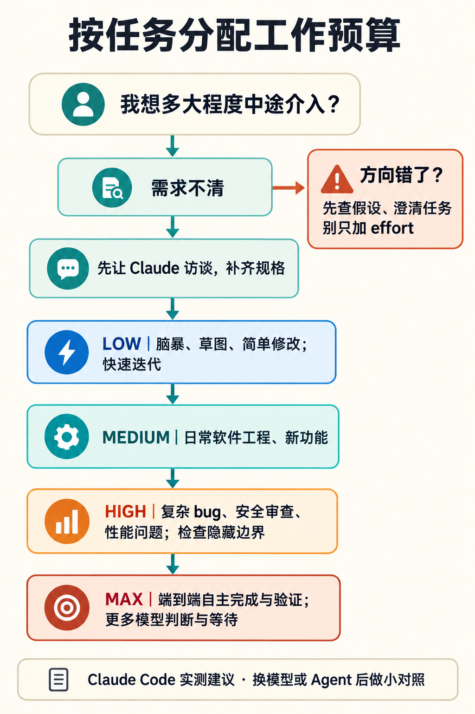

# Reasoning Effort 到底在调什么？从 Claude 的实测到跨模型验证

我以前把 reasoning effort 理解成一个很直观的旋钮：档位越高，模型多想一会儿；档位越低，回答快一点。

2026 年 9 月 25 日，Thariq Shihipar 在 [《Using Claude Code: Spending your effort》](https://claude.dev/blog/spending-your-effort/)里分享了他的 Claude Code 实测。读完之后，我原先的理解开始松动了。文章里最让我在意的，不是“高 effort 得分更高”，而是 effort 似乎会改变模型做事的方式：它会不会自行补全需求、做多少验证、愿意替用户做多少判断。

不过，Thariq 的结论来自 Claude 模型和 Claude Code 的实验。它给了我一个新的解释，也带出一个需要认真回答的问题：**reasoning effort 究竟在调模型的什么？哪些观察能推广到其他模型和 Agent？**

## 先拆开三个容易混在一起的概念

### 思维链是一种生成出来的中间过程

大语言模型是逐 token 生成的。Chain-of-Thought（CoT，思维链）通常指模型在给出最终答案之前，生成一串中间步骤：拆解问题、列出条件、尝试推导，再形成答案。经典的 CoT prompting 研究发现，在提示中给出逐步推理示例，可以提升模型在某些多步任务上的表现。[Wei 等人的原始论文](https://arxiv.org/abs/2201.11903)

但“让模型写出推理步骤”和“让模型拥有更大的推理计算预算”并不是同一个开关。普通模型可以按提示生成一段看起来像推理的文字；专门训练的 reasoning model 则可能通过额外训练，学会在回答前进行更长的推演、修正策略或尝试不同路径。OpenAI 对 o1 的公开说明就把强化学习训练与 test-time compute（推理时计算）都列为提升 reasoning 表现的因素。[OpenAI：Learning to reason with LLMs](https://openai.com/index/learning-to-reason-with-llms/)

思维链也不一定会完整展示给用户。有些 API 会把 reasoning tokens 作为独立用量统计，却不返回原始内容；即使能看到一段解释，也不能只凭它写得连贯，就断定它忠实记录了模型实际依赖的全部过程。关于 CoT faithfulness 的研究表明，模型给出的解释有时会遗漏影响答案的因素，甚至为错误答案补出听起来合理的理由。[Lanham 等人的研究](https://arxiv.org/abs/2307.13702)

### 推理时计算不只有“多写几步”

在不重新训练模型的前提下，推理阶段可以投入更多计算。最直观的方式是允许模型生成更长的 reasoning trace；其他方法还包括生成多个候选答案再筛选、逐步验证中间结果，或对不同推理路径进行搜索。

这些方法都可能增加推理时计算，但它们不是同一种算法。Snell 等人的 test-time compute 研究就分别分析了 verifier 引导的搜索，以及根据题目调整回答分布等方法，并发现最合适的策略会受模型、题目难度和计算预算影响。[ICLR 2025 论文](https://proceedings.iclr.cc/paper_files/paper/2025/hash/1b623663fd9b874366f3ce019fdfdd44-Abstract-Conference.html)

所以，effort 不应被直接理解为“多生成 N 个思维链 token”。它是产品或 API 暴露出来的控制项，告诉模型在这类任务上投入多少 reasoning。底层可能涉及可用 token 预算、模型学到的思考策略、候选探索或其他推理时机制；各家具体怎么实现，未必公开，也未必相同。

如果模型把额外投入主要用在延长单条推理轨迹上，可能会产生更多 reasoning tokens。这些 token 要逐步生成，可能增加首个可见答案的等待、总耗时和费用，也会占用 context window。但这不是一个可以直接换算的公式：推理和可见输出可以交错，服务端也可能并行探索或采用不同解码策略。实际效果需要结合 usage、TTFT、总延迟和任务质量一起看，不能只把 effort 档位当作时长或 token 数。

| 概念 | 主要指什么 | 可能的实现或表现 |
| --- | --- | --- |
| 思维链（CoT） | 模型生成的中间推理序列 | 逐步拆解、推导、修正；可以可见，也可以隐藏 |
| 推理时计算 | 推理阶段额外投入的计算 | 更长的单条推理、多候选生成、搜索或验证；方法不止一种 |
| reasoning effort | 面向用户的模型控制项 | 引导该模型投入更多或更少推理；档位不是跨厂商统一单位 |
| Agent 执行预算 | 模型与外部系统完成任务的总工作量 | 多轮调用、工具运行、验证、重试、超时和步数上限 |

*图 1：四个层次需要分开观察。effort 是控制入口；Agent 还包含多轮模型调用和外部工具。*

## Claude 的实测，提供了什么线索？

Thariq 把 effort 描述为对计算投入的近似调节。落到 Claude Code 的任务里，他观察到较高 effort 会让 Claude 更独立地判断和验证。

文章用一个健身记录 app 做了直观对照。需求只是一句“做一个健身和训练追踪 app”时，low effort 给出的更像一个简单起点；档位提高后，界面和功能更完整，但 Claude 也替用户做了更多设计选择。作者随后先访谈用户、把需求写得更具体，再让不同档位实现，结果就接近得多。

这个例子说明，输入规格本身会影响我们观察到的 effort 效果。需求模糊时，模型有较大空间自行补全；需求明确时，留给模型判断的空间收窄，档位对方案的影响可能也会变小。

作者在 Terminal-Bench 3.0 上看到的另一个模式，是较高 effort 对隐藏边界多的任务更有帮助。他举了 HTML sanitizer 的例子：一次 low effort 尝试写完过滤器后，只用手写页面做了简单检查；一次高 effort 尝试则继续审查初版、查看 parser 源码、运行 XSS 测试，还写了随机文档 fuzz 测试。对安全过滤器、复杂 bug 或性能优化来说，多做这些检查确实可能有价值。

但 effort 不是“正确性档位”。文章对失败类型的分析显示，提高 effort 有助于减少一部分漏掉边界情况的错误，却没有消除误读需求、选错方法或理解错领域规则等失败。更多计算能增加验证和探索的机会；如果任务理解或方向一开始就错了，模型也可能更充分地沿着错误方向工作。

这是一组有启发性的实测，不是跨模型定律。作者说明 Terminal-Bench 的每项任务只有少量尝试，失败类别由模型评审，也只是近似归因。它适合生成假设，不能单独证明 effort 在其他模型或生产 Agent 中会有相同效果。

## Reasoning Effort 是预算，还是策略？

答案取决于具体模型，不能从参数名称推断内部实现。

以 OpenAI API 为例，官方文档把 `reasoning.effort` 描述成引导模型在任务上“思考多少”的参数，并说明较低档位偏向速度和较少 token，较高档位倾向于更完整地思考。文档还说明 reasoning tokens 会占用 context window、计入用量，但原始内容不一定通过 API 返回；模型也可以根据任务难度自适应地分配推理量。[OpenAI reasoning guide](https://developers.openai.com/api/docs/guides/reasoning)

Google 对 Gemini 的暴露方式包括 `thinkingLevel`，部分旧模型还支持数值型 `thinkingBudget`。官方文档提示较高 thinking level 可能拉长首个可见 token 前的等待时间；在 Agent workflow 中，调低档位有时还能减少不必要的工具调用。[Gemini thinking guide](https://ai.google.dev/gemini-api/docs/generate-content/thinking)

Anthropic 的 Claude 文档则介绍了 adaptive thinking 与 effort 的组合，并保留了部分旧模型的 `budget_tokens` 配置路径；不同模型版本的默认行为和参数支持范围会变。[Claude Platform 文档](https://docs.anthropic.com/en/docs/build-with-claude/prompt-engineering/prompt-templates-and-variables)

这三家的接口都提供了“控制推理投入”的方式，但这并不能证明 `high` 是统一的计算单位。档位相同，不代表 reasoning token 数相同、思考策略相同、工具调用行为相同，甚至不保证默认档位相同。要比较模型，需要比较同一任务下的质量—成本曲线，而不是把档位名称当成等价标签。

## 对 Agent 来说，模型推理只是总计算的一部分

在普通 API 请求里，我们可以先关注一次模型调用里产生了多少 reasoning tokens、耗时多久、结果质量如何。进入 Agent 之后，计算会分布在多个位置：

1. 模型单次调用中的内部 reasoning；
2. Agent 为完成任务发起的多轮模型调用；
3. 浏览器、代码执行、测试和其他外部工具消耗的时间；
4. harness 设置的最大步数、超时、重试、验证器和权限边界。

effort 主要作用于模型推理这一层，也可能间接改变 Agent 后续做什么；但它不能凭空给 Agent 增加工具权限、移除步数限制，或保证 harness 一定会运行测试。一个 Agent 的端到端成本和可靠性，不能只看单次模型的 effort 档位。

这也让我想调整“effort 是委托尺度”这个比喻。它能描述 Claude Code 文章里观察到的行为倾向：高 effort 的 Claude 更常自行判断、测试和探索。但跨模型使用时，更稳妥的说法是：**effort 控制模型的推理投入；它是否转化成更多自主行动，要看模型训练和 Agent harness 如何共同作用。**

## 一个自己的测量例子

我此前在一项 `doubao-seed-evolving` 的 Direct / Agent benchmark 里补测过 `medium` 和 `high`。Direct 测试固定 Planner prompt 和 Responses API 配置，medium 跑了 5 次、high 跑了 3 次。在这组小样本里，high 的 p50 总耗时约为 medium 的 2.18 倍，首个可见答案约为 3.90 倍；reasoning tokens 约为 4.55 倍，而可见答案的 decode TPS 基本持平。

*图 2：Direct 请求中 high 的 reasoning tokens 和首个可见答案等待明显增加；Agent 两档均为 2/3 成功，小样本不足以证明成功率差异。*

这组数据支持一个有限的观察：在那个模型、那个请求和那套 API 配置下，升到 high 主要伴随着更多 reasoning tokens 和更长的可见答案等待，并不是可见文本生成速度显著变慢。它本身没有证明答案质量提高了，也不能推断其他模型会以同样比例增长。

进入真实 Agent 链路后，差异更复杂。在同一项小样本实验里，medium 和 high 的 Agent 都是 3 次中成功 2 次；high 的两次成功耗时分别约 503 秒和 694 秒，其中一次超过了当时 600 秒的生产 turn budget。模型输出还要经过 Hermes 的接收、JSON 解析、业务 validator 和 turn budget；耗时也会受 watchdog 与重试影响。这个结果不能证明 high 没有质量收益——样本量太小——但至少说明 Direct 上测到的 reasoning token 和延迟变化，不能代替端到端 Agent 的成功率、业务验收和预算检查。Direct 测试回答的是“模型在这条请求上怎么表现”，Agent 测试才开始回答“这套模型与 harness 组合能不能完成工作”。

## 把 effort 当作按任务分配的工作预算

这篇文章最实用的地方，是把 effort 当成**按任务分配的工作预算**，并根据自己想不想在过程中介入来选档位。下面的建议来自 Claude Code 实测；换到其他模型时，可以当作实验起点，别直接照搬成通用规则。

1. **需求不清时，先让模型访谈你。**让它找出遗漏的细节、逐项提问，再开始实现。规格越清楚，模型越少替你猜，effort 档位造成的方案差异也可能越小。
2. **先低档起步，快速看方向。**适合头脑风暴、草图、简单修改，或你准备边看边迭代的任务。目标是尽快拿到可讨论的起点。
3. **常规工程任务可从 medium 试起。**作者把它作为日常软件工程工作的默认起点，例如开发新功能；具体是否合适，仍要看任务和你的介入方式。
4. **把实现和验收分开调档。**作者常用的流程是：补齐规格 → low effort 实现 → 人工检查并迭代 → high effort 验证和测试。这样把高档位留给查漏，避免一开始就让模型花很久补全你还没确认的细节。
5. **高档位优先留给隐藏边界多的任务。**比如安全审查、复杂 bug 和性能问题。这些任务需要的不只是写出可行方案，还要找反例、检查依赖、测试边界。文中的 HTML sanitizer 案例里，高 effort 的 Claude 做了 adversarial review、运行 XSS 测试，还写了 fuzz 测试。
6. **方向错了，别只加 effort。**高 effort 更能减少部分漏测边界的问题，但不一定能纠正误读需求、选错方法或弄错领域规则。遇到这些问题，应先澄清任务、检查假设；继续加 effort 可能只是更仔细地做错事。
7. **任务要全权交给模型时，再考虑 max。**例如端到端完成并验证一个复杂任务。代价是时间更长，模型也会替你作出更多选择；需求没说清时，先想好是否愿意把这些判断交出去。
8. **用同一个任务做小对照。**分别试不同档位，观察完成质量、验证行为、耗时和消耗。Claude Code 允许在对话中用 `/effort` 切换；作者的对照也显示，需求模糊的 app 构建差异明显，规格详细后产出则更接近。

*图 3：这是一张基于 Claude Code 实测建议整理的任务选择图，不是跨模型通用的档位标准。*

可以先记成一句操作口诀：**规格先问清；想快速迭代就低档；要查复杂边界就高档；要模型全权完成才考虑 max。**

换模型或 Agent 后，最好重新做自己的小测试。可以固定任务、prompt、模型版本、工具权限和运行边界，对每个 effort 档位做多次重复实验，分别统计：

- 任务成功率与业务验收结果；
- 测试发现的缺陷、漏掉的边界和误读需求；
- reasoning tokens、可见 TTFT、总耗时和成本；
- 工具调用、重试、人工纠正次数，以及 Agent 是否超出生产预算。

尤其要把 Direct 与 Agent 分开报告，再比较相同任务在不同模型上的结果。否则，一个参数让模型多想了一会儿、一个 harness 多跑了几轮、一个 validator 替模型挡住了缺陷，都可能被混成“effort 提升了能力”。

读完这篇文章后，我对 effort 的认识确实变了，但目前还不是“高 effort 等于更高自主权”这个定论。我现在会把它看成一个模型相关的推理时控制项；它如何影响验证行为、工具使用和端到端质量，需要在具体 Agent 上测出来。

对我而言，下一步的问题不是选一个全局最好的档位，而是找出在自己的任务上，额外推理投入究竟换来了什么。多出来的时间和成本，是否让结果更正确、更完整，或减少了多少人工返工？这才是值得拿实验回答的问题。
