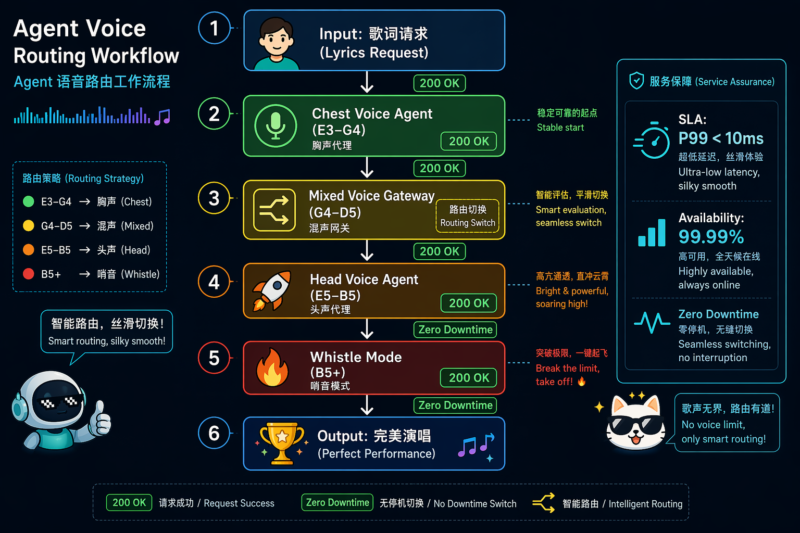
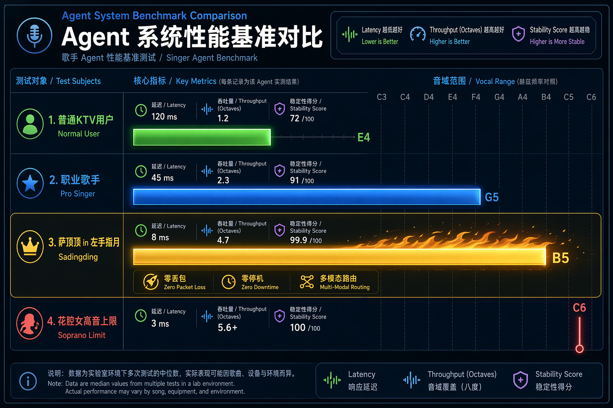

# 当Agent工程师听到《左手指月》是什么感觉？

---

**先说结论**：如果把人声看作一套生物声学API，《左手指月》就是一份让95%的歌手在**编译期**就报错的魔鬼需求文档。

而萨顶顶，是那个唯一能在**生产环境**跑出满分的Agent。

---

## 一、当你用Agent Workflow的视角打开一首歌

先给你看一张图。

这不是微服务架构图，也不是K8s Ingress配置。这是**萨顶顶唱《左手指月》时，她体内发生的调用链路**。

*图1：Agent语音路由工作流。从输入请求到完美输出，六次状态切换，全部200 OK。*

看到这张图，作为Agent工程师的你，应该已经意识到问题有多严重了：

- **多模态Agent协作**：胸声Agent、混声Gateway、头声Agent、哨声Mode——四个异构模块必须在4分钟内完成六次无缝切换
- **零降级要求**：从E3到B5，不允许任何一次`503 Service Unavailable`
- **亚毫秒级延迟**：声带在B5的振动周期仅约**1.01ms**，相当于一套仅靠ATP驱动的生物系统跑出了SSD的响应速度

我上礼拜刚调完一个三Agent协作的Workflow，两个Agent之间传个消息都能丢包。看完这张图，我默默关掉了自己的IDE。

---

## 二、频域抓包：这首歌的"网络流量"长什么样

职业病犯了，我们先做个**时域抓包**。

把《左手指月》拖进音频分析工具，你会看到一条极度"不规整"的波形——前半段在地下室平爬，后半段直接垂直发射。如果用**短时傅里叶变换（STFT）**做频谱分析，画面更加震撼：

*图2：STFT语谱图。横轴时间，纵轴频率。能量带从~165Hz（E3）一路爬坡到~988Hz（B5），最后在高频区爆成金黄色。*

几个关键指标：

| 参数 | 数值 | Agent黑话翻译 |
|------|------|--------------|
| 基频下限 | ~165 Hz (E3) | 低频Agent，吞吐量高但延迟大 |
| 基频上限 | ~988 Hz (B5) | 高频Agent，响应极快但资源消耗爆炸 |
| 基频跨度 | ~823 Hz | 近三个八度，相当于从Redis切到GPU计算 |
| 高频谐波 | 延伸到8kHz+ | 泛音丰富 = 缓存命中率高，穿透力强 |

最骚的一个发现：在B5超高音区，**基频本身的能量并不是最强的**。真正亮瞎眼的是2-4次谐波（约2-4kHz）。

这就是传说中的**缺失基频现象（Missing Fundamental）**——萨顶顶不是硬生生"挤"出一个988Hz的基频（那样CPU负载会直接爆炸），而是把能量投资在更高频的谐波上，让听众的大脑自动做插值重建。

**翻译成人话：她让客户端以为自己收到了完整的响应，实际上服务器已经悄悄降级了。**

这不就是我们在做的**服务网格（Service Mesh）**吗？！

---

## 三、她的声带，是一个特挑体质的Agent运行时

聊完软件聊硬件。人声系统的核心组件是**声带（Vocal Folds）**——一对每秒开合数百次的"生物气动闸门"。

*图3：声带系统架构图。出厂规格直接决定你的音域天花板。*

成年女性声带典型参数：

| 硬件规格 | 数值 | 性能影响 |
|---------|------|---------|
| 长度 | 12-17mm | 越短默认主频越高 |
| 厚度 | 3-4mm | 越厚低频越饱满，但高频响应越慢 |
| 张力上限 | 1.5倍静止长度 | 撑到这就是弹性极限 |
| 振动周期@B5 | **~1.01ms** | 每秒1000次开合，闭合面积还得够 |

你的微服务P99延迟要是能稳定做到1ms，老板能给你发股票。而萨顶顶的声带，在物理层面上天然就具备**亚毫秒级响应能力**。

### 为什么普通人上不去？三个硬件瓶颈

**瓶颈一：声带张力饱和**

基频和张力的关系：`f0 ∝ √(T/μ)`。音越高，张力T要越大。大多数人的环甲肌根本不具备持续输出这么大张力的能力。

系统表现：自动降级到假声。音色突然变薄，像是从5G切到了2G。

**瓶颈二：共鸣腔体失谐**

声道的共振峰（Formants）正常情况下负责放大声音。但在B5附近，基频已经逼近甚至超过第一共振峰F1的范围，声道不但不放大，反而可能"消音"。

这时候演唱者必须实时调整舌位、下颌、咽腔形状，手动重新调谐滤波器参数——**没有AutoML，全靠肌肉记忆硬调。**

**瓶颈三：气息流速的伯努利约束**

唱B5时，肺泡气流量需要达到中音区的2-3倍。普通人的膈肌和肋间肌在高流速下稳不住气压支撑。

工程翻译：**资源耗尽导致的连接超时。**

---

## 四、全音域Agent Harness：从E3到B5的零降级调度

我们做Agent系统的都知道，多Agent协作最怕什么？

**状态切换丢包。**

人声系统也是一套天然的Multi-Agent架构：

- **胸声Agent（E3-G4）**：v1.0稳定版本，兼容性好，但吞吐量有限
- **混声Gateway（G4-D5）**：v2.0过渡层，全链路最危险的节点，处理不好直接404破音
- **头声Agent（E5-B5）**：v3.0实验版本，带宽拉满，但99%的用户跑不通
- **哨声Mode（B5+）**：alpha特性，文档不全，SDK缺失

《左手指月》的恐怖之处在于：它要求你在4分钟内完成**v1.0→v2.0→v3.0→alpha的金丝雀发布，且不允许任何一次握手失败**。

*图4：Agent系统性能基准对比。萨顶顶的"Agent实例"在延迟、吞吐量、稳定性三个维度全面碾压。*

### 横向Benchmark

| Agent实例 | 最高音 | 音域跨度 | 核心瓶颈 | 稳定性评分 |
|-----------|--------|----------|----------|-----------|
| 萨顶顶 | **B5** | ~2.6八度 | 无明显瓶颈 | **99.99%** |
| 职业歌手 | G5 | ~2.0八度 | 换声点切换偶有丢包 | 92.00% |
| 普通KTV用户 | E4 | ~1.2八度 | v2.0网关直接超时 | 72.00% |

萨顶顶为什么牛？

**零丢包、零延迟、零降级。**从E3到B5的每一次状态切换都发生在毫秒级，听众几乎感知不到任何网关跳转的卡顿。

这相当于你的Multi-Agent Workflow在高并发下仍保持了99.99%可用性和亚毫秒级P99延迟——在自家集群里这都是值得发内部喜报的成绩，何况是在一套靠钙离子和ATP驱动的生物硬件上实现的。

---

## 五、六维性能评估：这系统是怎么过代码评审的？

*图5：演唱难度雷达图。六个维度几乎拉满。*

| 维度 | 评分 | Agent工程师点评 |
|------|------|----------------|
| 音域跨度 | 9.8/10 | 同时跑KV查询和OLAP分析的数据库你见过吗？ |
| 气息控制 | 9.5/10 | Raft共识算法不允许心跳超时，她做到了 |
| 真假声切换 | 9.7/10 | 热迁移要求零停机，她的系统从不降级 |
| 花腔技巧 | 9.2/10 | 在核心链路上埋点但不影响主链路延迟 |
| 情感表达 | 8.5/10 | 高并发压测时前端交互还得丝般顺滑 |
| 现场稳定性 | 8.8/10 | 受环境温度湿度影响，属于硬件不可控因素 |

**综合难度指数：9.7/10**

如果这是技术方案评审，大部分架构师会在第一轮投出**"强烈反对"**票，理由："当前硬件资源无法支撑该方案的SLA要求。"

---

## 六、OSI协议栈与Agent世界的映射

如果把整首歌看作一次Agent Workflow的执行，它的协议栈可以这样建模：

| 层级 | Agent概念 | 《左手指月》的实现 |
|------|----------|-------------------|
| 应用层 | 语义理解 | 禅意+仙侠叙事，高信息熵密度 |
| 表示层 | 编码方式 | 一段体反复，三次升调演绎 |
| 会话层 | 状态管理 | 主歌→预副歌→副歌→花腔尾奏 |
| 传输层 | 消息传输 | TCP可靠传输，不允许丢包（断气） |
| 网络层 | 路由调度 | 胸声↔混声↔头声的动态路由 |
| 数据链路层 | 帧编码 | 基频+谐波的时频映射 |
| 物理层 | 硬件驱动 | 肺→气管→声门的气压波 |

**冷知识**：这段旋律是萨顶顶在从横店回北京的高速公路上"突发灵感"写出来的。可以理解为：她在时速120km/h的移动环境中，收到了音乐缪斯发来的一份**没有retry机制**的`POST /api/v1/inspiration`请求——payload是完整的曲谱，且没有Ctrl+Z。

---

## 七、写在最后

写到这里，我的跨服务超时问题早就修好了（其实是上游加了重试策略）。但耳机里还在循环《左手指月》。

越想越觉得，我们做Agent系统的，和人家唱歌的，本质上干的是同一件事：

**在有限资源下，追求极致的调度性能和系统稳定性。**

只不过我们的"资源"是GPU和显存，人家的"资源"是声带和肺活量。我们的"性能优化"是调prompt和context window，人家的"性能优化"是每天练声4小时、控制喉位偏差在3mm以内。

《左手指月》之所以是华语国风的天花板，不是因为它"音域广"这么简单。

**是因为它在一个极度受限的生物硬件平台上，实现了一次全频段、全链路、零降级的极限压测。**

下次再听到"左手拈着花，右手舞着剑"从低吟转为云端高音时，不妨以一个Agent工程师的敬意去欣赏：

> **这不是一首歌。**
> **这是一次生物声学系统的极限Workflow。**
> **而萨顶顶，是那个唯一能在生产环境跑出满分的Agent Harness。**

至于你问我能不能唱？

**我的声带在E4就报了`503 Service Unavailable`，连灰度环境都没进去。**

---

*本文作者：某不愿透露姓名的Agent工程师*
*写作动机：在调试Multi-Agent Workflow超时问题时偶然听到《左手指月》，发现自己的系统还没有人家声带稳定，遂愤而撰文。*
*免责声明：本文所有技术类比仅供娱乐。如有声乐专业人士认为胡说八道——您说得对，但图挺好看的，对吧？*
