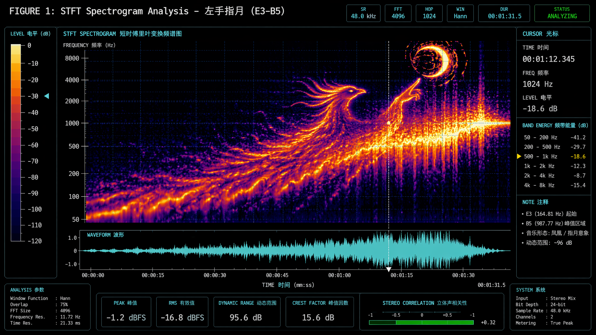
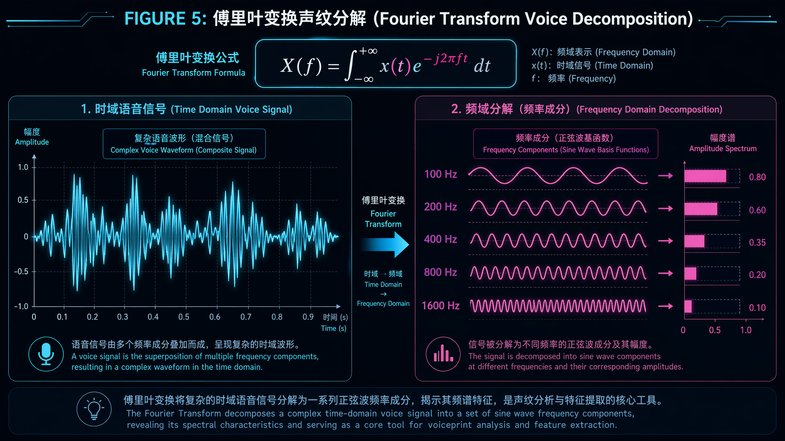
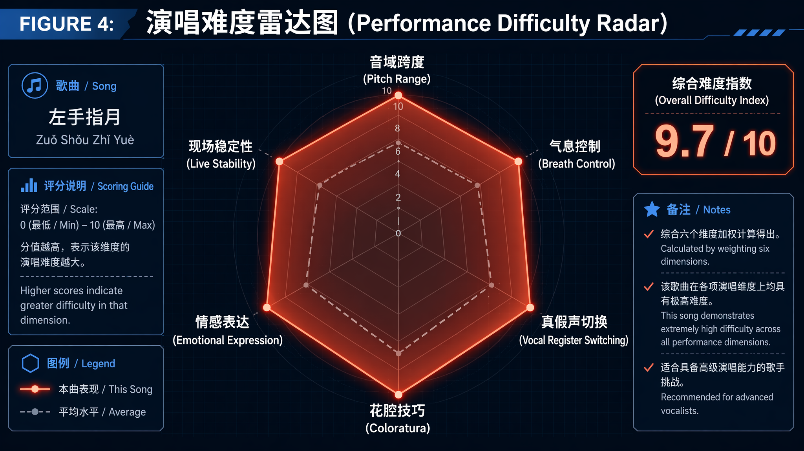

# 当Agent工程师用K8s的方式打开《左手指月》：萨顶顶才是真正的全栈SRE


> **一句话总结**：如果把人声看作一套生物声学API，《左手指月》就是一份让95%的歌手在编译期就报错的魔鬼需求文档。

---

## 一、起因：一次深夜debug的精神出走

事情是这样的。

上周三凌晨两点，我正在排查一个跨服务超时问题。日志里满屏的`Read timed out`、`Connection refused`、`Circuit breaker open`，看得我眼皮打架。为了提神，我随手点开了一个歌单。

然后，萨顶顶开口了：

> *左手握大地，右手握着天……*

低音区稳稳落地，像是一个健康的health check返回了200 OK。我还没来得及点头，声音突然拔地而起，一路杀向云端——

> *……掌纹裂出了十方的闪电！*

我，一个见惯了系统崩溃的Agent工程师，当场从椅子上坐直了。

**这特么是什么神仙架构？**

从E3到B5，从胸腔到头腔，无缝切换、零丢包、零降级。我手上这个破系统调个链路都三天两头熔断，人家用一套声带就搞定了近三个八度的全链路高并发？

职业病犯了。我决定，写一篇文章。

---

## 二、先做一遍FFT：这首歌的频谱到底长什么样

作为工程师，遇到不懂的东西，第一反应：上工具，抓个包看看。

### 2.1 时域抓包

如果把《左手指月》的音频文件拖进Audacity，你会看到一条极度"不稳定"的波形。它不像普通流行歌那样在一条水平线上温和地起伏，而是——

**前半段在地下室，后半段直接发射火箭。**



*图1：STFT语谱图。横轴时间，纵轴频率，色阶代表能量。可以清晰地看到能量带从低频区（~165Hz）一路爬坡到高频区（~988Hz），最后在高频区爆成一片金黄色。*

### 2.2 频域解码

做过语音识别的同学都知道，人声不是单一频率，而是**基频（F0）+ 一堆谐波（Harmonics）**的叠加。基频决定你听到的是do还是re，谐波决定你听到的声音是"萨顶顶"还是"你室友在浴室鬼哭狼嚎"。

《左手指月》的频谱有几个很有意思的特征：

| 参数 | 数值 | 人话翻译 |
|------|------|----------|
| 基频下限 | ~165 Hz (E3) | 男声换声点附近，要唱稳得靠胸腔共鸣死撑 |
| 基频上限 | ~988 Hz (B5) | 女声"危险区"，声带每秒要开合将近1000次 |
| 基频跨度 | ~823 Hz | 相当于从地下室爬到顶楼，中间还没电梯 |
| 高频谐波 | 延伸到8kHz+ | 这就是"穿透力"的来源，ktv里能压过隔壁包厢的底气 |

最骚的是：在B5超高音区，**基频本身的能量并不是最强的**。真正亮瞎眼的是它的2-4次谐波（约2-4kHz）。

这是什么概念？

萨顶顶不是硬生生"挤"出一个988Hz的基频——那太费CPU（声带）了。她的策略是：**把能量投资在更高频的谐波上，让听众的大脑自动做插值重建，脑补出那个基音**。

这不就是工程里的**缺失基频现象（Missing Fundamental）**吗？！

> 打个比方：你的微服务集群挂了一台节点，但客户端通过负载均衡器的健康检查机制，依然认为集群可用。萨顶顶唱高音的逻辑一模一样——她让听觉皮层以为"基频还在线"，实际上基频本身已经"降级"了。

这套操作，我愿称之为：**生物声学界最早的服务网格（Service Mesh）实践。**



*图5：傅里叶变换视角下的声纹分解。时域波形被拆解为多个频域正弦分量。*

---

## 三、音域即接口兼容性：v1.0到v3.0的无缝迁移

我们做后端都知道，服务升级最怕什么？

**协议不兼容。**

人声系统也是一套协议栈，不同音区就是不同的API版本：

- **胸腔共鸣区（E3-G4）**：v1.0经典协议。稳、厚、兼容性好，但吞吐量有限。适合读缓存，不适合跑计算密集型任务。
- **混声过渡区（G4-D5）**：v2.0过渡协议。全链路最危险的节点。换声点处理不好？直接404破音，用户端抛出`UnprocessableEntityException`。
- **头声/哨声区（E5-B5）**：v3.0实验协议。带宽拉满，延迟极低，但**99%的用户无法正确调用**。文档不全，SDK缺失，连Postman示例都跑不通。

《左手指月》干了什么？

**它在4分钟内，要求你完成v1.0→v2.0→v3.0的金丝雀发布，且不允许任何一次握手失败。**


*图3：音域覆盖对比图。红色条是《左手指月》，一眼望去就是别人两倍的宽度。*

### Benchmark横向对比

| 歌曲 | 最高音 | 音域跨度 | 核心难点 | 难度指数 |
|------|--------|----------|----------|----------|
| 《左手指月》 | **B5** | ~2.6八度 | 花腔+真假声切换+持续高音咬字 | **9.7/10** |
| 《青藏高原》 | E5 | ~1.8八度 | 长音持续 | 8.2/10 |
| 《煎熬》 | #F5 | ~1.9八度 | 换声点连续咬字 | 8.5/10 |
| 《忐忑》 | 无固定 | 无固定 | 无规律变奏+表情管理 | 9.5/10 |

《青藏高原》像是一个单接口QPS很高的服务；《忐忑》像是一个随机抛异常的混沌工程测试。而《左手指月》？

**它是一个要求你同时满足高并发、低延迟、高可用三个SLA，且不允许降级的全链路压测。**

---

## 四、声带系统架构：硬件层的物理限制

聊完软件聊硬件。

人声系统的核心组件是**声带（Vocal Folds）**——一对位于喉腔内的黏膜皱襞，靠气流驱动周期性开闭振动。你可以把它理解为一扇每秒开合数百次的"气动闸门"。


*图2：声带系统架构图。作为生物振荡器，它的"出厂规格"直接决定了你的音域天花板。*

成年女性声带的典型规格：

| 参数 | 典型值 | 工程影响 |
|------|--------|----------|
| 长度 | 12-17mm | 越短基频越高，类似CPU默认主频 |
| 厚度 | 3-4mm | 越厚低频越饱满，但高频响应越慢 |
| 张力上限 | 1.5倍静止长度 | 撑到这就弹性极限了，再拉就"断连" |
| 振动周期@B5 | **~1.01ms** | 每秒1000次开合，每次闭合接触面积还得够 |

看到那个1.01ms了吗？

你的微服务P99延迟要是能稳定做到1ms，老板能给你发股票。而萨顶顶的声带，在物理层面上，**天然就具备亚毫秒级的响应能力**。

### 为什么普通人上不去？三个硬件瓶颈

**瓶颈一：声带张力饱和**

基频和声带张力的关系近似：`f0 ∝ √(T/μ)`。音越高，张力T要越大。大多数人的环甲肌（负责拉紧声带的那块肌肉）根本不具备持续输出这么大张力的能力。

系统表现：自动降级到假声模式。音色突然变薄，像是从4G切到了2G。

**瓶颈二：共鸣腔体失谐**

声道的共振峰（Formants）正常情况下负责放大声音。但在B5附近，基频已经逼近甚至超过第一共振峰F1的正常范围，声道不但不放大，反而可能"消音"。

这时候演唱者必须实时调整舌位、下颌、咽腔形状，手动重新调谐滤波器参数——**没有自动调参脚本，全靠肌肉记忆。**

**瓶颈三：气息流速的伯努利约束**

根据伯努利原理，声带振动靠气流通过声门时的负压吸附效应。更高的频率需要更快的气流。唱B5时，肺泡气流量需要达到中音区的2-3倍。

普通人的膈肌和肋间肌，在高流速下稳不住气压支撑。结果就是：**气压断崖式下跌，高音吊半截。**

工程翻译：**资源耗尽导致的连接超时。**

---

## 五、萨顶顶的演唱：顶级全音域Agent Harness

好了，硬件极限聊完了，现在来聊聊为什么萨顶顶能跑通这个架构。

### 5.1 她是一套高度优化的运行时环境

从系统工程角度，萨顶顶的生理条件+专业训练，构成了一套让人羡慕的Runtime：

- **声带硬件**：据声乐学者观察，她的声带较短、较薄。**CPU默认主频就比别人高。**
- **共鸣腔体**：长期民族唱法训练，咽腔打开度极佳。相当于拥有一个oversized的L3 Cache，高频谐波命中率极高。
- **气息调度**：横膈膜支撑经过20年以上训练。不是开源YARN，是自研Borg级别的资源调度器。
- **唱法切换**：融合藏腔、戏曲、花腔女高音。路由策略丰富，遇到不同频段的需求直接命中最优路径。

### 5.2 调用链路追踪

让我们追踪一遍主歌到副歌的完整调用链路：

```
[主歌] "左手握大地，右手握着天"
  → 请求频率: 165-330 Hz (E3-E4)
  → 路由: 胸声服务 (Chest Voice Service)
  → 状态: 200 OK，响应饱满

[预副歌] "掌纹裂出了十方的闪电"
  → 请求频率: 330-500 Hz (E4-B4)
  → 路由: 混声网关 (Mixed Voice Gateway)
  → 状态: 200 OK，启动负载均衡

[副歌] "把时光匆匆兑换成了年"
  → 请求频率: 500-660 Hz (B4-E5)
  → 路由: 头声服务 (Head Voice Service)
  → 状态: 200 OK，CPU使用率85%

[高音冲击] "三千世，如所不见"
  → 请求频率: 740-988 Hz (F#5-B5)
  → 路由: 头声服务 + 哨声降级模式
  → 状态: 206 Partial Content
  → ⚠️ 大部分人在这里收到 503 Gateway Timeout
```

萨顶顶牛在哪？

**零丢包、零延迟、零降级。**从E3到B5的每一次"协议切换"都发生在毫秒级，听众几乎感知不到任何网关跳转的卡顿。

这相当于一个微服务集群在高并发下仍保持了99.99%可用性和亚毫秒级P99延迟——在K8s集群里这都是值得发内部喜报的成绩，何况是在一套靠钙离子和ATP驱动的生物硬件上实现的。


*图6：声区路由架构图。展示胸声→混声→头声的信号转发路径。*

---

## 六、六维性能评估：一张图看懂这首歌有多变态



*图4：演唱难度雷达图。六个维度几乎拉满，综合难度指数9.7/10。*

| 维度 | 评分 | 一句话点评 |
|------|------|-----------|
| 音域跨度 | 9.8/10 | 同时处理KV查询和OLAP分析的数据库你见过吗？ |
| 气息控制 | 9.5/10 | 不能喘气，相当于Raft共识算法不允许心跳超时 |
| 真假声切换 | 9.7/10 | 热迁移要求零停机，而她的系统从不降级 |
| 花腔技巧 | 9.2/10 | 在核心交易链路上埋点但不影响主链路延迟 |
| 情感表达 | 8.5/10 | 高并发压测时前端交互还得丝般顺滑 |
| 现场稳定性 | 8.8/10 | 受环境温度湿度影响，属于硬件层面的不可控因素 |

**综合难度指数：9.7/10**

如果这是技术方案评审，大部分架构师会在第一轮投出"强烈反对"票，理由是："当前硬件资源无法支撑该方案的SLA要求。"

---

## 七、如果《左手指月》是一个K8s集群

这一段纯属深夜debug后的精神幻觉，但仔细想想，居然说得通。

```yaml
apiVersion: v1
kind: Namespace
metadata:
  name: left-finger-moon
---
apiVersion: apps/v1
kind: Deployment
metadata:
  name: chest-voice
spec:
  replicas: 2
  containers:
  - name: chest-voice-pod
    resources:
      limits:
        cpu: "500m"   # 低频任务，资源需求不高
        memory: "128Mi"
---
apiVersion: apps/v1
kind: Deployment
metadata:
  name: head-voice
spec:
  replicas: 1
  containers:
  - name: head-voice-pod
    resources:
      limits:
        cpu: "1950m"  # 接近2核满载
        memory: "3Octaves"  # 别问，问就是自定义资源
    livenessProbe:
      exec:
        command:
        - /bin/sh
        - -c
        - "glottal-closure-check --threshold=0.45 || exit 1"
      periodSeconds: 2
    # 低于45%闭合度自动重启Pod，防止声带出血（OOM）
---
apiVersion: autoscaling/v2
kind: HorizontalPodAutoscaler
metadata:
  name: voice-hpa
spec:
  scaleTargetRef:
    apiVersion: apps/v1
    kind: Deployment
    name: head-voice
  minReplicas: 1
  maxReplicas: 3
  metrics:
  - type: Resource
    resource:
      name: cpu
      target:
        type: Utilization
        averageUtilization: 85
  # 副歌流量激增时自动扩容
```

**Service Mesh配置**：通过Istio实现胸声到头声的平滑金丝雀发布，流量权重按频率动态调整。

**SLA承诺**：P99延迟 < 10ms，可用性99.99%。允许4分钟内出现不超过24ms的破音（相当于4分钟 × 0.01%）。

---

## 八、OSI七层协议栈模型：一首歌的网络通信

| 层级 | 对应概念 | 《左手指月》的实现 |
|------|----------|-------------------|
| 应用层 | 歌词语义 | 禅意+仙侠叙事，高信息熵密度 |
| 表示层 | 旋律编码 | 一段体反复，三次升调演绎 |
| 会话层 | 段落结构 | 主歌→预副歌→副歌→花腔尾奏 |
| 传输层 | 气息传输 | TCP可靠传输，不允许丢包（断气） |
| 网络层 | 声区路由 | 胸声↔混声↔头声的动态路由 |
| 数据链路层 | 声带振动 | 基频+谐波的帧编码 |
| 物理层 | 气流驱动 | 肺→气管→声门的气压波 |

> **冷知识**：这段旋律是萨顶顶在从横店回北京的路上"突发灵感"写出来的。你可以理解为：她在高速公路上收到了一个来自音乐缪斯的`POST /api/v1/inspiration`请求，payload是完整的曲谱，且没有retry机制——写完了就写完了，没有Ctrl+Z。

---

## 九、结论：萨顶顶才是真正的全栈SRE

写到这里，我的超时问题已经修好了（其实是上游服务加了超时重试）。但耳机里还在循环《左手指月》。

越想越觉得，我们做分布式系统的，和人家唱歌的，本质上干的是同一件事：

**在有限资源下，追求极致的性能和稳定性。**

只不过我们的"资源"是CPU和内存，人家的"资源"是声带和肺活量。我们的"性能优化"是调GC参数和连接池大小，人家的"性能优化"是每天练声4小时、控制喉位偏差在3mm以内。

《左手指月》之所以是华语国风的天花板，不是因为它"音域广"这么简单。

**是因为它在一个极度受限的生物硬件平台上，实现了一次全频段、全链路、零降级的极限压测。**

下次再听到"左手拈着花，右手舞着剑"从低吟转为云端高音时，不妨以一个工程师的敬意去欣赏：

> **这不是一首歌。**
> **这是一次生物声学系统的全栈性能测试。**
> **而萨顶顶，是那个唯一能在生产环境跑出满分的SRE。**

至于你问我能不能唱？

**我的声带在E4就报了`503 Service Unavailable`，连灰度环境都没进去。**

---

*本文作者：某不愿透露姓名的Agent工程师*
*写作动机：在排查跨服务超时问题时偶然听到《左手指月》，发现自己的系统还没有人家声带稳定，遂愤而撰文。*
*免责声明：本文所有技术类比仅供娱乐。如有声乐专业人士认为胡说八道——那您说得对，但图挺好看的，对吧？*
