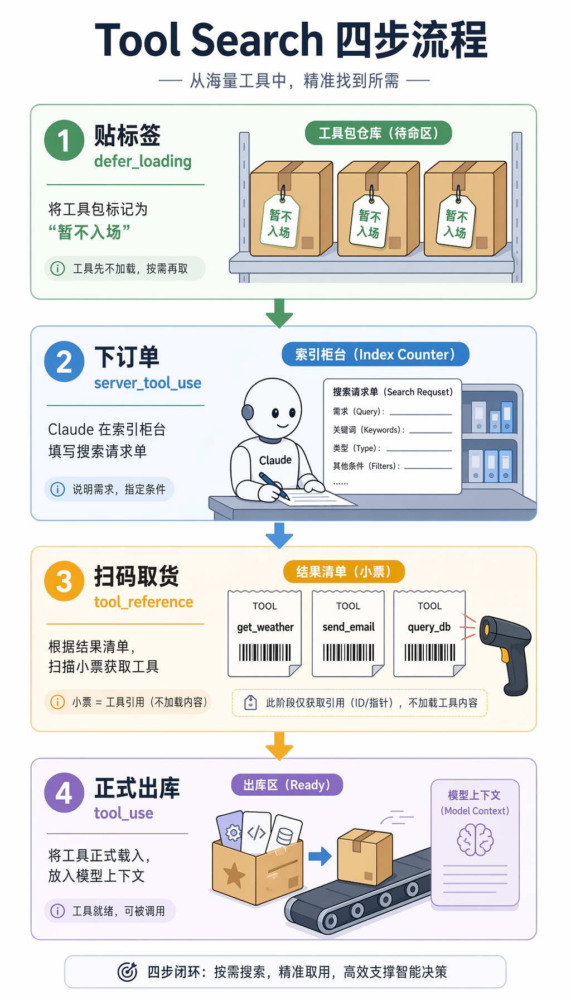
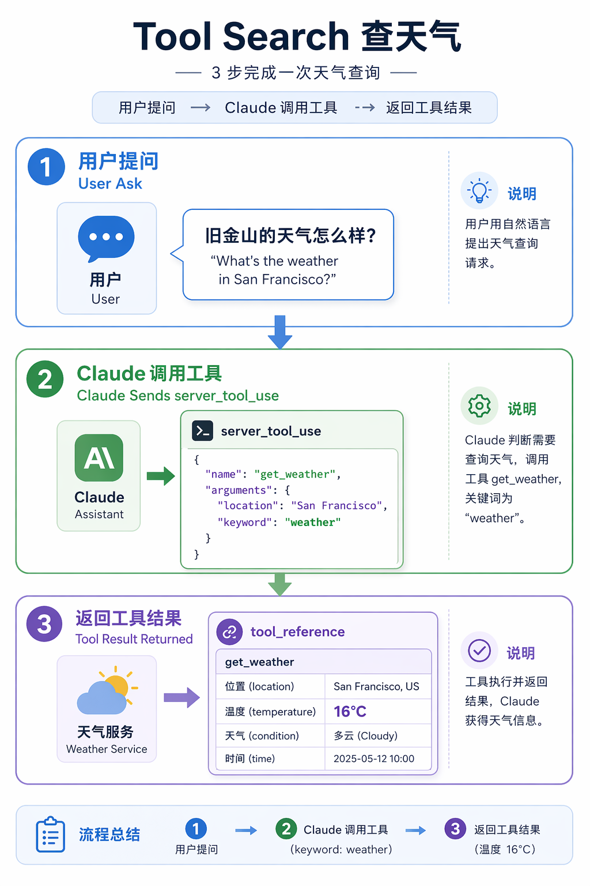
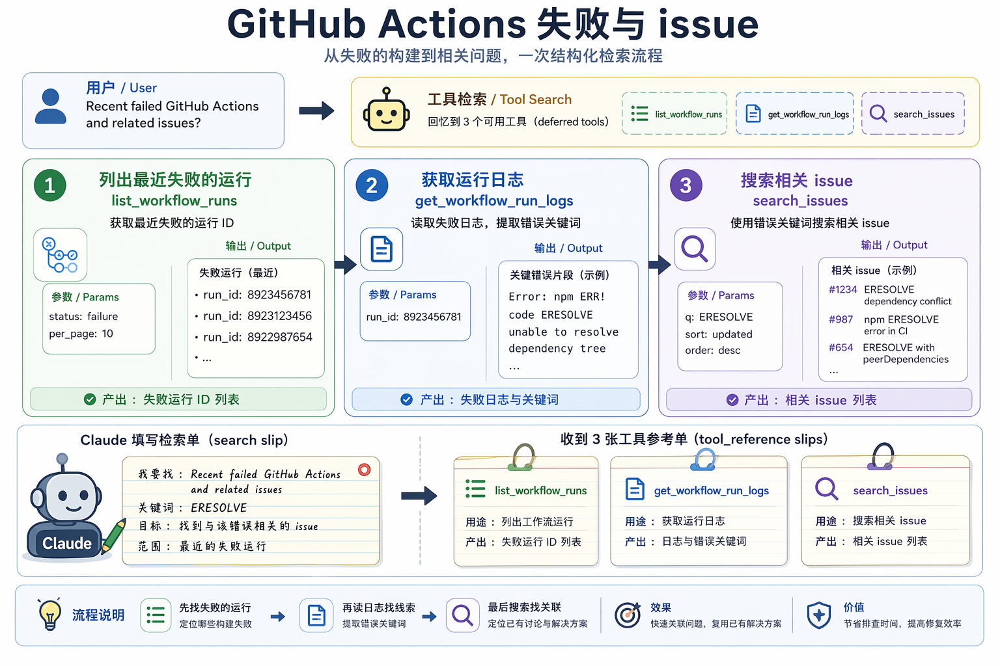
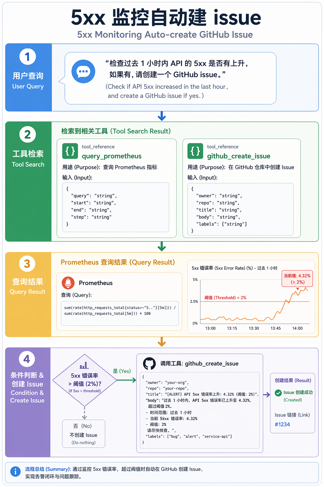
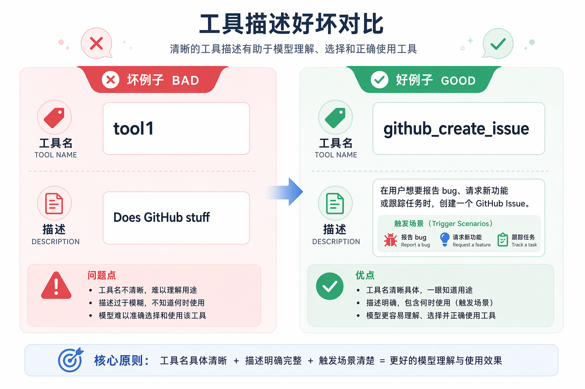

# Claude Tool Search 揭秘：AI 的“工具雷达”是怎么工作的？

## 为什么需要 Tool Search

Claude 的 MCP（Model Context Protocol）生态越接越重。一个典型的开发环境里，GitHub、Slack、Jira、Sentry、Grafana、PagerDuty、Notion、Linear 等 MCP 服务器同时在线，工具数量轻松过百。

问题随之而来：每次对话，模型都要面对这 100 多个工具的 JSON Schema。全部塞进上下文，既浪费 token，也让选择准确率下降。工具越多，模型越容易选错、漏选或多选。

Anthropic 的解法是 **Tool Search**，也就是延迟加载（deferred tool loading）。核心思路很简单：不必一次性把所有工具定义喂给模型，只先给一份索引；模型需要时再搜索、召回、展开对应的工具。

这套能力最早在 **2025 年 11 月**以“Advanced Tool Use”形式出现在 Anthropic API（beta header：`advanced-tool-use-2025-11-20`），2026 年 1 月扩展到 Claude Code 的 MCP 工具加载。它要解决的不是“模型不够聪明”，而是“工具太多时上下文扛不住、选不准”。

---

## 核心机制

整个流程可以拆成四步：

1. **延迟加载（`defer_loading`）**：大多数工具在启动时不会被直接塞进模型上下文，而是标记为“按需加载”。
2. **服务端搜索（`server_tool_use`）**：模型判断需要工具时，先向 Anthropic 服务端发起一次搜索请求。
3. **返回引用（`tool_reference`）**：服务端返回匹配工具的引用，不是完整 schema，而是一份“货位单”。
4. **展开调用（`tool_use`）**：API 自动把被引用的工具定义展开到上下文中，模型再像往常那样调用它。

关键点在于：只有被搜索命中的工具才会进入模型视野。绝大部分工具一直待在仓库里，从未上过工作台。这样上下文更干净，选择也更聚焦。

---

## 几个控制开关

在 Claude Code 和 Anthropic API 中，这套机制由几个参数控制。

`ENABLE_TOOL_SEARCH` 是总开关。默认在官方 Anthropic endpoint 上是开启的。`true` 强制启用；`false` 回到全量加载；`auto` 按阈值自动触发，例如 `auto:5` 表示工具描述占上下文 5% 时启用延迟加载。

`alwaysLoad` 用于少数高频工具，比如文件读写、核心 Git 操作。开启后会跳过搜索直接加载，但数量不宜多，否则延迟加载的意义就被抵消了。

还需要注意代理兼容性。如果你通过 `ANTHROPIC_BASE_URL` 指向非 Anthropic 官方 endpoint，代理可能不认识 `server_tool_use` 和 `tool_reference` 这些 Anthropic API 特有字段，导致静默丢包或报错。走代理时务必先做端到端验证。

---

## 什么时候该关掉它

默认情况下，使用官方 Anthropic endpoint 时 Tool Search 是开启的，不需要手动干预。

只有一种情况建议关闭：你通过 `ANTHROPIC_BASE_URL` 接入了非 Anthropic 官方 endpoint。这些后端通常不理解 `server_tool_use`、`tool_reference`、`tool_search_tool_result` 等 Anthropic API 特有字段，开启 Tool Search 后容易出现报错或异常。

关闭方式很简单：在 Claude Code 配置或 cc-switch 里把 `ENABLE_TOOL_SEARCH` 设为 `"false"`，效果就是回到全量加载的老路。代价是上下文更满、工具选择噪声更大，但至少能跑通。

---

## 三个真实 query

### 查天气

你问“旧金山现在多少度？”Claude 搜索 weather，召回 `get_weather`，然后调用得到温度。工具总数再多，这个 query 的调用路径都一样：搜索 → 召回 → 展开 → 调用。

### GitHub Actions 失败 + 相关 issue

你问“最近有没有失败的 GitHub Actions，顺便看看有没有相关 issue？”搜索一次召回三个工具：列出 workflow runs、读取 run logs、搜索 issues。Claude 按顺序执行：先看失败记录，再查日志，最后用错误关键词搜 issue。

### 5xx 监控 + 自动建 issue

你问“帮我查一下最近一小时 API 的 5xx 是否升高，如果升高就帮我建一个 GitHub issue。”Claude 一次召回 Prometheus 查询和 GitHub issue 创建两个工具，先查指标，再按条件分支决定是否建 issue。

这三个例子难度递增，但底层节奏一致：模型先搜索，再召回，再调用。

---

## 给开发者的建议

想让 Tool Search 效果更好，工具本身的元数据质量是关键。

- **工具名**带上命名空间，例如 `github_create_issue` 而不是 `create_issue`，`mcp__grafana__query_prometheus` 而不是 `query_metrics`。
- **工具描述**写明触发场景，例如“当用户想报告 bug、请求功能或跟踪任务时使用”。搜索会同时看名字和描述。
- **`input_schema` 字段**也要写描述。字段越具体，越容易被命中。
- **高频工具**可以 `alwaysLoad`，但数量要克制。太多就等于没开延迟加载。
- **走代理或网关**时要做端到端验证，确认 `server_tool_use` 和 `tool_reference` 没被静默吞掉。

---

## 它不是银弹

Tool Search 能解决上下文膨胀和选择噪声，但不是万能药。

- **HTTP / Streamable HTTP 形态的 MCP 工具**目前可能不会被延迟加载。如果你的 MCP 架构是 HTTP gateway 聚合大量上游工具，Tool Search 的收益会打折扣。
- **代理兼容性**仍是常见坑。很多第三方代理只识别 text、tool_use、tool_result，不认识 `server_tool_use` 和 `tool_reference`。
- **`auto` 阈值有反直觉的一面**：上下文窗口越大，10% 的绝对阈值就越高。在 1M token 模型上，50K 工具集只占总上下文的 5%，系统可能判定“不需要延迟加载”。
- **工具描述和任务清晰度**仍是上限。索引再智能，也救不了一本乱写的目录。

---

## 结语

Claude Tool Search 的本质不是让模型更聪明，而是让工具上下文从“全量加载”变成“按需索引”。模型不必背下所有工具的说明书，只在需要时搜索、召回、调用。对 MCP 工具越来越多的场景来说，这是一种必要的工程优化。
