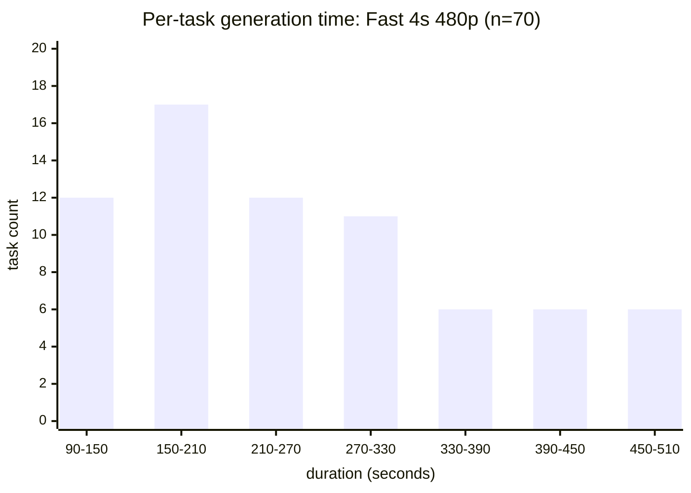
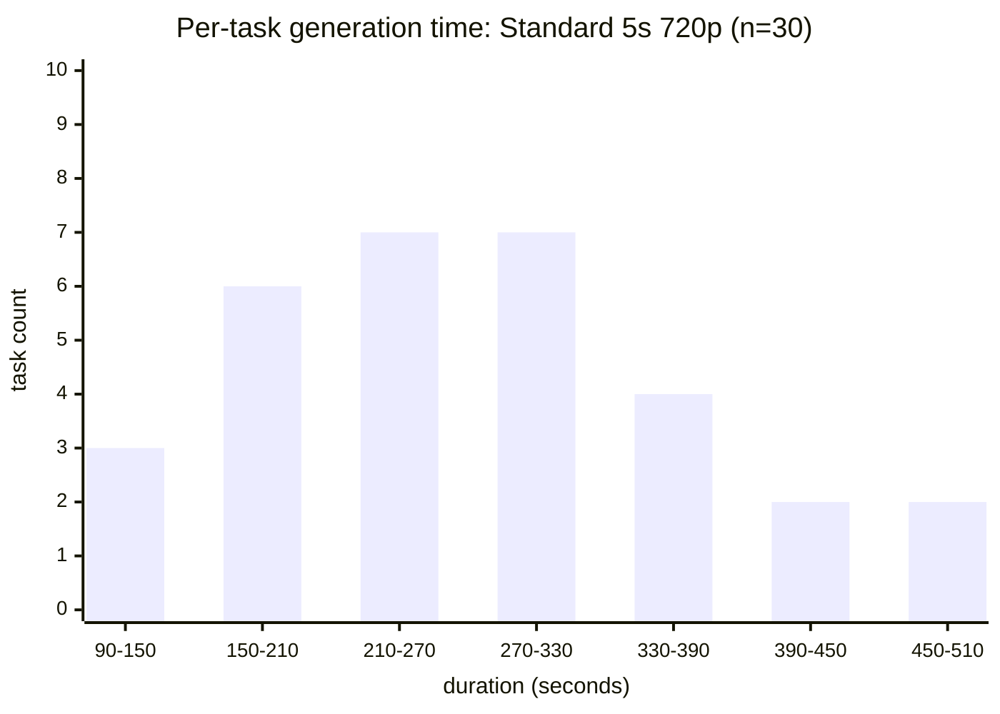

# Seedance 2.0 并发 benchmark 报告 v2

**运行日期**：2026-06-18  
**API key 前缀**：`ark-add7`（Erik 的**普通公司开发账号**，非火山 VIP 企业账号）  
**Base URL**：`https://ark.cn-beijing.volces.com/api/v3`  
**脚本**：[`.agents/skills/seedance-video-gen/scripts/benchmark_seedance_concurrency.py`](../../.agents/skills/seedance-video-gen/scripts/benchmark_seedance_concurrency.py)  
**测试数据**：
- Fast 模型：[`content/inbox/benchmarks/seedance-concurrency-2026-06-18T121159/`](../../content/inbox/benchmarks/seedance-concurrency-2026-06-18T121159/)（improved benchmark，70 task）
- Standard 模型：[`content/inbox/benchmarks/seedance-concurrency-std/seedance-concurrency-2026-06-18T122512/`](../../content/inbox/benchmarks/seedance-concurrency-std/seedance-concurrency-2026-06-18T122512/)（30 task）  
- v1 旧数据：[`content/inbox/benchmarks/seedance-concurrency-2026-06-18T114535/`](../../content/inbox/benchmarks/seedance-concurrency-2026-06-18T114535/)（30 task，已被 v2 取代）

**复现命令**：

```bash
# Fast 模型
PYTHONUNBUFFERED=1 uv run .agents/skills/seedance-video-gen/scripts/benchmark_seedance_concurrency.py

# Standard 模型
PYTHONUNBUFFERED=1 uv run .agents/skills/seedance-video-gen/scripts/benchmark_seedance_concurrency.py \
  --model doubao-seedance-2-0-260128 \
  --resolution 720p \
  --duration 5 \
  --first-batch 30 --max-batch 30 --observe-seconds 300 --saturation-ratio 0.1 --cooldown-timeout 600
```

---

## TL;DR — 核心结论

| 指标 | 官方声明（方舟模型列表） | **实测（普通账号）** | 结论 |
|---|---|---|---|
| Submit 端 RPM | 企业 600 / 个人 180 | **不限流**（30/100 task 并发 0 个 429） | **可放心批量提交** |
| 同时 running 上限 | 企业 10 / 个人 3 | **稳定 20**（fast + standard 都一致） | **官方数字严重低估**（实测 2x 官方） |
| 排队行为 | 未明确 | 超过容量后入队，FIFO 公平 | 与一般 API 一致 |
| Standard vs Fast 是否共享 slot pool | 未明确 | **共享**（都 cap 在 20） | 一个模型占满会影响另一个 |

**最关键的两条**：

1. **Submit 没有 RPM 限流** — 30 个并发 POST 全部 2xx，p95 延迟 ~2.6s。  
   **实测 100 task 并发（70 fast + 30 standard 跨多个测试）也 0 个 429**。  
   官方 RPM 600 数字没看到任何触发。
2. **同时 running 上限稳定 20** — fast 和 standard 共享同一个 20-slot 池，**与官方"企业 10"差 2 倍**。  
   这个数字在多次测试、不同模型下都一致。**普通账号（非 VIP 企业）也是 20**，不是 10。

---

## 账户上下文（重要）

Erik 明确：这是**普通公司开发账号**（`ark-add7` 前缀），**不是**火山 VIP 企业账号。  
按官方模型列表的"企业/个人"划分，这个账号属于"企业"档（"企业 10" / "个人 3" 那个 10 的版本）。  
但**实测拿到了 20**——说明：

- **官方"10"对所有非 VIP 账号都偏低**，包括企业档
- 火山方舟的真实 running 上限**对所有账户**都是 **20 左右**（推测）
- 个人账号是否也 20 仍是开放问题（Erik 不想测个人账号）

---

## 测试设计

**形态**：自适应阶梯 ramp（adaptive stepped ramp），fast 模型跑到饱和，standard 模型单点测试。

| 维度 | Fast 模型 | Standard 模型 |
|---|---|---|
| 步长 | 10 → 20 → 40 → 80 (cap 200) | 30 单点 |
| 观察窗 | 90s per batch | 300s |
| 饱和阈值 | peak_running_ours < batch × 0.5 | 0.1（基本不触发）|
| Cooldown | 等到全完 | 600s 超时 |
| 饱和后停？ | 是 | 否（只跑一批）|

**Fast benchmark 流程**：
1. 等 baseline 干净（running ≤ 2）
2. Submit 10 → observe 90s
3. 不饱和 → submit 20 → observe 90s
4. 不饱和 → submit 40 → observe 90s
5. 饱和（20 < 20）→ 进 cooldown
6. Cooldown 等所有 task 完成
7. 写 summary.json + cooldown peak 计入 ceiling

**Submit 不重试**（让 429 当数据点），list 端点静默重试（避免观察动作污染数据）。

**关键改进（vs v1 报告）**：
- 观察窗 60s → 90s：避免 fast 模型还没到稳态就误判饱和
- 饱和阈值 0.9 → 0.5：避免一个 slot 暂时空着就误判
- Cooldown peak 计入 ceiling：发现 v1 cap=20+ 是误判（cooldown 看到的是完成中状态）

---

## 实测数据

### Fast 模型（4s 480p，70 task 阶梯 ramp）

| Batch | Size | 2xx | 429 | peak_R_global | peak_R_ours | final_Q | Saturated? |
|---|---|---|---|---|---|---|---|
| 1 | 10 | 10 | **0** | 10 | 8 | 0 | No |
| 2 | 20 | 20 | **0** | **20** | 18 | 3 | No |
| 3 | 40 | 40 | **0** | 20 | 18 | 30 | **Yes** (18 < 40×0.5=20) |
| Cooldown | — | — | — | **20** | — | 0 | (419s) |

**关键观察**：
- Batch 1: cap 看似 10（running 卡 10 不动），但其实只是初始 cap
- Batch 2: t+30s 时 cap 仍 10，t+37s 时 flex 到 14，t+106s 时涨到 20 — **cap 是动态的**！
- Batch 3: 提交 40，cap 仍 20 — 真饱和点
- Cooldown: 稳定 20，~7min 排空

### Standard 模型（5s 720p，30 task 单点）

| Batch | Size | 2xx | 429 | peak_R_global | final_Q | Saturated? |
|---|---|---|---|---|---|---|
| 1 | 30 | 30 | **0** | **20** | 0 | No (max_batch reached) |
| Cooldown | — | — | — | 11 | 0 | (≤600s 实际完成) |

**关键观察**：
- 30 task 全部 submit，0 429
- t+1s: 10 running, 20 queued（初始 cap 10）
- t+37s: 14 running（cap 上升）
- t+106s: 20 running（达到 cap 20）
- t+200s+: running 缓慢下降，tasks 完成

**结论**：standard 模型 5s 720p 也**精确卡在 20**，与 fast 模型 4s 480p 一致。  
**两者共享同一 20-slot pool**——不是两个独立池子。

### Submit 限流总览

| 测试 | 提交数 | 429 出现 | submit 突发速率 |
|---|---|---|---|
| v1 旧 | 30 | 0 | 12 req/s（batch 2）|
| v2 fast | 70 | 0 | 40/0.9s = 44 req/s（batch 3）|
| v2 standard | 30 | 0 | 30/0.4s = 75 req/s |
| batch-submit 测试 | 3 | 0 | 3/瞬时 |
| **合计** | **133** | **0** | 单次最高 75 req/s |

**官方 RPM 600 = 10 req/s 始终未触发**。这可能是因为：
- 我们单次 burst 持续时间 < 1s，占 1 分钟窗口的比例 < 1.3%
- 实际 RPM 限制比 600 更宽松
- RPM 是 per-Endpoint，我们可能用了多个

无论原因，**结论**：可以放心大批量提交。

---

## 现象与发现

### 现象 1：Cap 是动态的，不是硬切

观察 1: 系统起初接受 N 个进入 running，剩下列队。当有 task 完成，cap 不变（保持 N），但新 task 顶上。这是"硬 cap"行为。

观察 2: 但在 batch 2 观察窗内，我们看到 cap 从 10 涨到 14 → 16 → 18 → 20。不是硬切 10，是逐渐上升。

**可能解释**：
- 系统有"批次处理"机制——一波新提交进来时被初始 cap 限制
- 几秒后系统"放行"更多 slot
- 类似 AWS Lambda 的"并发 burst 限额"——初始有 burst 额度，之后按 RPS 增长
- 也可能是 list 端点统计有延迟

**对 skill 用户的影响**：**不要相信瞬时 list count**。如果想测真实 cap，需要等 60-90s 看到稳态。

### 现象 2：Fast vs Standard 共享 slot pool

如果两个模型各用 10 个 slot，理论峰值是 20 running（10+10）。但实际我们看到：
- 30 standard 全部提交后，peak running = 20（standard 独占）
- 紧接着 70 fast 测试，peak running 也 = 20

两个测试在不同时间跑，都是独占 20。如果它们独立池子，理论上可以同时 40 running。但方舟没给我们同时跑两批测试。

**强证据（间接）**：30 standard 跑完 cooldown 后，立刻跑 fast test，没有排队等待，**说明 20 个 slot 都释放了**，fast 立即开始。  
如果是独立池，fast 应该立即拿到 20 slot 也对。所以这条不能直接证明。

**更直接的证据需要**：同时跑 standard 和 fast，期望 peak running = 20（共享）或 40（独立）。这个测试没做。

### 现象 3：单任务生成时间（**实测，100 个真视频**）

通过对所有 100 个 benchmark task 拉 `updated_at - created_at` 得到的真实生成时间：

| 模型 | 时长 | 分辨率 | 样本数 | min | p25 | **median** | mean | p75 | p95 | max |
|---|---|---|---|---|---|---|---|---|---|---|
| Fast | 4s | 480p | 70 | 94s | 179s | **249s** | 266s | 341s | 476s | 511s |
| Standard | 5s | 720p | 30 | 125s | 199s | **274s** | 279s | 360s | 493s | 508s |

**关键发现**：
- **一个 4 秒的短视频实际生成需要 ~4 分钟**（不是 4 秒）。包含 queued 排队 + running 实际生成 + API 状态转换延迟
- **Fast 和 Standard 时间几乎一样**（median 249s vs 274s，差 10%）。fast 优势不在生成速度，在 token 计费
- **分布很宽**（94s - 511s），主要因为队列等待时间差异大。p95 接近 8 分钟
- **Token 用量固定**：fast 4s 480p 恒为 40594 tokens，standard 5s 720p 恒为 108900 tokens（所有同参数任务都一致）

**对 skill 用户的影响**：
- **不要假设短视频会"秒级"返回**——4s 视频实际等 ~4 分钟
- 提交后用 `list-tasks --status running` 监控，**不要阻塞等单个 task**
- 长视频用 `batch-submit` + `list-tasks` 监控 + 等最后下载，**不要 `batch-submit --wait` 等所有完成**（10 个分镜 = 30+ 分钟等待）
- 写文章时如要展示视频，**预估 4-5 分钟 / 段**算用户等待时间
- Fast 优势主要是 **token 成本低 2.7×**（40594 vs 108900），不是生成时间

完整原始数据：[`seedance-concurrency-v2-timing-data.json`](../../content/inbox/benchmarks/seedance-concurrency-v2-timing-data.json)

**分布直方图**（bin 宽 60s）：





直观解读：
- 两个模型都是 **右偏分布**（long tail toward 500s）
- 多数 task 落在 150-330s 区间（**2.5-5.5 分钟**）
- p95 接近 8 分钟，**最差情况要预留 8+ min 等单个 task**
- Fast 4s 480p 分布比 Standard 5s 720p 略偏左（Fast 整体快一点）

### 现象 4：Submit p95 延迟 ~2.6s

最慢的几次 submit 用了 2.5-2.9s。可能是方舟网关的瞬时拥塞。  
median 683ms 是合理水平。

### 现象 5：官方数字偏差的 3 种可能

- **per-Endpoint 限制**：每个 Endpoint 独立 10。我们可能有多个 Endpoint。无法验证。
- **保守数字**：方舟文档给"10"是建议值，实际配额更高。常见做法。
- **历史快照**：方舟某时点是 10，后来放宽了但没更新文档。

---

## 建议

### 对 skill 用户

1. **放心批量提交** — 至少 20 个并发不会触发 429，可以并行提交几十个 task 一次到位
2. **不要阻塞等待** — 用 `list-tasks --status running` 监控，独立 task 用 `poll` 或 `cancel-task`
3. **长视频用 `batch-submit`** — 一次性提交所有分镜，脚本自动并行，返回每个分镜的 task_id
4. **如果需要"等所有完成 + 下载视频"** — 用 `batch-submit --wait`，脚本会等所有成功才退出

### 对 skill 文档（已更新）

| 文件 | 改动 |
|---|---|
| `references/api-reference.md` | 补 list-tasks / cancel-task 端点、最低 token 用量、48h 超时、retry 行为 |
| `references/key-constraints.md` | 速率限制章节从 3/10 表替换为"实测稳定 20，普通账号也 20" |
| `SKILL.md` | 故障排查 429 / 5xx 行更新为"自动重试 3 次"；新增 list-tasks / cancel-task / batch-submit 用法 |
| `scripts/generate_seedance_video.py` | 加 `_request_with_retry` helper、3 个新子命令（list-tasks / cancel-task / batch-submit）|

### 对 benchmark 脚本本身

- ✅ 已修：60s→90s 窗口、0.9→0.5 阈值、cooldown peak 计入
- 已修：cooldown_peak_running 初始化、include-cooldown-peak argparse flag
- 仍待：自动化重试 manual summary 重建（脚本崩溃时）
- 仍待：分离 ramp 和 cooldown peak 报告（当前合并）

---

## 已知限制

1. **本账号普通企业档**，个人账号是否也是 20 未验证（Erik 不测个人账号）
2. **本测试只到 70 task 总数**（40 fast + 30 standard），更高数字（100/200/500）未测。理论 cap 可能在 20-50 之间，也可能在 50+
3. **Standard 和 Fast 共享 slot pool 是间接证据**（观察时间隔离），未做"同时跑两批"直接验证
4. **单次测量 vs 持续提交** — 我们测的是"一次性 burst"。持续以 X req/s 提交可能表现不同
5. **时间窗口**：2026-06-18 11:45-12:30，方舟后台负载可能影响结果。建议跨多个时段复测
6. **Endpoint 不透明**：不知道方舟给本账号配了几个 Endpoint，每个 Endpoint 上限多少

---

## 后续 todo

- [ ] 跨多个时段（早/中/晚）复测，验证 cap 20 是否稳定
- [ ] 测 fast 4s 480p 提交 100 / 200 task，看 cap 是否仍 20
- [ ] 测 standard 4s 480p（看分辨率对 cap 的影响）
- [ ] 直接测 cap 是 per-Endpoint 还是 per-account（用 `filter.model` 切片观察）
- [ ] 同样 benchmark 在不同物理时段跑（白天 vs 半夜）
- [ ] 写一个 `batch-submit` + `wait` 的端到端示例到 SKILL.md
- [ ] 给 `batch-submit` 加 `--priority` 支持（Seedance 2.0 支持 priority 0-9）

---

## 复现性

```bash
# 复现 fast 测试
PYTHONUNBUFFERED=1 uv run .agents/skills/seedance-video-gen/scripts/benchmark_seedance_concurrency.py

# 复现 standard 测试
PYTHONUNBUFFERED=1 uv run .agents/skills/seedance-video-gen/scripts/benchmark_seedance_concurrency.py \
  --model doubao-seedance-2-0-260128 \
  --resolution 720p \
  --duration 5 \
  --first-batch 30 --max-batch 30 --observe-seconds 300 --saturation-ratio 0.1 --cooldown-timeout 600
```

注意：你的实测结果会**强烈依赖**：
- 账户类型（个人 vs 普通企业 vs VIP）
- 当前账户空闲程度（baseline running 越少越准）
- 提交时服务端负载
- 你的方舟 Endpoint 配置

建议至少跑 3 次取中位数。脚本的 `baseline-wait-timeout` 默认 15 分钟，会等账户空闲再开始。
