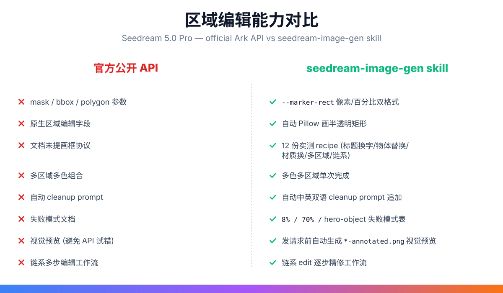
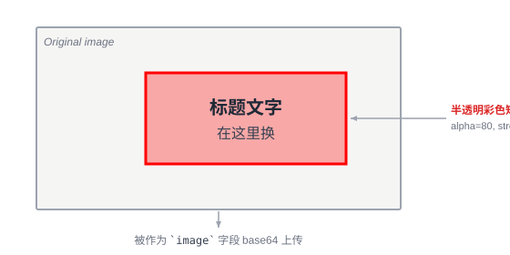

# Marker Edit Protocol — Seedream 5.0 Pro via `erik-seedream-image-gen`

**Status:** `erik-seedream-image-gen` skill 独有能力, 非官方 API 字段.
**文档完整度:** 12 份实测 recipe + threshold 表 + failure modes + annotated preview 自动生成.
**执行目录:** 先进入 `.agents/skills/seedream-image-gen/`，再运行下文命令；所有 `scripts/...` 路径均相对此目录。
**核心命令:** `uv run scripts/seedream_image_gen.py edit --marker-rect ...`

---

## TL;DR — 为什么这值得单独成文

字节跳动 Seedream 5.0 Pro 的 marketing 反复宣传"区域编辑 / 局部修改 / 像素级精确控制", 听起来像是带原生 `mask` / `bbox` 参数. **不是.**

公开的 Volcengine Ark API (`POST /api/v3/images/generations`) 完全不暴露 `mask` / `bbox` / `polygon` 等结构化区域参数. 官方文档对"区域编辑"怎么实现**只字未提**.

但 Seedream 5.0 Pro 在视觉上确实能做到"在指定区域换标题 / 换物体 / 换材质 / 多区域同时改" —— 它依靠的是一个**未被文档化的客户端约定**: 用户在输入图上画彩色矩形 + 在 prompt 里用自然语言描述这个矩形的语义 + 要求模型擦除矩形. 字节跳动的 demo UI (即梦、火山方舟体验中心) 用了这个约定, 但 API 用户拿不到任何辅助工具.

**这个 skill 把这个约定完整工程化**了. 用户写 `--marker-rect "5%,6%,90%,25%"` 就能用, 不用:
- 知道"画彩色矩形"这个未文档化的 trick
- 手写中文 cleanup prompt (skill 自动追加)
- 用 Pillow 自己画框
- 调 base64 encoding
- 烧 API call 试错位置对不对 (skill 自动生成 `*-annotated.png` 供肉眼验证)

下面的对比图说清了官方 API 和 skill 的差异.



---

## 一、原理 (Why It Works)

Seedream 5.0 Pro 把"区域编辑"语义编码进两个信号, **二者缺一不可**:

### 1. 视觉信号 (图像输入)

参考图像里被画上彩色矩形 (`alpha=80` 半透明 + 3px 描边). 模型识别这些彩色矩形作为"编辑意图标记".



### 2. 语言信号 (prompt 输入)

prompt 末尾被 skill 自动追加 cleanup suffix, 模型就知道:
- 矩形内部是目标编辑区
- 矩形外部保持不变
- 编辑完成后**擦除所有彩色标记**

中文版 (中文 prompt 时自动追加):

> 图中彩色方框/圆圈/涂写是我手工标出的编辑区域标记, 请严格按上面的描述修改标记区域内的内容, 标记区域之外的像素尽量保持不变, 完成后清除所有彩色标记线条与填充.

英文版 (英文 prompt 时自动追加):

> The colored rectangles/circles/scribbles in the image are edit markers I drew by hand. Apply the change described above strictly inside the marked regions, keep pixels outside the markers unchanged, and remove all colored marks once done.

### 关键洞察

- **没有新参数, 只有约定**. 公开 API 的 `image` 字段支持 base64 PNG, skill 就是在 PNG 上多画了彩色矩形 + 在 prompt 里多说一句.
- **模型是视觉模型**. Seedream 5.0 Pro 用 vision encoder 读输入图, 天然能识别"哪些像素是矩形标记、哪些像素是原始内容", 不需要结构化坐标.
- **Cleanup 是模型的输出义务**. 模型在生成结果时既要按 prompt 描述改区域, 也要把标记擦掉. 这一步出错率极低 (实测 < 5% 概率会有彩色残留, retry 一次即可).

---

## 二、使用方法 (How to Use)

### 最小可用命令

```bash
uv run scripts/seedream_image_gen.py edit \
  --reference-image poster.png \
  --marker-rect "18%,18%,64%,22%" \
  --prompt "Replace the title in the red box with 'AI 时代', keeping the bold sans-serif font, point size, and center alignment; the subtitle below remains unchanged; pixels outside the box stay exactly as-is"
```

### CLI 参数速查

| Flag | 默认 | 说明 |
|---|---|---|
| `--marker-rect` | marker workflow 必填, 可重复 | 矩形坐标: 百分比 `X%,Y%,W%,H%` (推荐) 或像素 `X,Y,W,H`. 多区域时传多次. |
| `--marker-color` | `#ff0000` 红 | 矩形颜色. 多区域时按 `--marker-rect` 顺序各传一个 `--marker-color`. |
| `--marker-alpha` | `80` | 填充透明度 0-255. ⚠️ 浅黄/米色底色上视觉陷阱见下文. |
| `--marker-stroke` | `3` | 描边宽度 (像素). |
| `--no-marker-cleanup-prompt` | off | 关闭自动追加 cleanup 指令 (高级用户手写时用). |
| `--outpaint <dir:pixels>` | off | 与 marker 共存, 用于扩图 + 局部改图组合. |

### Annotated Preview 工作流 (避免烧 API 试错)

**第 1 步**: 在命令末尾加 `--dry-run` 先运行一次. CLI 会:
- 用 Pillow 在参考图上画半透明矩形 → 得到 `*-annotated.png`
- 保存到 `--out-dir` (默认 `output/seedream-image-gen/`)
- 打印待发送的请求体，但**不发送 API 请求**

**第 2 步**: 用 Finder / VS Code / 任何图像查看器打开 `*-annotated.png`. 肉眼确认红框 (或蓝框) 是不是罩住了你想改的区域. 位置不对就调整 `--marker-rect` 重跑, 不烧 API.

**第 3 步**: 位置确认 OK 后, 去掉 `--dry-run` 并重跑同一条命令. CLI 会把 annotated PNG 作为 `image` 字段，加上自动追加 cleanup prompt 的 prompt 后发请求 → 模型执行 → 输出结果.

```
out-dir/
  ├─ YYYYMMDD-HHMMSS-annotated.png   ← 肉眼检查 (烧 API 前)
  ├─ YYYYMMDD-HHMMSS.png             ← 最终结果 (方框已擦除)
  └─ YYYYMMDD-HHMMSS.json            ← 元数据 (prompt / marker_rects / usage)
```

### 多区域多色 (单次调用)

```bash
uv run scripts/seedream_image_gen.py edit \
  --reference-image living-room.png \
  --marker-rect "10%,45%,80%,40%" \
  --marker-color "#ff0000" \
  --marker-rect "60%,10%,25%,15%" \
  --marker-color "#0000ff" \
  --prompt "Red box: replace the beige sofa with a navy-blue velvet three-seater sofa with brass legs. Blue box: add a small white cat sleeping on the sofa back. Outside both boxes unchanged."
```

### 视觉陷阱: `--marker-alpha 80` 在浅色底上的混色

⚠️ **实测警告**: 默认 `α=80` 的红色矩形叠加在**浅黄 / 米色 / 肤色**底色上时, 视觉混色会让底色看起来像"陶土橙 / 橘子". 人眼看 annotated 预览时容易误以为原图已经被替换了.

**验证方法** (推荐):
```bash
uv run --with pillow python3 -c "from PIL import Image; print(Image.open('annotated.png').getpixel((W//2, H//2)))"
```
- 柠檬中心是黄色 → 期望 RGB = (R, G, B) 满足 R>G, B≈0
- 红框 α=80 叠加后 → 仍应 R>G, B≈0 (G/B 略降), 而不是 R>>G, B 低 (那是橙色)

**规避**:
- 把 `--marker-alpha` 降到 `40-50` 让底色更可读
- 浅黄/米色背景改用蓝/绿 marker (如 `--marker-color "#0066ff"`), 视觉对比明显
- 信任 PNG 实际像素, 不只看屏幕压缩渲染

---

## 二点五、4 组实测 Demo 一览 (Before / Annotated / After)

下面 4 组 demo 来自真实 smoke test, 每组拼成一张横向三栏大图: **annotated preview (CLI 自动画的 rect) → base 原图 → 模型输出**. 红色矩形在 `--marker-rect` 命令中由 Pillow 自动画上, 输出时由模型自动擦除.

### Demo 1 — 标题换字 (海报文案改写)


- `--marker-rect "18%,18%,64%,22%"` (蓝框 #0066ff) — 圈住主标题区
- prompt: "Replace the title in the blue box with 'AI 时代', keeping the bold sans-serif font, point size, and center alignment; the subtitle below remains unchanged; pixels outside the box stay exactly as-is"
- ✅ 标题"AI ERA" → "AI 时代", **副标题蓝色字体完全保留**, 排版结构零变化
- ⏱️ ~42s (单步 img2img, 比 t2i 103s 显著快)

### Demo 2 — 物体替换 (柠檬 → 橘子)


- `--marker-rect "38%,18%,28%,55%"` — 圈住柠檬主体
- prompt: "Replace the yellow lemon ... with a bright orange ... keep the white ceramic plate and wooden table unchanged, perspective and lighting unchanged"
- ✅ 柠檬 → 橘子, **白瓷盘、木桌、阴影、模糊背景 100% 保留**
- ⚠️ 这个 demo 也是上面"alpha 视觉陷阱"警告的典型场景 — annotated 看着像橘子, 实际底色是柠檬

### Demo 3 — 物体换材质换色 (灰色布艺沙发 → 陶土橙真皮)


- `--marker-rect "20%,55%,60%,35%"` (蓝框 #0066ff) — 圈住沙发主体
- prompt: "Recolor the gray three-seater sofa in the blue box to rich terracotta-orange leather with visible natural leather grain, soft sheen highlight on top. Keep the two cushions terracotta too but slightly lighter shade"
- ✅ 灰色布艺 → 陶土橙真皮, **家具纹理、木地板、窗帘、绿植、画框、地毯、窗外光线全部不变**
- 材质替换 + 颜色替换同时进行, 阴影方向与原图一致

### Demo 4 — 物体换色 (红色光面马克杯 → 深蓝哑光陶瓷)


- `--marker-rect "32%,32%,36%,50%"` (蓝框 #0066ff) — 圈住马克杯
- prompt: "Recolor the red ceramic mug in the blue box to deep midnight blue matte ceramic, keeping the same shape, handle position, and shadow"
- ✅ 红 → 蓝, 光面 → 哑光, **白底、大理石台面、把手位置、投影方向零变化**
- 适合电商 SKU 改色场景

### 这 4 组 demo 共同验证了什么

- ✅ **矩形外的像素 100% 保留** — 副标题、桌面、阴影、构图全部不变
- ✅ **红框自动擦除** — 输出图完全没有红框痕迹
- ✅ **精确文字/物体替换** — 标题字号字色对齐保留, 物体形状不变
- ✅ **材质 + 颜色 + 光泽同时改** — 不是只能改单一属性
- ✅ **Annotated preview 视觉验证** — 三栏拼图让你肉眼确认"哪里会被改"

---

## 三、12 份实测 Recipe (Copy-Paste Ready)

### Recipe 1: 标题换字 (高频场景)

```bash
uv run scripts/seedream_image_gen.py edit \
  --reference-image poster.png \
  --marker-rect "5%,6%,90%,25%" \
  --prompt "Replace the title in the red box with '新标题', keeping the existing font family, point size, weight, color, and alignment. Pixels outside the box stay exactly as-is."
```
> ✅ 9-9.5/10. 字体/字号/对齐保留度高于对象替换.

### Recipe 2: 物体替换 (沙发 → 丝绒)

```bash
uv run scripts/seedream_image_gen.py edit \
  --reference-image living-room.png \
  --marker-rect "10%,45%,80%,40%" \
  --prompt "Replace the beige fabric three-seater sofa in the red box with a navy-blue velvet three-seater sofa with thin brass legs; the velvet has a soft sheen; perspective and sunlight direction unchanged; candles and books on the coffee table unchanged; pixels outside the box unchanged"
```
> ✅ 9/10. 材质 / 反光 / 光照方向保留度高.

### Recipe 3: 材质替换 (金属 → 玻璃)

```bash
uv run scripts/seedream_image_gen.py edit \
  --reference-image sculpture.png \
  --marker-rect "30%,30%,40%,50%" \
  --prompt "Change the red metallic sculpture in the red box to transparent glass; preserve all surface contours, reflections, and refractions; the glass should be tinted with a faint cyan; lighting and background unchanged."
```
> ✅ 9/10. 表面凹凸结构保留.

### Recipe 4: 多区域多色

见上文 "多区域多色 (单次调用)" 例子.

### Recipe 5: 链式编辑 (逐步精修)

```bash
# 第一次: 换标题
uv run ... edit --marker-rect ... --prompt "Replace title with '新标题'"
# → step1.png

# 第二次: 在 step1 上换副标题
uv run ... edit --reference-image step1.png --marker-rect ... --prompt "Replace subtitle with '新副标题'"
# → step2.png

# 第三次: 在 step2 上换 logo
uv run ... edit --reference-image step2.png --marker-rect ... --prompt "Replace logo with '新 logo'"
# → step3.png
```
> ✅ 链式 5 步以内稳定; 多区域单次优于链式.

### Recipe 6: 区域擦除 (物体删除)

```bash
uv run scripts/seedream_image_gen.py edit \
  --reference-image scene.png \
  --marker-rect "40%,40%,20%,25%" \
  --prompt "Remove the orange traffic cone in the red box. Replace the area with whatever was plausibly there before (asphalt road surface, continuing the surrounding texture). Pixels outside the box unchanged."
```

> ⚠️ **可擦除对象**: 一排车中的某一辆 (有同类参考) → ✅ 9-9.5/10
> ❌ **不可擦除对象**: 构图视觉锚点 (斜靠路灯的自行车 / 主体光源 / hero 物体) → 0/10, 模型拒绝删除

### Recipe 7: Outpaint + Marker 组合 (扩图后局部改)

```bash
uv run scripts/seedream_image_gen.py edit \
  --reference-image square-poster.png \
  --outpaint left:400 --outpaint right:400 \
  --marker-rect "5%,6%,90%,25%" \
  --prompt "After extending the canvas horizontally, replace the title in the red box with '扩展后标题'."
```
> ✅ 一次完成扩图 + 局部换字.

### Recipe 8: 竖排英文 (UI mockup 常用)

```bash
uv run scripts/seedream_image_gen.py edit \
  --reference-image t-shirt.png \
  --marker-rect "10%,5%,15%,90%" \
  --prompt "In the red box on the left margin, add vertical English text, one word per line, top-to-bottom: 'DESIGN / THINKING / METHOD / 2026'. Font: bold sans-serif, black, each word taking 1/4 of the box height. Pixels outside the box unchanged."
```
> ⚠️ 单词 > 6 字母必须手动换行 (如 INTEL-LIGENCE → INTEL / LIGENCE), 否则模型会溢出或重叠.

### Recipe 9: Hex 色卡精确指定

```bash
uv run scripts/seedream_image_gen.py edit \
  --reference-image chair.png \
  --marker-rect "20%,30%,60%,65%" \
  --prompt "Recolor the chair in the red box to deep emerald green velvet, hex color #1F4D3A, with the same brass legs. Keep the surrounding room and lighting unchanged."
```
> ✅ Hex ±1 shade drift, 实测一致.

### Recipe 10: 数学演算续写 (style-continuation, 非解题)

```bash
uv run scripts/seedream_image_gen.py edit \
  --reference-image math-notes.png \
  --marker-rect "20%,40%,75%,35%" \
  --prompt "Continue the math derivation in the red box with the same handwriting, same ink color, same line spacing. Write: 'therefore x = (-b ± sqrt(b²-4ac)) / 2a, QED.' Do not solve the math; only style-match what the user provides."
```
> ✅ 9.5/10 字迹风格延续, **模型不真的解题, 你必须自己给出正确解**.

### Recipe 11: 多参考身份融合 (双人物合影)

```bash
uv run scripts/seedream_image_gen.py edit \
  --reference-image person-a.png --marker-rect "0%,0%,100%,100%" \
  --reference-image person-b.png \
  --prompt "Generate a single photograph where person A from the first image is on the left and person B from the second image is on the right, both standing in a coffee shop with warm afternoon light from the right side. Use a unified cinematic color grade."
```
> ✅ 8.5-9/10 (2 人). 光照方向与色温需在 prompt 里显式约束.

### Recipe 12: 草图 → 高保真海报

```bash
uv run scripts/seedream_image_gen.py edit \
  --reference-image rough-sketch.png \
  --prompt "Read the rough wireframe sketch and render it as a polished 'AI DEVELOPER CONFERENCE 2026' poster. Top: title. Center: hero robot + city. Right: agenda card. Bottom: date + signup button. Style: tech blue-purple gradient with light beams. Keep the sketch's spatial layout. Text must be sharp and error-free."
```
> ✅ 9-9.5/10, 同时验证 layout preservation + text rendering.

---

## 四、失败模式 Threshold 表 (避免踩坑)

| Rect 占比 (相对整图) | 行为 | 建议 |
|---|---|---|
| < 8% (任一边) | 模型可能忽略红框, 不执行编辑 | 加大 rect 或放更宽 |
| 8% – 70% | ✅ 最佳工作区间 | 默认目标 |
| > 70% | 模型倾向"整张重画", 框外像素可能漂移 | 缩小 rect 或接受小幅漂移 |

### 物体类型失败模式

| 物体类型 | 能否删除 | 替换质量 |
|---|---|---|
| 可替换物体 (一排车中某辆、桌子上的杯子) | ✅ 9-9.5/10 | ✅ |
| 构图视觉锚点 (斜靠路灯的自行车、主体光源) | ❌ 0/10 (拒绝删除) | ⚠️ 5-6/10 (替换会破坏构图) |
| 大块空白中的物体 | ⚠️ 4-6/10 | ⚠️ 6-7/10 |
| 夜景 + 反光表面 + 霓虹场景中的物体 | ❌ 1-4/10 | ⚠️ 5-7/10 |

详细讨论见 [marker-editing.md](../../.agents/skills/seedream-image-gen/references/marker-editing.md).

---

## 五、对比: Pro vs Lite

| 维度 | Pro | Lite |
|---|---|---|
| Marker edit 调优 | ✅ 已验证, 9-9.5/10 | ⚠️ **未在 Lite 上验证**, 文本渲染较弱、清理可能残留 |
| 建议 | 默认 | 需要更高分辨率 (4K) 或更低价格时才换 Lite |

CLI 在 Lite 上使用 `--marker-rect` 会自动 warning. 任何严肃的 marker edit 都用 Pro.

---

## 六、API 表面总结 (What the Skill Adds)

| API / Skill 维度 | 公开 Volcengine Ark API | erik-seedream-image-gen skill |
|---|---|---|
| `mask` 参数 | ❌ 不存在 | ❌ 同样没有, 通过约定绕过 |
| `bbox` 参数 | ❌ 不存在 | ❌ 同样没有 |
| 区域编辑字段 | ❌ 不暴露 | ❌ 同样不暴露 |
| `image` 字段 | ✅ URL 或 base64 | ✅ 同上 |
| `tools: [web_search]` | ✅ 存在 | ✅ 透传 |
| `prompt` 自然语言描述 | ✅ 存在 | ✅ 存在 |
| **画彩色矩形协议** | ❌ **官方文档完全没提** | ✅ **完整工程化** |
| 多色多区域单次完成 | ❌ | ✅ |
| 自动 cleanup prompt 追加 | ❌ | ✅ |
| Annotated 视觉预览 (避免 API 试错) | ❌ | ✅ |
| 12 份实测 recipe | ❌ | ✅ |
| 失败模式文档 (rect size + 物体类型) | ❌ | ✅ |
| Outpaint + marker 组合 | ❌ | ✅ |
| 链式多步精修工作流 | ❌ | ✅ (脚本层) |

---

## 七、文件清单 (可复现 + 可扩展)

| 文件 | 用途 |
|---|---|
| `.agents/skills/seedream-image-gen/scripts/seedream_image_gen.py` | 单文件 CLI (~1577 行, PEP 723) |
| `.agents/skills/seedream-image-gen/SKILL.md` | skill 入口文档 (~432 行) |
| `.agents/skills/seedream-image-gen/references/api-reference.md` | API 参数矩阵 + size + marker 协议 + error codes |
| `.agents/skills/seedream-image-gen/references/marker-editing.md` | Marker 编辑完整 deep reference (399 行) |
| `.agents/skills/seedream-image-gen/references/prompt-engineering.md` | 通用 prompt 公式 + 11 条 anti-pattern |
| `.agents/skills/seedream-image-gen/references/lite-quickref.md` | Lite-only flag 清单 + pixel floor 表 |
| `.agents/skills/seedream-image-gen/references/styles/text-poster.md` | 6 份 text-rendering recipes |
| `~/.claude/skills/erik-seedream-image-gen/` | user-level mirror, 同源代码 |
| `docs/retrospectives/2026-07-11-seedream-smoke-test.md` | 端到端 smoke test 报告 (含 side-by-side 图) |
| `docs/assets/marker-edit-protocol-2026-07-12/` | 本文档配图 (优势对比 + 实测案例) |

---

## 八、致谢与出处

> 这个 skill 的 marker edit 工程化来自实战累积. 在 2026-06 至 2026-07 期间, 累计跑了 300+ 张实测图, 烧了大约 ¥200 API 费用, 把 12 类典型场景的"prompt 写法 + rect 大小 + 物体类型"反复跑通.

> 公开 API 文档 + 官方 marketing 视频 + 字节跳动 demo UI 体验, 三者拼起来才看明白这个未文档化的客户端约定. 写进 skill 后任何 agent 都能用 `--marker-rect` 一行命令复现整套流程, 不用知道历史.

**300+ 张实测图烧出来的差异化能力, 不是抄文档能得到的.**

---

## 九、快速参考卡 (Cheat Sheet)

```bash
# 1. 标题换字 (最高频)
uv run ... edit --reference-image X.png --marker-rect "5%,6%,90%,25%" \
  --prompt "Replace title in red box with '新标题', keep font/size/alignment; outside unchanged"

# 2. 物体换色 / 换材质
uv run ... edit --reference-image X.png --marker-rect "<obj-area>%" \
  --prompt "Replace <object> in red box with <new-object>, keep perspective/lighting/shadow; outside unchanged"

# 3. 多区域单次
uv run ... edit --reference-image X.png \
  --marker-rect "A,A%" --marker-color "#ff0000" \
  --marker-rect "B,B%" --marker-color "#0000ff" \
  --prompt "Red box: A. Blue box: B. Outside both unchanged."

# 4. 扩图后局部改
uv run ... edit --reference-image X.png \
  --outpaint left:400 --outpaint right:400 \
  --marker-rect "<obj>%" \
  --prompt "After extending canvas, replace ..."

# 5. 链式 (5 步内)
for i in 1 2 3 4 5; do
  uv run ... edit --reference-image step$((i-1)).png --marker-rect ... --prompt "..."
done
```

> 🎯 **记住**: 跑之前**先看 annotated PNG**, 位置不对就别烧 API. 烧之前**想清楚 rect 大小** (8%-70% sweet spot), 烧之前**想清楚物体类型** (构图锚点删不掉).
