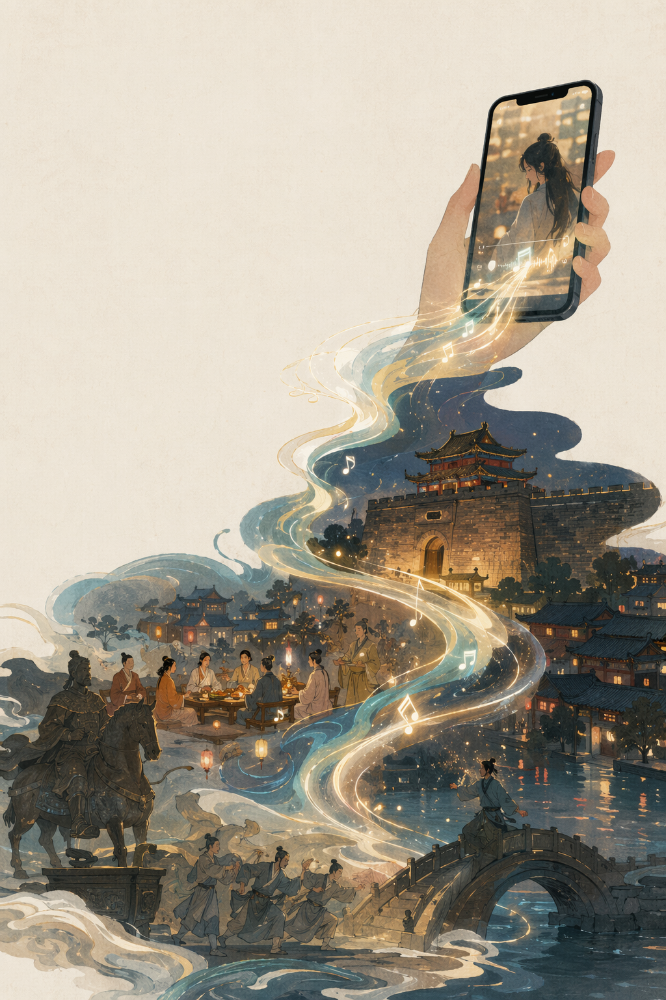
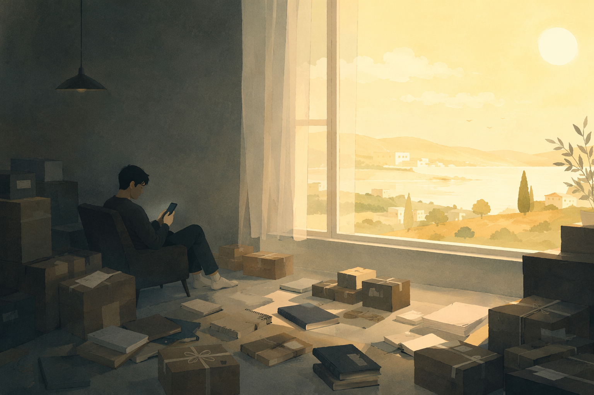
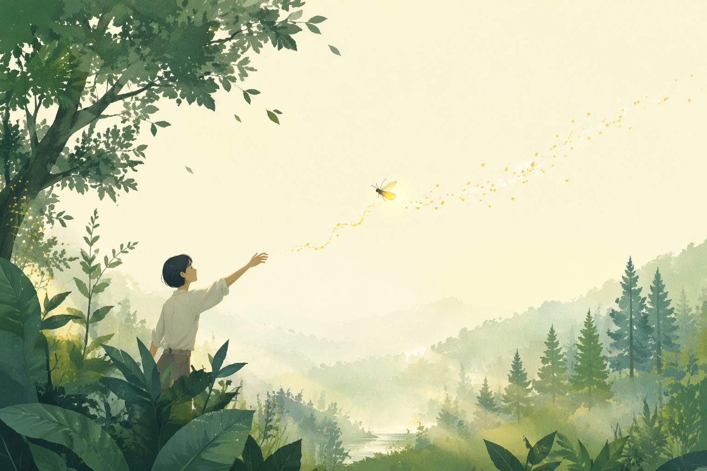

# Article Illustration Skill

`article-illustration` 用于生成文章封面、正文插图、章节视觉分隔图和技术图示。它是项目级写作 workflow 的视觉能力，不只是“文档插图”工具。

## Current Behavior

- 脚本：`.agents/skills/article-illustration/scripts/generate_article_illustration.py`
- 默认风格：`--style-profile auto`
- 文章正式出图时，优先明确指定风格，不要把 `auto` 当成审美决策。
- 文学、生活散文、文化现象文章不再默认钉死水彩；应按文章气质选择风格。

常用艺术风格：

- `editorial-atmospheric`：适合一般散文、文化观察、章节正文插图。
- `modern-guochao-editorial`：适合中国文化、城市、文旅、古风/国风主题。
- `cinematic-editorial`：适合舞台、现场、城市夜色和具有场景感的文章。
- `watercolor-illustration`：只在确实需要柔和绘画感时使用。
- `literary-picture-book`：**扁平插画 + 水彩晕染 + 手绘线条**，适合个人散文、随笔、哲思文章。强调留白、克制、文学感，色调偏暖金/墨蓝/森绿等低饱和度组合。

## Prompt Pattern

优秀的正文插图 prompt 不只是描述“画什么”，还要说明：

- 放在文章哪一节；
- 承担什么阅读功能；
- 用什么视觉隐喻承接论点；
- 需要出现哪些具体可见对象；
- 明确不要变成什么俗套方向；
- 明确移动端正文阅读、留白、不要文字等约束。

通用结构：

```text
正文插图，放在<文章标题>的<章节名>章节。画面表现：<文章论点或传播机制>，通过<一个具体视觉隐喻>连接<3-5 个可见对象或场景元素>。重点是<这张图要帮助读者理解的判断>，不是<需要避免的俗套方向>。风格<明确风格名或审美边界>，画面应有留白，适合移动端正文阅读。不要任何文字、字幕、logo、二维码、箭头或信息图标签。
```

## Example: Cultural Tourism Body Illustration

用于文章：

- Article: `content/source/2026-06-08-luolebai-handanxuebu/article.md`
- Section: `泼天的流量，邯郸接住了`
- Style profile: `modern-guochao-editorial`
- Size: `portrait-hd`
- Documentation image: `docs/assets/article-illustration/handan-traffic-caught-by-city.png`
- Local archive source: `.local-archive/2026-06-08-落了白-邯郸学步/images/handan-traffic-caught-by-city.png`
- Metadata: `docs/assets/article-illustration/handan-traffic-caught-by-city.json`



为什么这次效果好：

- 明确了图片在文章中的位置和功能：从短视频热闹过渡到城市文旅分析。
- 用具体视觉隐喻承接论点：手机短视频里的旋律，以声波和光带形式落到城市。
- 把文化元素列成可见对象：邯郸古城、赵文化礼宴、成语典故、学步桥、城市夜色。
- 明确反风格：不是旅游广告，不要文字、字幕、logo、二维码、箭头或信息图标签。
- 明确阅读场景：微信公众号正文、移动端阅读、需要留白。

Brief:

```text
正文插图，放在微信公众号文章《我只是听了首〈落了白〉，怎么就掉进了邯郸学步宇宙？》的‘泼天的流量，邯郸接住了’章节。画面表现：一段来自手机短视频的《落了白》旋律，像流动的声波与光带，从竖屏手机里延展出来，落到邯郸古城、赵文化礼宴、成语典故、学步桥意象和城市夜色之间。重点是‘短视频流量被城市文旅接住’，不是旅游广告。风格克制、有文化感、现代国潮编辑插图，画面应有留白，适合移动端正文阅读。不要任何文字、字幕、logo、二维码、箭头或信息图标签。
```

Command:

```bash
uv run .agents/skills/article-illustration/scripts/generate_article_illustration.py \
  --title "handan-traffic-caught-by-city" \
  --brief "正文插图，放在微信公众号文章《我只是听了首〈落了白〉，怎么就掉进了邯郸学步宇宙？》的‘泼天的流量，邯郸接住了’章节。画面表现：一段来自手机短视频的《落了白》旋律，像流动的声波与光带，从竖屏手机里延展出来，落到邯郸古城、赵文化礼宴、成语典故、学步桥意象和城市夜色之间。重点是‘短视频流量被城市文旅接住’，不是旅游广告。风格克制、有文化感、现代国潮编辑插图，画面应有留白，适合移动端正文阅读。不要任何文字、字幕、logo、二维码、箭头或信息图标签。" \
  --style-profile modern-guochao-editorial \
  --size portrait-hd \
  --quality auto \
  --language zh \
  --output-dir content/source/2026-06-08-luolebai-handanxuebu/assets/images
```

## Example: Literary Essay Illustration (《过时不候》)

用于文章：

- Article: `content/drafts/article-draft.md`
- Style profile: `literary-picture-book`（本项目新沉淀的风格）
- Size: wechat-cover-hd + doc-hd（正文横版）

为什么这次效果好：

- 三图色调统一（暖金+墨蓝、暖橙+冷灰、森绿+金光），和文章「文化随笔」气质完全匹配。
- `flat-illustration` 风格在 gpt-image-2 上非常稳，出图质量高、不崩。
- `watercolor + hand-drawn linework` 给了足够具体的材质描述，但又不至于太写实导致不像插画。
- `generous negative space` 确保每张图在手机窄屏上依然干净、不杂乱。
- 三幅图分别从"过期""拖延""捕捉"三个意象切入，和文章论点一一对应。

### 创作决策过程（从文章到图的完整思考链）

文章初稿完成后，我们按以下步骤决定插图方案：

**Step 1: 确定插图数量和位置**
封面必须有。正文看论点密度——这篇文章有 5 个章节，但核心意象只有 3 个（灵感过期 / 拖延 / 捕捉），所以正文配 2 张即可。放在"谨慎的外衣"和"野生念头"两个最抽象的章节，帮读者建立视觉锚点。

**Step 2: 确定风格方向**
文章是文化随笔 + 技术观察的混合体。纪实摄影太冷，纯抽象画太飘。最终选"扁平插画 + 水彩晕染 + 手绘线条"——既有插画的整洁，又有手绘的温度，和技术文字的冷感形成平衡。

**Step 3: 确定色调**
从文章情绪曲线提取：
- 开头"灵感过期" → 暖金 + 墨蓝（时间流逝的华丽感）
- 中段"拖延" → 暖橙 + 冷灰（内外对比的压抑感）
- 后段"捕捉灵感" → 森绿 + 金光（自然清新的希望感）

**Step 4: 写 prompt**
每幅图先确定"视觉隐喻"：
- 封面：火柴燃烧成光点 → 灵感的短暂与美丽
- 正文1：灰暗房间 vs 窗外阳光 → 拖延者的自我囚禁
- 正文2：萤火虫 + 文字碎片 → 念头稍纵即逝必须捕捉

然后套 prompt pattern：主体 + 动作 + 环境 + 材质 + 光影 + 构图 + 风格关键词。

### 风格解析：为什么这套 prompt 值得沉淀

**1. 模型甜点（Model Sweet Spot）**
`flat-illustration` 在 gpt-image-2 上是一条非常稳定的生成路径。相比写实摄影或复杂场景，扁平插画的构图更可控，色彩更统一，不容易出现手部崩坏、透视错乱等常见问题。对于公众号配图这种"不需要极致细节但需要气质统一"的场景，这是最划算的模型选择。

**2. 材质描述的精准度**
`watercolor + hand-drawn linework` 这组关键词起到了关键作用：
- `watercolor` 赋予画面柔和、不锐利的边缘，降低"AI 塑料感"
- `hand-drawn linework` 增加手绘温度，让插画看起来像人画的，而非矢量模板
- 两者结合，既有插画的整洁，又有手绘的呼吸感，和散文的文学气质天然契合

**3. 负空间策略（Negative Space）**
`generous negative space` 不是装饰性要求，而是移动端阅读的刚需。微信文章正文宽度约 390px，如果画面填满、细节密集，在手机屏幕上会变成一团模糊的色块。留白让主体突出，也让读者的眼睛有休息的地方——这和散文写作中"段落有呼吸"的原则是同一回事。

**4. 色调统一策略**
三幅图没有使用同一色调，而是采用了"同频异色"策略：
- 封面：暖金 vs 墨蓝（对比强烈，抓眼球，适合封面）
- 正文1：暖橙 vs 冷灰（内外对比，隐喻"拖延"的心理状态）
- 正文2：森绿 vs 金光（自然清新，隐喻"灵感"的生机）
三组图都保持低饱和度、高质感，放在一起不打架，分别承担不同的叙事功能。

**5. 尺寸选择**
- 封面用 `wechat-cover-hd`（1792x1024，裁切到 2.35:1 的 1080x460），这是公众号头条封面的标准比例
- 正文用 `doc-hd`（1536x1024 横版），在手机正文里不会被压缩得太窄，视觉体验比竖版好得多

**复用建议**
下次生成同类散文插图时，直接复用这套 prompt 结构，只换主体描述：
1. 保持 `flat-illustration` 风格
2. 保留 `watercolor + hand-drawn linework + generous negative space` 三件套
3. 根据文章论点选择 2-3 个核心意象
4. 色调从暖金/墨蓝/森绿/橙灰等低饱和度组合中选
5. 封面用 `wechat-cover-hd`，正文用 `doc-hd`

### 封面图：《过时不候》

Brief:
```text
A burning matchstick in the dark, its flame dissolving into golden sparks that drift upward and transform into floating letters and symbols. The background is deep ink blue. Flat editorial illustration style with soft watercolor edges, hand-drawn linework texture, minimalist composition with generous negative space. Warm gold and ink blue color contrast, literary magazine cover aesthetic, high quality.
```


Command:
```bash
uv run .agents/skills/article-illustration/scripts/generate_article_illustration.py \
  --title "guoshibu-cover" \
  --brief "A burning matchstick in the dark, its flame dissolving into golden sparks that drift upward and transform into floating letters and symbols. The background is deep ink blue. Flat editorial illustration style with soft watercolor edges, hand-drawn linework texture, minimalist composition with generous negative space. Warm gold and ink blue color contrast, literary magazine cover aesthetic, high quality." \
  --style-profile flat-illustration \
  --size wechat-cover-hd \
  --output-dir content/assets
```

### 正文图1：《谨慎的外衣》

Brief:
```text
A wide scene: a person sitting alone in a dim cluttered room full of unopened packages and blank notebooks, staring at their phone. Outside the large window is bright warm sunlight. Flat editorial illustration with soft watercolor washes, strong contrast between gloomy interior and warm exterior, metaphor for procrastination. Minimalist, generous negative space, literary picture book aesthetic. Landscape composition.
```



Command:
```bash
uv run .agents/skills/article-illustration/scripts/generate_article_illustration.py \
  --title "jinshen-de-waiyi" \
  --brief "A wide scene: a person sitting alone in a dim cluttered room full of unopened packages and blank notebooks, staring at their phone. Outside the large window is bright warm sunlight. Flat editorial illustration with soft watercolor washes, strong contrast between gloomy interior and warm exterior, metaphor for procrastination. Minimalist, generous negative space, literary picture book aesthetic. Landscape composition." \
  --style-profile flat-illustration \
  --size doc-hd \
  --output-dir content/assets
```

### 正文图2：《野生念头》

Brief:
```text
A wide panoramic forest scene in misty morning light. A glowing firefly flies out from green leaves, trailing luminous text fragments. A person reaches out trying to catch the light. Flat editorial illustration with soft watercolor texture, green and gold palette, fresh natural atmosphere. Minimalist, generous negative space, literary picture book aesthetic. Landscape composition.
```



Command:
```bash
uv run .agents/skills/article-illustration/scripts/generate_article_illustration.py \
  --title "yesheng-niantou" \
  --brief "A wide panoramic forest scene in misty morning light. A glowing firefly flies out from green leaves, trailing luminous text fragments. A person reaches out trying to catch the light. Flat editorial illustration with soft watercolor texture, green and gold palette, fresh natural atmosphere. Minimalist, generous negative space, literary picture book aesthetic. Landscape composition." \
  --style-profile flat-illustration \
  --size doc-hd \
  --output-dir content/assets
```
