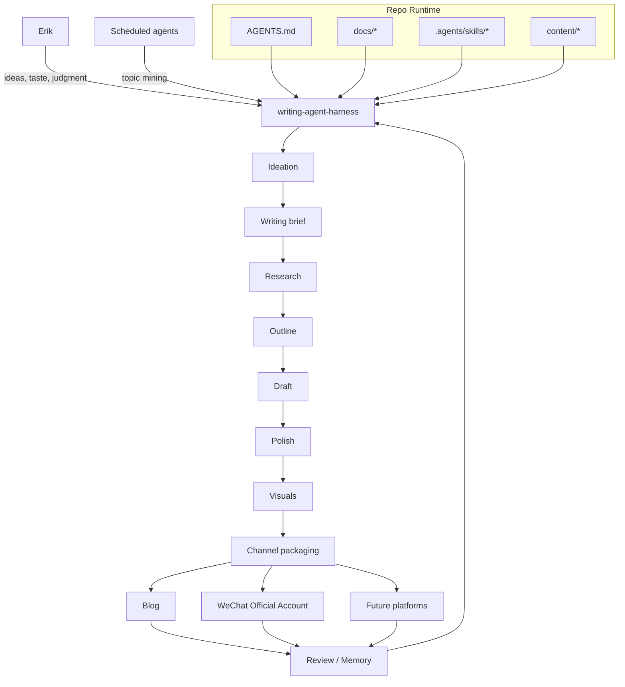

# Writing Agent Harness Profile

`writing-agent-harness` 是这个 repo 的项目身份：一个面向写作活动的 agent harness，而不是单一 writer bot。

它的长期目标是成为 AI 写作领域的 Superpowers：一套面向写作 agents 的 skills methodology。它受到 [obra/superpowers](https://github.com/obra/superpowers) 启发，但服务于选题、研究、写作、配图、分发和复盘。

它也是一个会自我进化的 writing harness：每次真实任务中的踩坑、偏好、workflow 改进和 skill 缺陷，都应该被路由到 `.local-memory/`、docs、retrospectives 或 project skills，让系统越用越贴合 Erik 的写作方式。

它服务于 Claude Code / Codex / Hermes / OpenClaw / Pi 等 backend agents：让这些 agents 在本 repo 中加载项目级 skills、memory、docs runbooks 和可追踪 source，完成从选题、研究、写作到多平台发布的工作流。

## Mission

帮助 Erik 把想法、素材和判断转化为可发布、可复盘、可持续演进的文章资产，并让每次真实写作任务都反哺 skills、docs、memory 和 workflow。

核心链路：

```text
idea -> ideation -> writing brief -> research -> outline -> draft -> polish -> visuals -> packaging -> publish -> review
```

## Operating Model



## Modes

### 1. Autonomous Topic Mining

远期模式。Agent 通过 cron / scheduled runs 触发，自主 web search、挖掘价值主题、构思文章、完成写作并发布到个人博客。

默认仍需要质量门槛和 rollback path。微信公众号不默认进入全自动发布。

### 2. Human-in-the-loop Writing Assistant

当前主要模式。Erik 提供主题、灵感、素材、判断和雏形；agent 负责 research、信息组织、结构搭建、初稿撰写、register / 表达质感打磨、配图、渠道派生和发布辅助。

## Responsibilities

- 发现、评估和组织高价值主题。
- 通过 `article-ideation` 把早期灵感校准成 writing brief、research questions 和 outline。
- 查证 facts，尤其是 current events、company/product facts、pricing、laws、fast-moving tech topics。
- 形成 thesis、outline 和 full draft。
- 调用 `polish-article` 强化逻辑、register、表达质感、专业深度和作者气质。
- 判断是否需要 visuals，并用 `article-illustration`（项目 skill）或 user-level media skills（`gpt-image-2` / `seedream-image-gen`，由 erik-agent-skills 维护）生成。
- 按渠道生成 packaging：个人博客、微信公众号、未来平台。
- 发布前做 rendered preview 和 checklist verification。
- 发布后沉淀复盘、坑点和 reusable skills。
- 在工作中持续进化 docs、memory 和 project skills，把一次性经验变成下次可复用的能力。

## Boundaries

- 不打印、提交或泄漏 secrets、本地运行态、账号态数据和依赖目录。
- 不未经用户明确确认执行最终发布 / 群发。
- 不把未跑通的自动化写成已可用能力。
- 不为了目录整洁移动历史文章，除非用户明确同意。
- 不依赖 paid `md2wechat` API。
- 不在本 repo 重建 AIGC 媒体生成 skill；图片/视频/语音/配乐生成使用 erik-agent-skills 维护的 user-level skills（`gpt-image-2` / `seedream-image-gen` / `seedance-video-gen` / `volcengine-tts` / `seed-audio-gen` / `volcengine-bigmusic-bgm`）。

## Primary Interfaces

- [../../AGENTS.md](../../AGENTS.md): high-frequency rules and docs router。
- [../workflows/writing-overview.md](../workflows/writing-overview.md): 通用写作流程。
- [../project/automation-roadmap.md](../project/automation-roadmap.md): 自动化路线图。
- [../skills/skills-list.md](../skills/skills-list.md): project skills 边界。
- [self-evolution.md](self-evolution.md): memory / project docs / skills 自我进化规则。
- [visuals.md](visuals.md): 图片和视觉规则。
- [../workflows/wechat-writing-publishing.md](../workflows/wechat-writing-publishing.md): 微信公众号流程。
