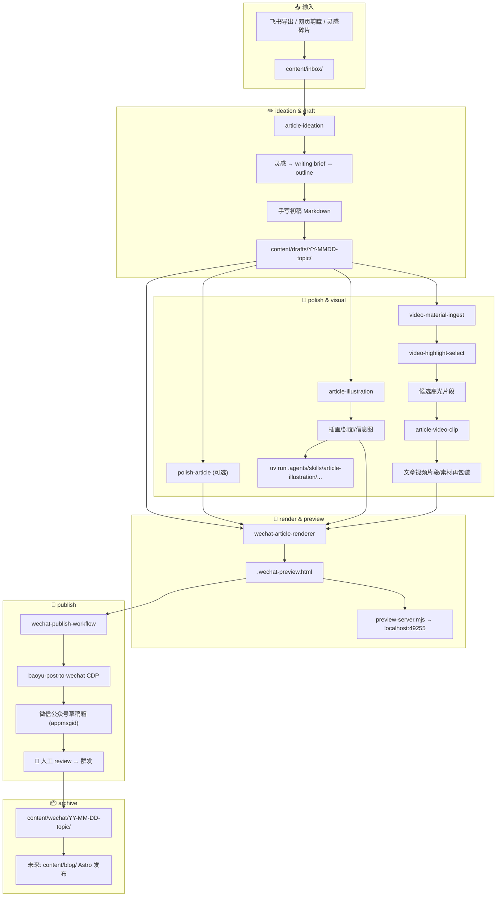

# AI 写作 + 微信公众号自动化发布工作流

## 流程全景

## 目录约定

| 目录 | 用途 |
|------|------|
| `content/inbox/` | 灵感碎片、飞书导出、网页剪藏、参考素材 |
| `content/drafts/` | Markdown canonical source + WeChat HTML + assets（写作工作区） |
| `content/wechat/` | 已发布微信公众号文章归档 |
| `content/blog/` | 未来 Astro/Cloudflare Pages 博客派生稿 |
| `content/assets/` | 可复用视觉资产 |

## Skill 分工

| 阶段 | Skill | 输入 | 输出 |
|------|-------|------|------|
| 灵感脑暴 | `article-ideation` | 灵感碎片、链接、截图 | writing brief + outline |
| 写作打磨 | `polish-article` | Markdown 草稿 | 打磨后 Markdown |
| 插图生成 | `article-illustration` | 风格/尺寸描述 | 插画/封面/信息图 |
| 视频素材摄取 | `video-material-ingest` | 已知视频 URL | `assets/media/<slug>/` 素材包 |
| 视频高光选择 | `video-highlight-select` | 本地素材包 + 文章意图 | contact sheet + 候选片段表 |
| 文章视频剪辑 | `article-video-clip` | 已确认片段 + preset | `assets/video-clips/<slug>/final.mp4` |
| 排版渲染 | `wechat-article-renderer` | article.md + assets | `.wechat-preview.html` |
| 发布草稿 | `wechat-publish-workflow` → `baoyu-post-to-wechat` | HTML + 元数据 | 草稿箱 (appmsgid) |
| 最终发布 | 👤 人工 review | 草稿箱 | 群发 |

## 渲染器风格

| 风格 | `--style` | 适用 |
|------|-----------|------|
| 技术评论/观点文 | `impact-rational` (默认) | agent 开发、技术分析 |
| 个人散文/随笔 | `literary-essay` | 生活随笔、文学类 |
| 通用技术博客 | `tech-blog` | 技术分享、教程 |

## 插图预设

| 预设 | `--size` | 用途 |
|------|----------|------|
| `wechat-cover-hd` | 1792x1024 → 自动裁剪 1080x460 (2.35:1) | 公众号头条封面 |
| `doc-hd` | 1536x1024 | 正文插图（横版） |
| `portrait-hd` | 1024x1536 | 正文插图（竖版，移动端） |
| `blog-banner` | 2048x1152 | 博客首页头图 |
| `9:16` | 1024x1792 | 全屏竖版 |

## 关键约束

- Python 脚本一律使用 `uv run`（pyproject.toml + .venv）
- Node.js 脚本使用 `bun` 或 `node`
- CDP 模式为唯一发布路径（不用官方 API）
- Agent 可创建草稿，最终发布必须人工确认
- 标题和摘要发布时显式传入 `--title` 和 `--summary`
- 视频素材和剪辑产物默认是本地工作素材，不应提交 Git；`content/inbox/**`、`content/drafts/**` 和 `content/wechat/**/*.mp4|mov|webm|mkv` 已按本地素材处理。
