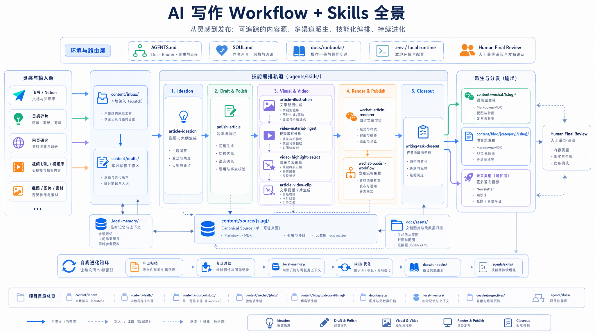
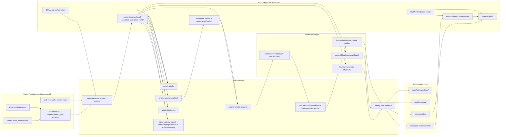

# AI 写作自动化 Harness 工作流

## 流程全景

这张图是面向真实写作任务的执行层视图：从灵感碎片进入 `content/inbox/` 和 `content/drafts/`，经过项目 skills 编排，沉淀到 `content/source/`，再派生到微信、博客和未来渠道。图片生成 metadata 归档在 [docs/assets/ai-writing-skills-workflow-overview.json](../assets/ai-writing-skills-workflow-overview.json)，方便后续用同一 prompt 和 reference 继续迭代。

这个图刻意把 repo 描述成 harness，而不是单线 pipeline：

- **Router 层**：`AGENTS.md` 只保留高频规则和 docs 路由；低频细节通过 `docs/` progressive disclosure 加载。
- **Source 层**：`content/source/{slug}/` 是 repo 内长期 canonical source；`content/drafts/` 和 `content/inbox/` 是本地 scratch，不默认提交。
- **Skill 层**：`.agents/skills/*` 负责可重复执行的写作、配图、视频、排版、发布和 closeout 能力。
- **Channel 层**：`content/wechat/`、`content/blog/` 和未来渠道都从同一个 source slug 派生，渠道稿 frontmatter 用 `source:` 指回 canonical article。
- **Evolution 层**：真实任务结束后用 `writing-task-closeout` 把坑点、复盘、memory、docs 和 skill 改进回填到 harness。

## 目录约定

| 目录 | 用途 |
|------|------|
| `content/inbox/` | 本地原始输入 scratch，gitignored |
| `content/drafts/` | 本地写作工作区，gitignored；进入可追踪状态前需要 promote |
| `content/source/` | 可追踪 canonical Markdown / MDX source package，跨渠道共用 |
| `content/wechat/` | 可追踪微信公众号文章、HTML preview、notes 和 metadata |
| `content/blog/` | 可追踪博客 Markdown / MDX，未来供 Astro/Cloudflare Pages 使用 |
| `content/assets/` | 可复用 prompt、metadata、manifest；二进制素材默认不提交 |

> `docs/assets/` 是文档图片目录，应该进入 Git；写作任务产生的二进制图片、视频素材和剪辑产物默认留在 `.local-archive/` 或外部资产库，只提交可复现的 prompt、metadata、manifest、sources 和 notes。

## Skill 分工

| 阶段 | Skill | 输入 | 输出 |
|------|-------|------|------|
| 灵感脑暴 | `article-ideation` | 灵感碎片、链接、截图 | writing brief + outline |
| 写作打磨 | `polish-article` | Markdown 草稿 | 打磨后 Markdown |
| 插图生成 | `article-illustration` | 风格/尺寸描述 | 插画/封面/信息图 |
| 视频素材摄取 | `video-material-ingest` | 已知视频 URL | `assets/media/<slug>/` 素材包 |
| 视频高光选择 | `video-highlight-select` | 本地素材包 + 文章意图 | contact sheet + 候选片段表 |
| 文章视频剪辑 | `article-video-clip` | 已确认片段 + preset | `assets/video-clips/<slug>/final.mp4` |
| 排版渲染 | `wechat-article-renderer` | article.md + assets | `.wechat-preview.html` |
| 发布草稿 | `wechat-publish-workflow` → `baoyu-post-to-wechat` | HTML + 元数据 | 草稿箱 (appmsgid) |
| 最终发布 | 👤 人工 review | 草稿箱 | 群发 |

## 渲染器风格

| 风格 | `--style` | 适用 |
|------|-----------|------|
| 技术评论/观点文 | `impact-rational` (默认) | agent 开发、技术分析 |
| 个人散文/随笔 | `literary-essay` | 生活随笔、文学类 |
| 文化现象/城市/音乐/文旅随笔 | `cultural-essay` | 文化观察、城市文旅、音乐传播 |
| 通用技术博客 | `tech-blog` | 技术分享、教程 |

## 插图预设

| 预设 | `--size` | 用途 |
|------|----------|------|
| `wechat-cover-hd` | 1792x1024 → 自动裁剪 1080x460 (2.35:1) | 公众号头条封面 |
| `doc-hd` | 1536x1024 | 正文插图（横版） |
| `portrait-hd` | 1024x1536 | 正文插图（竖版，移动端） |
| `blog-banner` | 2048x1152 | 博客首页头图 |
| `9:16` | 1024x1792 | 全屏竖版 |

## 关键约束

- Python 脚本一律使用 `uv run`（pyproject.toml + .venv）
- Node.js 脚本使用 `bun` 或 `node`
- CDP 模式为唯一发布路径（不用官方 API）
- Agent 可创建草稿，最终发布必须人工确认
- 标题和摘要发布时显式传入 `--title` 和 `--summary`
- `content/inbox/**` 和 `content/drafts/**` 默认是本地 scratch，不提交 Git。可追踪文章源稿应 promote 到 `content/source/`，再派生到 `content/wechat/` 或 `content/blog/`。
- 图片、视频素材和剪辑产物默认是本地工作素材，不应提交 Git；保留 prompt、metadata、manifest、sources 和 notes 作为可追踪文本。
