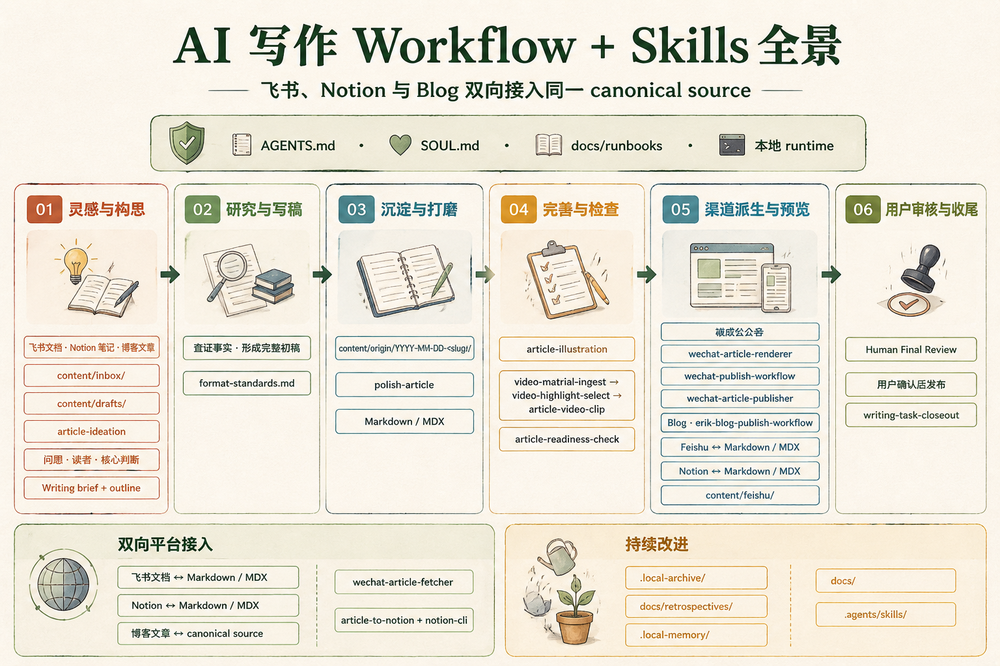

# AI 写作自动化 Harness 工作流

## 流程全景



这张图是面向真实写作任务的执行层视图：飞书、Notion 和 Blog 都可以作为输入，也都能接收从 `content/origin/YYYY-MM-DD-<slug>/` 派生或同步的内容。进入 repo 后以 Markdown / MDX canonical source 连接构思、写作、审核与各渠道交付。配图由 GPT Image 2.5 Sunburst 生成；流程摘要见 [metadata](../assets/ai-writing-skills-workflow-overview.json)，完整 prompt 和模型请求记录见 [生成记录](../assets/ai-writing-skills-workflow-overview-gpt-image-2.5.json)。

下面的 Mermaid 只作为维护用 compact map，不承担视觉展示职责，因此默认折叠。

<details>
<summary>维护用 Mermaid compact map</summary>


```mermaid
---
config:
  theme: base
  look: classic
  themeVariables:
    fontFamily: "ui-sans-serif, system-ui, sans-serif"
    primaryColor: "#eff6ff"
    primaryTextColor: "#172033"
    primaryBorderColor: "#93c5fd"
    lineColor: "#2563eb"
    secondaryColor: "#ecfdf5"
    tertiaryColor: "#fff7ed"
---
flowchart LR
    Input["灵感 / 飞书 / Notion / Blog / 网页 / 素材"] --> Scratch["content/inbox + drafts"]
    Input -. 剪藏 .-> Notion["article-to-notion + notion-cli"]
    Notion -. 研究资料 .-> Ideation["article-ideation → brief + outline"]
    Scratch --> Ideation
    Ideation --> Draft["研究与写稿"]
    Draft --> Origin["content/origin/YYYY-MM-DD-{slug}/"]
    Origin --> Polish["polish-article"]
    Polish --> Visuals["可选：插图 / 视频素材 / 剪辑"]
    Polish --> Ready["article-readiness-check"]
    Visuals -. 素材 .-> Ready
    Ready --> Channels["微信 / Blog / 飞书 / Notion 渠道同步"]
    Channels --> Review["用户最终审核与发布"]
    Review --> Closeout["writing-task-closeout"]
    Closeout --> Evolution["复盘 / local memory / docs / skills"]
    Evolution -. 经验反馈 .-> Ideation

    Router["AGENTS.md + SOUL.md + docs runbooks"] -. 贯穿全程 .-> Ideation
```

</details>

这份 Mermaid 刻意保持简单：

- **Router 层**：`AGENTS.md` 只保留高频规则和 docs 路由；低频细节通过 `docs/` progressive disclosure 加载。
- **Origin 层**：`content/origin/YYYY-MM-DD-<slug>/` 是 repo 内长期 canonical article；`content/drafts/` 和 `content/inbox/` 是本地 scratch，不默认提交。飞书、Notion、Blog 均可导入内容或接收回写；进入 harness 管理的文章仍以 origin 为 source of truth。
- **Skill 层**：`.agents/skills/*` 负责可重复执行的写作、配图、视频、排版、发布和 closeout 能力。
- **Channel 层**：`content/wechat/`、`content/blog/`、`content/feishu/` 和未来渠道都关联到同一个 origin slug，渠道稿 frontmatter 用 `source:` 指回 canonical article。已存在的 Blog 文章也可作为写作输入；harness 管理的文章由 origin 确定性派生到 Astro 博客。
- **Evolution 层**：真实任务结束后用 `writing-task-closeout` 把坑点、复盘、memory、docs 和 skill 改进回填到 harness。

## 目录约定

| 目录 | 用途 |
|------|------|
| `content/inbox/` | 本地原始输入 scratch，gitignored |
| `content/drafts/` | 本地写作工作区，gitignored；进入可追踪状态前需要 promote |
| `content/origin/` | 可追踪 canonical Markdown / MDX article package，跨渠道共用 |
| `content/wechat/` | 可追踪微信公众号文章、HTML preview、notes 和 metadata |
| `content/blog/` | 可追踪博客 Markdown / MDX 渠道副本；Astro blog repo 中的 `src/content/posts/` 也应视为从 origin 派生的发布副本 |
| `content/feishu/` | 飞书文档同步记录、远端链接与交付状态 |
| `content/assets/` | 跨文章复用 prompt、metadata、manifest 和 reference material；不要放单篇文章的一次性素材 |

> `content/origin/YYYY-MM-DD-<slug>/assets/` 是 article-local assets。`docs/assets/` 是文档图片目录，应该进入 Git；写作任务产生的大体积二进制图片、视频素材和剪辑产物默认留在 `.local-archive/` 或外部资产库，只提交可复现的 prompt、metadata、manifest、sources 和 notes。

## Blog Renderer Boundary

个人博客的推荐实现是独立 Astro repo，由 Cloudflare Pages 部署。既有 Blog 文章可以导入作为写作输入；对进入 harness 管理的文章，`content/origin/` 仍是 canonical source，博客 repo 消费从中派生的发布副本。

第一版同步策略：

```text
content/origin/YYYY-MM-DD-<slug>/index.md
-> scripts/sync_origin_to_blog.py
-> <astro-blog-repo>/src/content/posts/YYYY-MM-DD-<slug>.mdx
-> <astro-blog-repo>/src/content/posts/assets/YYYY-MM-DD-<slug>/
```

同步脚本只做确定性转换：补齐 Astro blog frontmatter、输出博客渠道 `.mdx`、复制 article-local `assets/` 中的非 Markdown 素材、重写图片路径、移除与 frontmatter `title` 重复的正文 H1，并处理 MDX 对 `<`、HTML void tag、缺失本地图片等更严格的解析要求。博客 repo 会把 posts 目录下的 Markdown/MDX 当作文章，因此 prompt、notes 等 `.md`/`.mdx` 资料不应复制进博客 posts 子目录。Notion 既可作为写作输入，也支持从 Markdown/MDX 接收内容；网页剪藏仍走 `article-to-notion`。

博客分类采用虚拟分层：`src/content/posts/` 保持扁平，`category` / `series` / `tags` 写入 frontmatter。`category` 用少量稳定大类，`series` 用于 Claude Code Notes、Codex Notes、Hermes Notes 等连续专题，`tags` 保持多对多自由增长。不要把主题目录写进文章 URL。

## Skill 分工

| 阶段 | Skill | 输入 | 输出 |
|------|-------|------|------|
| 灵感脑暴 | `article-ideation` | 灵感碎片、链接、截图 | writing brief + outline |
| 写作打磨 | `polish-article` | Markdown 草稿 | 打磨后 Markdown |
| 插图生成 | 用户指定的生图 skill（`gpt-image-api` / `seedream-image-gen` / `openrouter-image`） | 风格/尺寸描述 | 插画/封面/信息图 |
| AIGC 媒体生成 | `gpt-image-2` / `seedream-image-gen` / `seedance-video-gen` / `volcengine-tts` / `seed-audio-gen` / `volcengine-bigmusic-bgm`（均为 user-level skills，由 erik-agent-skills 维护） | 文字/参考图/提示词 | 图片/视频/旁白/音频素材 |
| 视频素材摄取 | `video-material-ingest` | 已知视频 URL | `assets/media/` 素材包 |
| 视频高光选择 | `video-highlight-select` | 本地素材包 + 文章意图 | contact sheet + 候选片段表 |
| 文章视频剪辑 | `article-video-clip` | 已确认片段 + preset | `assets/video-clips/<clip-name>/final.mp4` |
| 排版渲染 | `wechat-article-renderer` | article.md + assets | `.wechat-preview.html` |
| 发布草稿 | `wechat-publish-workflow` → `wechat-article-publisher` | HTML + 元数据 | 草稿箱 (appmsgid) |
| 双向平台同步 | `erik-blog-publish-workflow` / `markdown-article-to-feishu-doc` / Notion connectors | 平台文章或 canonical Markdown / MDX | Blog / 飞书文档 / Notion 页面与数据库 |
| 最终发布 | 👤 人工 review | 草稿箱 | 群发 |

> **平台连接**：飞书、Notion、Blog 的读入与回写链路均已打通。飞书文档与 Markdown/MDX 双向同步可调用 user-level skill `markdown-article-to-feishu-doc`；Notion 页面与数据库由 `notion-cli` 等入口读写，网页剪藏走 `article-to-notion`；个人博客文章可读入作为素材，正式稿由 `erik-blog-publish-workflow` 从 canonical source 派生发布。外部公众号文章可用 `wechat-article-fetcher` 提取。渠道连接不会改变 `content/origin/` 的 canonical source 约定。

## 渲染器风格

| 风格 | `--style` | 适用 |
|------|-----------|------|
| 技术评论/观点文 | `impact-rational` (默认) | agent 开发、技术分析 |
| 个人散文/随笔 | `literary-essay` | 生活随笔、文学类 |
| 文化现象/城市/音乐/文旅随笔 | `cultural-essay` | 文化观察、城市文旅、音乐传播 |
| 通用技术博客 | `tech-blog` | 技术分享、教程 |

## 插图预设

| 预设 | `--size` | 用途 |
|------|----------|------|
| `wechat-cover-hd` | 1792x1024 → 自动裁剪 1080x460 (2.35:1) | 公众号头条封面 |
| `doc-hd` | 1536x1024 | 正文插图（横版） |
| `portrait-hd` | 1024x1536 | 正文插图（竖版，移动端） |
| `blog-banner` | 2048x1152 | 博客首页头图 |
| `9:16` | 1024x1792 | 全屏竖版 |

## 关键约束

- Python 脚本一律使用 `uv run`（pyproject.toml + .venv）
- Node.js 脚本使用 `bun` 或 `node`
- Playwright 浏览器自动化为唯一发布路径（不用官方 API）
- Agent 可创建草稿，最终发布必须人工确认
- 标题和摘要发布时显式传入 `--title` 和 `--summary`
- `content/inbox/**` 和 `content/drafts/**` 默认是本地 scratch，不提交 Git。可追踪文章源稿应 promote 到 `content/origin/`，再派生到 `content/wechat/` 或 `content/blog/`。
- 图片、视频素材和剪辑产物默认是本地工作素材，不应提交 Git；保留 prompt、metadata、manifest、sources 和 notes 作为可追踪文本。
